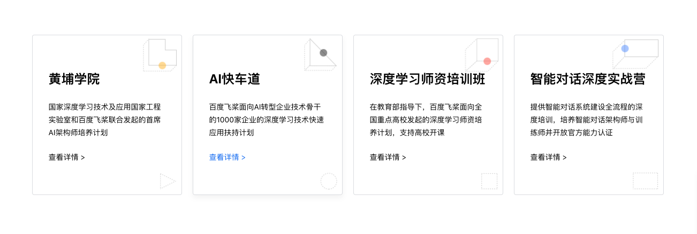
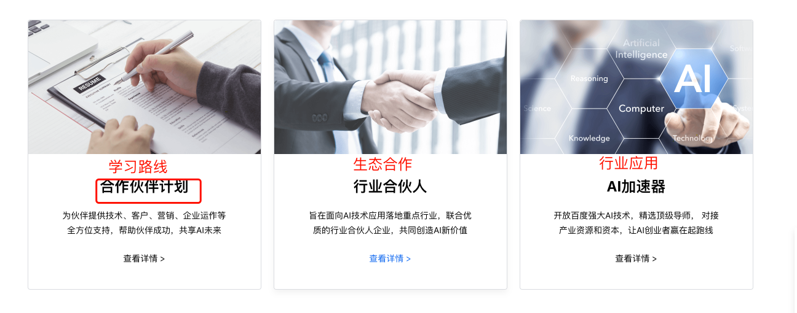
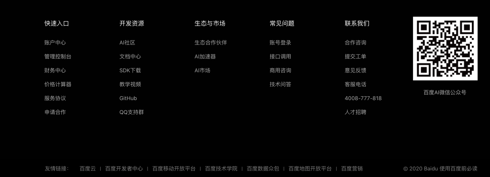
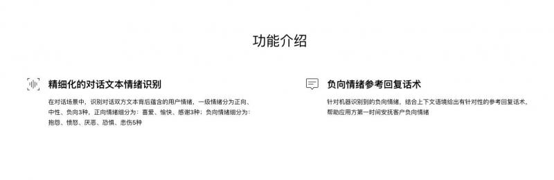
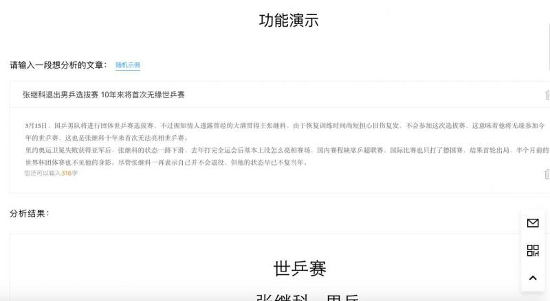
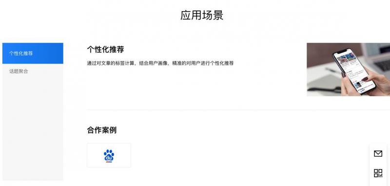

### 展示端首页


* 传智AI赋能：咨询对话系统优化
	* 利用AI技术，帮助信息中心从真实咨询对话中自动提取关键实体，如学员姓名，手机号，意向校区和意向学科，帮助咨询人员提升学员转化效率。

---

* 传智AI赋能：试卷自动批阅系统
	* 利用AI技术，帮助院校邦部门对学生网上作答的填空题题型进行自动打分，并给定对应的评分置信度，帮助教师更好更快的完成海量试卷批阅。


---


* 传智AI赋能：数据分析之图像解析
	* 利用AI技术，帮助数据分析团队对全国机构图片进行解析，从而判断该各个校区受疫情影响是否在线上进行教学，从而完成更具有说服力的数据分析报告。


---





* 文本标签化
	* 给定一段文本，通过语义技术，进行兴趣类标签判断。


* 实体抽取
	* 给定指定格式的文本，通过上下文关联，进行主要实体抽取。


* 相似度打分
	* 给定两段文本，通过AI模型判断语义相似，得到它们的相似度分值。


* 图片分类
	* 给定一张学员学习图片进行判断是否在线上或者线下学习。


---




* 学习路线
	* 针对零基础小白精心设计，开启你的AI学习之旅吧！


* 联合立项
	* 如果你的部门或团队已经积累了一定的历史数据，并希望进行AI赋能，请联系我们！


* 行业应用
	* AI真的火热吗，来看看整个互联网圈中的AI应用案例，或许会给你一些启发！


---





* 二维码（我的二维码）
* Github
* 抖音号
* 官网地址
* 我的团队
* 院校邦
* 项目信息站
* 信息中心


---

---

---


### 详情页展示banner


> * 立即使用按钮跳转功能演示


* 文本标签化
	* 给定一段文本，通过语义技术，进行兴趣类标签判断。


* 实体抽取
	* 给定指定格式的文本，通过上下文关联，进行主要实体抽取。

* 相似度打分
	* 给定两段文本，通过AI模型判断语义相似，得到它们的相似度分值。

* 图片分类
	* 给定一张学员学习图片进行判断是否在线上或者线下学习。


---


### 功能介绍



> * 功能小图标 + 文案

* 文本标签化
	* 这是一款专注于泛娱乐领域的标签化系统，它尤为擅长处理与明星，音乐，影视，游戏，美食等相关的文本内容并生成合适的标签。可输入的文本内容包括：对话，评论，留言，描述等。


---


### 功能演示




> * 建议使用上下的形式，输入的框只有图片和文本两种样式，输出框只有文本
> * 必须有随机示例，且需要比较明显的按钮

* 文本标签化

> * 输入文本样式：

```json
我爱踢足球
```

> * 输出文本样式：

```json
[
    {
        "label": "足球",
        "score": 0.715871,
        "related": [
            "体育"
        ]
    }
]
```

---


### 应用场景




> * 形式为：一段文案，一张图片（合作logo）

* 文本标签化：
	* 文案：该系统应用于传智播客python web项目的推荐系统之中，用于用户之间的兴趣推荐，对教学来讲，更加真实的还原了企业级的web项目，并在一定程度上将AI引入web课堂。
	* 图片：python web组logo

---


### 技术特色


> * 三段文案，三张图片（具体模型，优化工具，部署工具）

* 文本标签化：
	* 1，使用Fasttext模型进行多标签多分类
	* 2，对模型进行Keras tuner
	* 3，使用tf-serving进行多模型部署
