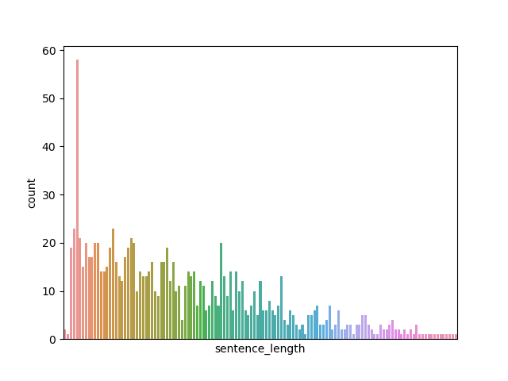
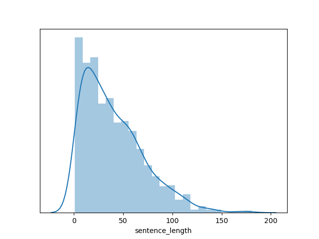
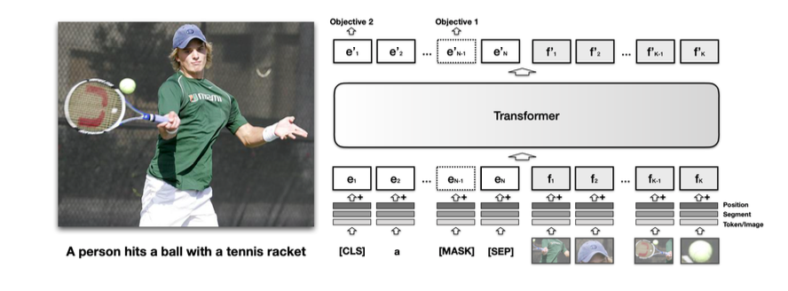
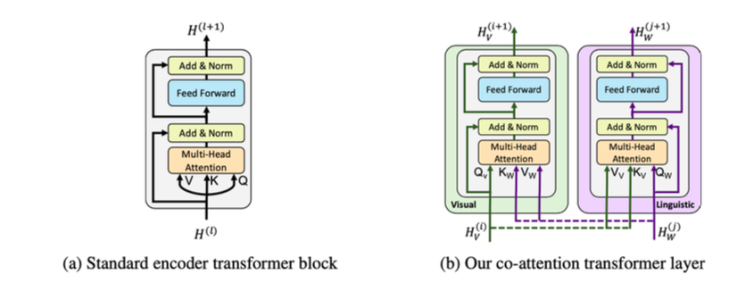
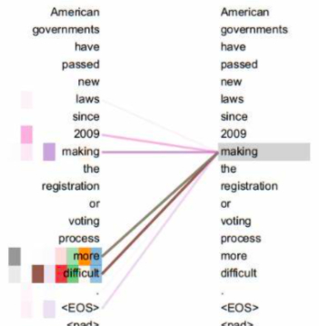
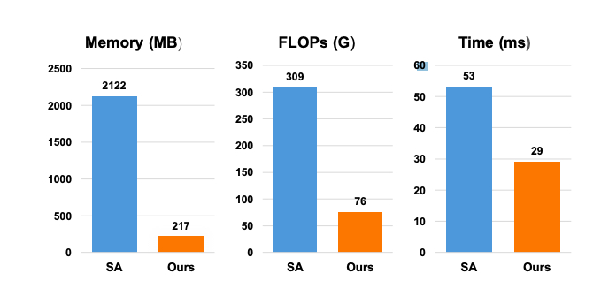

## 2.1 背景需求与分析

---

### 学习目标

* 了解该任务的背景需求。
* 通过对需求分析明确交付系统要求。

<center></center>

---

### 背景需求


* 在整个大的推荐系统背景下，需要构建视频画像，其中最重要的就是为无标签视频打上合适的系统标签。

* 在过去年月里，由于算力的限制，一般公司无力支持图像的处理，因此主要以处理视频周边的文本，如title，获赞最多的评论内容，作为标签化的输入，而今我们将迈出一小步，以视频中的关键帧+文本信息作为输入构建多模态模型，来进行更精准的标签化。


* 注：所谓无视频标签是指：用户在上传视频时没有通过 # 来自定义标签，这类视频是视频标签化需要处理的重点。


<center></center>


---

### 需求分析

通过上述背景需求，我们首先明确以下几点:

* 系统输入: 视频的关键帧图片（一般为封页）+ 视频title的文本内容。

* 系统输出: 输出是和业务一同指定的标签体系（类似于文本标签化系统）。

* 在线服务要求: 无（离线服务即可）。


* 多模态下的标签体系设计：
	* 之前的文本标签设计，依赖于文本中的内容描述来指向标签，比如谈论某个游戏人物就判断和游戏有关。
	* 但这样的文本内容其实都是“直述”内容，最容易表达“直述”内容的应该是图像（游戏画面）,而文本（title）往往在表达情感，情绪（这个也和应用本身的定位有关），按照这个逻辑，多模态下的标签体系可以更加的丰富。


<center></center>


---

### 小节总结

* 学习了任务的背景需求。

* 学习了交付系统要求以及多模态下的标签体系设计。

---


	
## 2.2 整体解决方案初定

---


### 学习目标

* 了解初始整体解决方案的作用。
* 了解初始整体解决方案的各个步骤。 


---


### 初始整体解决方案的作用

初始整体解决方案一般是在与产品，运营讨论需求后制定技术解决方案。在这个时间点上，AI工程师往往还没有拿到真实线上数据，只能通过需求描述来假设数据情况，并根据这种情况制定方案。

* 该方案主要基于我们之前的类似项目经验，一方面帮助我们初步梳理整个处理思路和流程，另一方面给合作部门人员彰显我们是可以胜任这项工作的（这对于团队之间的合作来讲至关重要，我们需要先有一定的表示才能获得信任）。

初始整体解决方案一般是一个细节不够完善的方案，但是它已经有了一个大体的解决框架，在之后的真实数据下和开发过程中不断优化。

---


### 初始整体解决方案的环节

* 第一步: 明确问题并提出数据要求
* 第二步: 对原始数据进行数据分析
* 第三步: 构建Resnet和GRU结合的多模态模型
* 第四步: 模型部署服务概述
* 第五步: 总结与改进

---  

#### 第一步: 明确问题并提出数据要求
   
* 明确问题:
	* 以视频关键帧和附带的文本信息为输入，以标签体系中的某些标签为输出。

---

* 数据要求:
	* 多模态需要文本-图像的对应数据，由于模型构造一般比较复杂，因此对数据总量的要求也比较高，至少提供10万对多模态数据。


* 基本数据形式:

```
# id 为序号，img 为图像的文件位置，label 为标签值，text 为文本内容
{"id":7,"img":"img\/7.png","label":12,"text":"苦尽甘来时，我给你讲讲来时的路"}
{"id":10896,"img":"img\/10896.png","label":0,"text":"when you try acid for the first time"}
```


---

#### 第二步: 对原始数据进行数据分析

* 重要的文本数据分析：
	* 1，统计文本长度分布
> * 作用： 通过分布情况决定长度合法性检验的范围（为了保证实时，需要限定每次解析的文本长度）。
	* 2，统计同标签的关键词概况
> * 作用： 用于确定语料质量。


* 图像数据分析：
	* 1，宽高分布(如果有需要)
> * 作用：筛查异常数据，确保宽高分布符合数据要求。
	

---

#### 第三步：构建Resnet和GRU结合的多模态模型


* 在Transformer没有出现之前，早前的多模态构建更多就是根据已有的模型自定义结构，比如GRU处理文本，Resnet处理图像，再将两者的张量融合，最后通过一个网络做输出。

> * 注：这里回顾GRU和Resnet，解释***梯度消失***。


* 将已有的模型融合或者说自定义业务需求的模型输入头，是算法工程师在企业里最常见也是最重要的工作。因此，在这里将带着大家来一步步构建Resnet和GRU结合的多模态模型，直到完成模型训练。


> * Step1：先设计这样一个模型，在文本侧，首先经过Embedding层，再经过Bi-GRU得到高维张量。在图像侧，使用带有预训练参数的Resnet18，并使用一个全连接替换它的输出层，以便保证输出维度与Bi-GRU一致，最后将两侧输出张量加性融合通过一个全连接做二分类。


```python
import torch
import torch.nn as nn
import numpy as np
import torchvision
from torchvision import datasets, models, transforms


class ResnetGRUModel(nn.Module):
    def __init__(
        self,
        vocab_size,
        embed_dim,
        num_class,
        # max_length,
        dropout,
        hidden_size,
        num_layers,
    ):
        super(ResnetGRUModel, self).__init__()
        self.resnet_model = models.resnet18(pretrained=True)
        self.num_ftrs = self.resnet_model.fc.in_features
        self.resfc = nn.Linear(self.num_ftrs, hidden_size * 2)
        self.token_embedding = nn.Embedding(vocab_size, embed_dim)
        self.gru = nn.GRU(
            embed_dim,
            hidden_size,
            num_layers,
            bidirectional=True,
            batch_first=True,
            dropout=dropout,
        )
        self.fc = nn.Linear(hidden_size * 2, num_class)
        # self.init_weights()

    def init_weights(self):
        initrange = 0.5
        self.token_embedding.weight.data.uniform_(-initrange, initrange)
        self.resfc.weight.data.uniform_(-initrange, initrange)
        self.fc.weight.data.uniform_(-initrange, initrange)

    def forward(self, text, img):
        token_embedded = self.token_embedding(text)
        txt_out, _ = self.gru(token_embedded)
        # print(txt_out)
        # print(txt_out.shape)
        # print(txt_out[:, -1, :])
        # print(txt_out[:, -1, :].shape)
        self.resnet_model.fc = self.resfc
        img_out = self.resnet_model(img)
        out = txt_out[:, -1, :] + img_out
        out = self.fc(out)
        return out


if __name__ == "__main__":
    model = ResnetGRUModel(
               vocab_size=vocab_size,
               embed_dim=64,
               num_class=2,
               dropout=0.1,
               hidden_size=16,
               num_layers=2,
            )
    # 随机单条数据
    img = torch.rand(1, 3, 700, 500)
    text = torch.tensor([[1, 2, 3, 4, 5, 6]])
    print(model(text, img))

``` 


> * Step2：完成了模型后，还需要将原始的文本和图像数据经过一系列的处理，成为模型的输入，现在我们给定大家一份原始数据（包括文本标签的jsonl以及对应图像集）。


```python
# train_multimodal_data.jsonl
# {"id":7,"img":"./img/7.png","label":1,"text":"苦尽甘来时，我给你讲讲来时的路"}
# {"id":8,"img":"./img/8.png","label":0,"text":"苏州老大凌阿九！"}

# 读取数据并转成json
with open("./train_multimodal_data.jsonl", 'r') as fr:
    multimodal_data_list = fr.readlines()

# 处理文本读取时附带一些符号，比如换行符
multimodal_data_list = list(map(lambda x: eval(x[:-1]), multimodal_data_list))
print(multimodal_data_list)


## 文本处理流程

### 提取文本
multimodal_data_text = list(map(lambda x: x["text"], multimodal_data_list))


### 对文本进行tokenizer映射并记录映射器

import numpy as np

tokenizer = dict()
fit_text = set("".join(multimodal_data_text))
vocab_size = len(fit_text) + 1
tokenizer = {x : i+1 for i, x in enumerate(fit_text)}

print(tokenizer)


def _use_tokenizer(tokenizer, text:list, value=0):
    res = []
    for t in text:
        temp = []
        for i in t:
            temp.append(tokenizer.get(i, value))
        res.append(temp)
    return res


import json
json.dump(tokenizer, open("./gru_tokenizer.json", "w"))


### 对文本进行截断补齐
def _pad_sequences(text:list, max_length, value=0):
    res = []
    for txt in text:
        if len(txt) > max_length:
            res.append(txt[:max_length])
        else:
            res.append(txt + [value]*(max_length - len(txt)))
    return res

### 整合处理函数

def text_preprocess(text, tokenizer, max_length):
    text_token = _use_tokenizer(tokenizer, text)
    text_token = _pad_sequences(
        text_token, max_length, value=0,
    )
    return torch.tensor(text_token)


train_txt_list = text_preprocess(multimodal_data_text, tokenizer, 15)


## 图像处理流程

# 根据当前图片的尺寸进行设定
gold_size = (700, 500)

# 使模型输入张量服从标准正态分布，第一个参数为均值列表，代表各个通道的均值，
# 第二个参数为标准差列表，代表各个通道的标准差。这里的图片都是有三个通道。
# 其中均值和标准差列表中的数值来自对ImageNet的全局采样结果。
gold_normalize = ([0.485, 0.456, 0.406], [0.229, 0.224, 0.225])

# 定义一系列标准处理流程，Resize，张量化，规范化
# Resize和张量化用于统一图片尺寸和满足框架要求
# 规范化便于模型快速收敛


data_transforms = {
    'train': transforms.Compose([
        transforms.RandomResizedCrop(gold_size),
        transforms.ToTensor(),
        transforms.Normalize(gold_normalize[0], gold_normalize[1])
    ]),
    'val': transforms.Compose([
        transforms.Resize(gold_size),
        transforms.ToTensor(),
        transforms.Normalize(gold_normalize[0], gold_normalize[1])
    ]),
}

train_data_dir_list = list(map(lambda x: x["img"], multimodal_data_list))

from PIL import Image

def img_loader(path):
    """图片读取"""
    with open(path, 'rb') as f:
        img = Image.open(f)
        return img.convert('RGB')

# 进行指定的转化
train_img_list = list(map(lambda x: data_transforms["train"](img_loader(x)), train_data_dir_list))


## 获取标签

train_label_list = list(map(lambda x: x["label"], multimodal_data_list))


## 整合数据成为DataLoader

from torch.utils.data import DataLoader

train_iter = list(zip(train_img_list, train_txt_list, train_label_list))

BATCH_SIZE = 8

train_dataloader = DataLoader(
    train_iter, batch_size=BATCH_SIZE, shuffle=True
)

print(train_dataloader)

```


> * Step3：定义损失函数，优化器以及重要的超参数，训练和评估你的模型（假设验证集，测试集与训练集相同）。

```python
import time

# Hyperparameters
EPOCHS = 20  # epoch
LR = 0.05  # learning rate

criterion = torch.nn.CrossEntropyLoss()
optimizer = torch.optim.SGD(model.parameters(), lr=LR)
scheduler = torch.optim.lr_scheduler.StepLR(optimizer, 0.99, gamma=0.1)
total_accu = None

# 暂且认为三个数据集是相同的
test_dataloader = valid_dataloader = train_dataloader

def train(dataloader):
    model.train()
    total_acc, total_count = 0, 0
    log_interval = 500
    start_time = time.time()
    for idx, (img, txt, label) in enumerate(dataloader):
        optimizer.zero_grad()
        predited_label = model(txt, img)
        loss = criterion(predited_label, label)
        loss.backward()
        # torch.nn.utils.clip_grad_norm_(model.parameters(), 0.1)
        optimizer.step()
        total_acc += (predited_label.argmax(1) == label).sum().item()
        total_count += label.size(0)
        if idx % log_interval == 0 and idx > 0:
            elapsed = time.time() - start_time
            print(
                "| epoch {:3d} | {:5d}/{:5d} batches "
                "| accuracy {:8.3f}".format(
                    epoch, idx, len(dataloader), total_acc / total_count
                )
            )
            total_acc, total_count = 0, 0
            start_time = time.time()


def evaluate(dataloader):
    model.eval()
    total_acc, total_count = 0, 0

    with torch.no_grad():
        for idx, (img, txt, label) in enumerate(dataloader):
            predited_label = model(txt, img)
            loss = criterion(predited_label, label)
            total_acc += (predited_label.argmax(1) == label).sum().item()
            total_count += label.size(0)
    return total_acc / total_count


for epoch in range(1, EPOCHS + 1):
    epoch_start_time = time.time()
    train(train_dataloader)
    accu_val = evaluate(valid_dataloader)
    if total_accu is not None and total_accu > accu_val:
        scheduler.step()
    else:
        total_accu = accu_val
    print("-" * 59)
    print(
        "| end of epoch {:3d} | time: {:5.2f}s | "
        "valid accuracy {:8.3f} ".format(
            epoch, time.time() - epoch_start_time, accu_val
        )
    )
    print("-" * 59)


print("Checking the results of test dataset.")
accu_test = evaluate(test_dataloader)
print("test accuracy {:8.3f}".format(accu_test))

torch.save(model.state_dict(), './model_weights.pth')

```

---


#### 第四步: 模型部署服务概述


* 总体服务架构设计
	* 使用基于Django的服务框架。
	* 使用nginx作为反向代理和负载均衡。
	* 使用supervisor作为单服务守护与监控。
	* 使用uwsgi作为高性能web server。


---

* 模型服务封装
	* 基于tensorflow/keras框架开发的模型使用tf-serving进行封装，以保证服务健壮性以及模型热更新。
	* 基于pytorch框架开发的模型使用flask框架进行封装，使用交替双服务保证模型热更新。


---

* 系统联调与测试
	* 与外界服务使用REST API（http）进行交互。
	* 输入与输出为规范json格式。
	* 根据实际接口调用情况，进行并发压力测试。
	* 灰度发布，进行可用性测试。

---


* 服务器资源
	* 模型训练服务器：
	> * CPU: 64C，128G内存，1T硬盘
        > * GPU: 4*Tesla T4
	* 模型部署服务器: 
	> * CPU: 64C，128G内存，1T硬盘，10M带宽


---

#### 第五步: 总结与改进

* 上述方案的模型是较早期的解决方案，我们可以将GRU和Resnet替换成更具有提取能力的模型，如：BERT，InceptionV3等。同时特征融合的点也是值得考虑的，简单的加性运算或则拼接绝不是最佳的选择。


* 所以在之后真正的方案实施过程中，我们将尝试更多的方法。

---


### 小节总结

* 学习了初始整体解决方案的作用:
	* 一方面帮助我们初步梳理整个处理思路和流程，另一方面给合作部门人员彰显我们是可以胜任这项工作的。

---

* 学习了初始整体解决方案的各个步骤:
	* 第一步: 明确问题并提出数据要求
	* 第二步: 对原始数据进行数据分析
	* 第三步: 构建Resnet和GRU结合的多模态模型
	* 第四步: 模型部署服务概述
	* 第五步: 总结与改进

---

## 2.3 整体解决方案实施与调整

---

### 学习目标

* 掌握ViLBERT中最核心的优化方案以及代码实现。
* 掌握真实模型部署过程中需要注意的重点工程问题。

---


### 整体解决方案的实施步骤

* 第一步: 获取指定数据并进行数据分析
* 第二步: 进行模型识别部分分析
* 第三步: 对模型进行工程化部署

---

#### 第一步: 获取指定数据并进行数据分析


* 根据之前的数据要求，我们将得到单类别至少10万的文本与图像数据，假设我们的类别总数是50，那么数据总量就是500万+；这些数据怎么来的呢，并不是人工标注得到的，而是通过用户自定义标签获得的，比如用户在给视频打了#周杰伦，那这个视频去除标签后就成为了“音乐”标签的正样本。


* 对文本数据进行数据分析：
> * 注：数据是严格的公司资产，因此我们在学习过程中一般无法拿到真实的数据，但是这并不影响我们在面试过程中阐述数据形式，和学习有关数据的技术，下面的数据分析将以“MELD”开源数据为例进行分析和讲解。
> * 数据集介绍：以视频和文本为模态的情感分析（分类任务）数据集
> * 数据集github地址：https://github.com/declare-lab/MELD/
> * 数据下载地址(百度网盘)：

* 对原生视频数据进行首帧截取，获得图片文件：
	* mp4_to_jpg.py


```python

# pip3 install cv2
# 如果出现ImportError: libXext.so.6: cannot open shared object file: No such file or directory
# 可以执行：yum install libXext
import cv2
import os


input_path = "./dev_splits_complete/"
output_path = "./dev_sent_emo/"
if not os.path.exists(output_path):
    os.mkdir(output_path)


def get_jpg(input_path):
    files = os.listdir(input_path)
    for fn in files:
        uri = input_path + fn
        get_video_cover(uri, output_path)


def get_video_cover(uri, output_path):
    cap = cv2.VideoCapture(uri)
    rate = cap.get(5)
    frame_number = cap.get(7)  # 视频文件的帧数
    if rate==0:
        duration=0
    else:
        duration = int(frame_number / rate)  # 单位秒
    cap.set(1, 1)  # 取它的第一帧
    rval, frame = cap.read()  # 如果rval为False表示这个视频有问题，为True则正常
    filename = uri.split("/")[-1].split(".")[0] + ".jpg"
    cv2.imwrite(output_path + filename, frame)
    cap.release()


if __name__ == "__main__":
    get_jpg(input_path)

```


* 将csv文件向jsonl转换：
	* data_process.py

```python
import pandas as pd

path = "./dev_sent_emo.csv"
dev_list = pd.read_csv(path).values.tolist()
print(dev_list)


with open("dev_sent_emo.jsonl", "w") as f:
    for dl in dev_list:
        if dl[4] != 'neutral':
            if dl[4] == 'negative':
                label = 0
            else:
                label = 1
            f.write(str({"id": dl[0], "text": dl[1], "img": "./dev_sent_emo/dia" + str(dl[5])  + "_utt" + str(dl[6]) + ".jpg", "label": label}) + "\n")
```


---

* 统计文本长度分布的实现:
	* data_process.py 
```python
# 以csv文件为基础进行文本解析
# 导入必备工具包
# seaborn == 0.10.1
# matplotlib == 3.1.1
import seaborn as sns
import matplotlib.pyplot as plt


# 这里以给定的excel表格为输入
# 该数据可以在给定的原始代码中找到
# 可以将该段代码和数据拷贝到本地运行，查看可视化效果

# 读取csv文件
original_data = pd.read_csv(input_path)

# 分别在数据中添加新的句子长度列
original_data["sentence_length"] = list(
    map(lambda x: len(str(x)), original_data["Utterance"])
)
"""
print("绘制句子长度分布图:")
sns.countplot("sentence_length", data=original_data)
# 主要关注count长度分布的纵坐标, 不需要绘制横坐标, 横坐标范围通过dist图进行查看
plt.xticks([])
plt.show()
plt.savefig("./fig1.png")
"""

sns.distplot(original_data["sentence_length"])
# 主要关注dist长度分布横坐标, 不需要绘制纵坐标
plt.yticks([])
plt.show()
plt.savefig("./fig2.png")
```


---

* 输出效果:

> * 绘制句子数量-长度分布图:

<center></center>
<center></center>


* 分析:
	* 通过文本长度分布可以选择合适的模型截断补齐长度150.


---

* 获得图片宽-高分布
	* 但查看宽-高分布是有必要的，因为之后在输入模型前需要规范图片尺寸: 


```python
from PIL import Image
im = Image.open("./dev_sent_emo/dia9_utt7.jpg")
print(im.size[0], im.size[1])

# 1280 720
```

---


#### 第二步：进行模型识别部分分析

* 随着迁移学习技术越来越成熟，数据积累越来越多，大型模型在多模态领域的表现越来越抢眼。以VisualBERT为代表的单流模型是时代之星，尤其在拥有海量数据的工业界，VisualBERT应用更是广泛。下面我们将简单介绍该模型，并实现对其的进一步优化。


> * 注：回顾[Transformer](http://121.199.45.168:8001/2/)


* VisualBERT：


<center>



</center>

* 模型的主要结构为借助一组堆叠的transformer encoder层，通过自注意力机制把把输入一段文本中的元素和一张相关的输入图像中的区域隐式地对⻬起来。如下图所示，其中图像通过检测的方法提取目标 region作为基础的视觉单元，与文本区域进行拼接后作为transformer的输入。


* VisualBERT的训练：
	* 可以参考GRU-Resnet的代码，进行对比。


> * 如何使用VisualBERT模型： 

```python
import torch
from torchvision import datasets, models, transforms
from transformers import BertTokenizer, VisualBertForQuestionAnswering


path = "/data/mkdocs_gld/mkdocs_GLD/docs/img/Fig1.png"

from PIL import Image

import numpy as np


def img_loader(path):
    """图片读取"""
    with open(path, 'rb') as f:
        img = Image.open(f)
        return img.convert('RGB')

# 根据之前的数据分析获得
gold_size = (1280, 720)

# 使模型输入张量服从标准正态分布，第一个参数为均值列表，代表各个通道的均值，
# 第二个参数为标准差列表，代表各个通道的标准差。这里的图片都是有三个通道。
# 其中均值和标准差列表中的数值来自对ImageNet的全局采样结果。
gold_normalize = ([0.485, 0.456, 0.406], [0.229, 0.224, 0.225])

# 定义一系列标准处理流程，Resize，张量化，规范化
# Resize和张量化用于统一图片尺寸和满足框架要求
# 规范化便于模型快速收敛


data_transforms = {
    'train': transforms.Compose([
        transforms.RandomResizedCrop(gold_size),
        transforms.ToTensor(),
        transforms.Normalize(gold_normalize[0], gold_normalize[1])
    ]),
    'val': transforms.Compose([
        transforms.Resize(gold_size),
        transforms.ToTensor(),
        transforms.Normalize(gold_normalize[0], gold_normalize[1])
    ]),
}


model = VisualBertForQuestionAnswering.from_pretrained("uclanlp/visualbert-vqa-coco-pre")
# model.config

tokenizer = BertTokenizer.from_pretrained("bert-base-uncased")

inputs = tokenizer("What is the man eating?", return_tensors="pt")
origin_visual_embeds  = data_transforms["train"](img_loader(path))
print(origin_visual_embeds.shape)
# 根据模型结构要求进行张量维度转化
# 2048是UCLA预训练VisualBERT选择的Embedding linear输入维度，输出维度是768
visual_embeds = origin_visual_embeds.view(1, -1, 2048)
print(visual_embeds.shape)
visual_token_type_ids = torch.ones(visual_embeds.shape[:-1], dtype=torch.long)
visual_attention_mask = torch.ones(visual_embeds.shape[:-1], dtype=torch.float)
inputs.update({
    "visual_embeds": visual_embeds,
    "visual_token_type_ids": visual_token_type_ids,
    "visual_attention_mask": visual_attention_mask
})
print(inputs)
outputs = model(**inputs)
print(outputs.logits.argmax(-1))
# print(outputs)

```


> * 如何对VisualBERT进行训练:


```python3
#!/usr/bin/env python3
# -*- coding: utf-8 -*-
"""
Created on 2021-2-22

@author: zmz
"""

import torch
import torch.nn as nn
import numpy as np
import torchvision
from torchvision import datasets, models, transforms
import time
import os
import copy


# multimodal_data = {"id":7,"img":"./img/7.png","label":1,"text":"苦尽甘来时，我给你讲讲来时的路"}


# 读取数据并转成json
path = "dev_sent_emo.jsonl"
with open(path, 'r') as fr:
    multimodal_data_list = fr.readlines()

# 处理文本读取时附带一些符号，比如换行符
multimodal_data_list = list(map(lambda x: eval(x[:-1]), multimodal_data_list))
print(multimodal_data_list)


train_txt_list = list(map(lambda x: x["text"], multimodal_data_list))
print(train_txt_list)

### 图片预处理
# 根据之前的数据分析获得
gold_size = (512, 700)
# 使模型输入张量服从标准正态分布，第一个参数为均值列表，代表各个通道的均值，
# 第二个参数为标准差列表，代表各个通道的标准差。这里的图片都是有三个通道。
# 其中均值和标准差列表中的数值来自对ImageNet的全局采样结果。
gold_normalize = ([0.485, 0.456, 0.406], [0.229, 0.224, 0.225])

# 定义一系列标准处理流程，Resize，张量化，规范化
# Resize和张量化用于统一图片尺寸和满足框架要求
# 规范化便于模型快速收敛
data_transforms = {
    'train': transforms.Compose([
        transforms.RandomResizedCrop(gold_size),
        transforms.ToTensor(),
        transforms.Normalize(gold_normalize[0], gold_normalize[1])
    ]),
    'val': transforms.Compose([
        transforms.Resize(gold_size),
        transforms.ToTensor(),
        transforms.Normalize(gold_normalize[0], gold_normalize[1])
    ]),
}

train_data_dir_list = list(map(lambda x: x["img"], multimodal_data_list))

from PIL import Image

def img_loader(path):
    with open(path, 'rb') as f:
        img = Image.open(f)
        return img.convert('RGB')


train_img_list = list(map(lambda x: data_transforms["train"](img_loader(x)), train_data_dir_list))
print(train_img_list)
print(train_img_list[0].shape)


### 获取标签

train_label_list = list(map(lambda x: x["label"], multimodal_data_list))

print(train_label_list)
### 整合数据成为DataLoader
from torch.utils.data import DataLoader

train_iter = list(zip(train_img_list, train_txt_list, train_label_list))

BATCH_SIZE = 8

train_dataloader = DataLoader(
    train_iter, batch_size=BATCH_SIZE, shuffle=True
)


print(train_dataloader)

from torchvision import datasets, models, transforms
from transformers import BertTokenizer, VisualBertForQuestionAnswering

### 模型构建与实验

class VisualBERTModel(nn.Module):
    def __init__(
        self,
    ):
        super(VisualBERTModel, self).__init__()
        self.model = VisualBertForQuestionAnswering.from_pretrained("uclanlp/visualbert-vqa-coco-pre")
        self.tokenizer = BertTokenizer.from_pretrained("bert-base-uncased")
        print(self.model.config)


    def forward(self, text, visual_embeds):
        # padding=True进行长度向后补齐
        inputs = self.tokenizer(text, return_tensors="pt", padding=True)
        visual_embeds = visual_embeds.view(visual_embeds.size(0), -1, 2048)
        visual_token_type_ids = torch.ones(visual_embeds.shape[:-1], dtype=torch.long)
        visual_attention_mask = torch.ones(visual_embeds.shape[:-1], dtype=torch.float)
        inputs.update({
              "visual_embeds": visual_embeds,
              "visual_token_type_ids": visual_token_type_ids,
              "visual_attention_mask": visual_attention_mask
        })
        outputs = self.model(**inputs)
        return outputs.logits


model = VisualBERTModel()
# 随机单条数据
visual_embeds = torch.rand(1, 3, 512, 700)
text = "不要再想你"
print(model(text, visual_embeds))


### 模型训练


import time

def train(dataloader):
    model.train()
    total_acc, total_count = 0, 0
    log_interval = 500
    start_time = time.time()
    for idx, (img, txt, label) in enumerate(dataloader):
        optimizer.zero_grad()
        predited_label = model(txt, img)
        loss = criterion(predited_label, label)
        loss.backward()
        torch.nn.utils.clip_grad_norm_(model.parameters(), 0.1)
        optimizer.step()
        total_acc += (predited_label.argmax(1) == label).sum().item()
        total_count += label.size(0)
        if idx % log_interval == 0 and idx > 0:
            elapsed = time.time() - start_time
            print(
                "| epoch {:3d} | {:5d}/{:5d} batches "
                "| accuracy {:8.3f}".format(
                    epoch, idx, len(dataloader), total_acc / total_count
                )
            )
            total_acc, total_count = 0, 0
            start_time = time.time()


def evaluate(dataloader):
    model.eval()
    total_acc, total_count = 0, 0

    with torch.no_grad():
        for idx, (img, txt, label) in enumerate(dataloader):
            predited_label = model(txt, img)
            loss = criterion(predited_label, label)
            total_acc += (predited_label.argmax(1) == label).sum().item()
            total_count += label.size(0)
    return total_acc / total_count


# Hyperparameters
EPOCHS = 20  # epoch
LR = 0.05  # learning rate

criterion = torch.nn.CrossEntropyLoss()
optimizer = torch.optim.SGD(model.parameters(), lr=LR)
scheduler = torch.optim.lr_scheduler.StepLR(optimizer, 0.99, gamma=0.1)
total_accu = None
test_dataloader = valid_dataloader = train_dataloader

for epoch in range(1, EPOCHS + 1):
    epoch_start_time = time.time()
    train(train_dataloader)
    accu_val = evaluate(valid_dataloader)
    if total_accu is not None and total_accu > accu_val:
        scheduler.step()
    else:
        total_accu = accu_val
    print("-" * 59)
    print(
        "| end of epoch {:3d} | time: {:5.2f}s | "
        "valid accuracy {:8.3f} ".format(
            epoch, time.time() - epoch_start_time, accu_val
        )
    )
    print("-" * 59)


print("Checking the results of test dataset.")
accu_test = evaluate(test_dataloader)
print("test accuracy {:8.3f}".format(accu_test))

torch.save(model.state_dict(), './model_weights.pth')
```


---

* Visual的优化方案：
	* 实现co-attention




> * 引入互注意力机制(来自论文[Hierarchical Question-Image Co-Attention for Visual Question Answering](https://arxiv.org/pdf/1606.00061.pdf))，其为模型的核心部分，相比单纯的自注意力机制，互注意力在进行运算时交换了两种模态self-attention运算时的K/V查 询对，让两种模态的进行充分的学习，是模态融合的重要方法。

```python
import torch
import torch.nn as nn
import math


class Config:
    def __init__(self):
        super().__init__()
        self.bi_num_attention_heads = 12
        self.bi_hidden_size = 768
        self.v_hidden_size = 768
        self.hidden_size = 768
        self.v_attention_probs_dropout_prob = 0.2
        self.attention_probs_dropout_prob = 0.2


# 互自注意力子层
class BertBiAttention(nn.Module):
    def __init__(self, config):
        super().__init__()
        # 多头注意力机制中多头的数量
        self.num_attention_heads = config.bi_num_attention_heads

        # 每个attention头输出的张量最后一维的尺寸
        # 其中config.bi_hidden_size是指希望通过bi-attention之后输出的张量最后一维的尺寸
        # 因为最后要做“拼接”操作，因此每个attention头输出的张量尺寸为二者的商
        self.attention_head_size = int(
            config.bi_hidden_size / config.bi_num_attention_heads
        )

        # 非特殊情况下self.all_head_size与config.bi_hidden_size是相同的
        # 不过二者应用的含义不同，self.all_head_size是指QKV全连接层的输出维度
        self.all_head_size = self.num_attention_heads * self.attention_head_size

        # 视觉Q/K/V参数矩阵
        # 注：按照自注意力机制的原理，一般QKV参数矩阵都是方阵，
        # 即config.v_hidden_size = self.all_head_size
        self.query1 = nn.Linear(config.v_hidden_size, self.all_head_size)
        self.key1 = nn.Linear(config.v_hidden_size, self.all_head_size)
        self.value1 = nn.Linear(config.v_hidden_size, self.all_head_size)
        self.dropout1 = nn.Dropout(config.v_attention_probs_dropout_prob)

        # 文本Q/K/V参数矩阵
        self.query2 = nn.Linear(config.hidden_size, self.all_head_size)
        self.key2 = nn.Linear(config.hidden_size, self.all_head_size)
        self.value2 = nn.Linear(config.hidden_size, self.all_head_size)
        self.dropout2 = nn.Dropout(config.attention_probs_dropout_prob)

    def transpose_for_scores(self, x):
        """在进入attention计算公式前需要做一些准备
        首先需要view，将QKV全连接输出的Q／K／V按头分割
        然后对第二维和第三维进行转置操作，
        为了让代表句子长度维度和词向量维度能够相邻，这样注意力机制才能找到词义与句子位置的关系，
        从attention函数中可以看到，利用的是原始输入的倒数第一和第二维.这样我们就得到了每个头的输入.
        """

        # x的最后一维变成两维，需保证最后一维的size = self.num_attention_heads * self.attention_head_size
        new_x_shape = x.size()[:-1] + (
            self.num_attention_heads,
            self.attention_head_size,
        )
        # 这样输入的三维张量变成了四维，从文本角度，第二为代表长度应该与最后一维的词向量相邻
        x = x.view(new_x_shape)

        # 因此在这里将文本长度维度与attention头数维度调换
        return x.permute(0, 2, 1, 3)

    def forward(self, input_tensor1, input_tensor2):
        # 对视觉输入计算向量
        mixed_query_layer1 = self.query1(input_tensor1)
        mixed_key_layer1 = self.key1(input_tensor1)
        mixed_value_layer1 = self.value1(input_tensor1)
        query_layer1 = self.transpose_for_scores(mixed_query_layer1)
        key_layer1 = self.transpose_for_scores(mixed_key_layer1)
        value_layer1 = self.transpose_for_scores(mixed_value_layer1)
        # 对文本输入计算向量
        mixed_query_layer2 = self.query2(input_tensor2)
        mixed_key_layer2 = self.key2(input_tensor2)
        mixed_value_layer2 = self.value2(input_tensor2)
        query_layer2 = self.transpose_for_scores(mixed_query_layer2)
        key_layer2 = self.transpose_for_scores(mixed_key_layer2)
        value_layer2 = self.transpose_for_scores(mixed_value_layer2)
        # attention scores for value 1. 这是关键部分，主要为计算text query 和 image 的 key的结果
        # 视觉的query 与文本的Key的转置进行交叉
        attention_scores1 = torch.matmul(query_layer2, key_layer1.transpose(-1, -2))
        attention_scores1 = attention_scores1 / math.sqrt(self.attention_head_size)
        # 通过softmax 归一化得分概率
        attention_probs1 = nn.functional.softmax(attention_scores1, dim=-1)
        attention_probs1 = self.dropout1(attention_probs1)
        # 得到的归一化概率与文本value进行运算得到context_layer
        context_layer1 = torch.matmul(attention_probs1, value_layer1)

        # 变换成原来的维度以及对应的含义
        context_layer1 = context_layer1.permute(0, 2, 1, 3).contiguous()
        new_context_layer_shape1 = context_layer1.size()[:-2] + (self.all_head_size,)
        context_layer1 = context_layer1.view(new_context_layer_shape1)
        # 文本的query与视觉的key 进行运算，运算方式与上面相同
        attention_scores2 = torch.matmul(query_layer1, key_layer2.transpose(-1, -2))
        attention_scores2 = attention_scores2 / math.sqrt(self.attention_head_size)
        # Normalize
        attention_probs2 = nn.functional.softmax(attention_scores2, dim=-1)
        attention_probs2 = self.dropout2(attention_probs2)
        context_layer2 = torch.matmul(attention_probs2, value_layer2)

        # 变换成原来的维度以及对应的含义
        context_layer2 = context_layer2.permute(0, 2, 1, 3).contiguous()
        new_context_layer_shape2 = context_layer2.size()[:-2] + (self.all_head_size,)
        context_layer2 = context_layer2.view(new_context_layer_shape2)
        attn_data = {
            "attn1": attention_probs1,
            "queries1": query_layer2,
            "keys1": key_layer1,
            "attn2": attention_probs2,
            "querues2": query_layer1,
            "keys2": key_layer2,
        }
        # context_layer1, context_layer2 is for text and vision
        return context_layer1, context_layer2, attn_data


if __name__ == "__main__":
    config = Config()
    biattention = BertBiAttention(config)
    input_tensor1 = torch.rand(3, 8, 768)
    input_tensor2 = torch.rand(3, 525, 768)
    context_layer1, context_layer2, attn_data = biattention(
        input_tensor1, input_tensor2
    )
    print(context_layer1, context_layer1.shape)
    print(context_layer2, context_layer2.shape)
```

---


> * 输出效果:

```python

tensor([[[-9.6074e-02, -8.1292e-02, -1.7113e-01,  ...,  1.8071e-01,
           3.1835e-01,  7.8117e-02],
         [-9.4354e-02, -8.3363e-02, -1.5782e-01,  ...,  2.0677e-01,
           3.5806e-01,  1.2813e-01],
         [-6.2287e-02,  2.4098e-04, -1.2370e-01,  ...,  1.9457e-01,
           3.7959e-01,  1.0256e-01],
         ...,
         [-1.1077e-01, -3.9221e-02, -1.8073e-01,  ...,  2.3376e-01,
           3.9866e-01,  1.1799e-01],
         [-1.1786e-01, -2.9357e-02, -1.9034e-01,  ...,  2.3433e-01,
           3.9668e-01,  1.1613e-01],
         [-1.1233e-01,  1.0437e-03, -9.6470e-02,  ...,  2.3463e-01,
           3.9997e-01,  1.1814e-01]]], grad_fn=<ViewBackward>) torch.Size([3, 8, 516])
tensor([[[-0.2471,  0.0176,  0.0424,  ...,  0.3034, -0.2601, -0.2893],
         [-0.2232,  0.0199,  0.0218,  ...,  0.1760, -0.1642, -0.1626],
         [-0.2953,  0.0326,  0.0608,  ...,  0.2543, -0.2102, -0.2610],
         ...,
         [-0.2469,  0.0377,  0.0494,  ...,  0.3083, -0.2558, -0.2803],
         [-0.2957,  0.0297,  0.0630,  ...,  0.3144, -0.2671, -0.3090],
         [-0.2354,  0.0436,  0.0457,  ...,  0.1931, -0.2148, -0.2196]]],
       grad_fn=<ViewBackward>) torch.Size([3, 525, 516])

```

---


* 说明:
	* co-attention(bi-attention)是非常重要的特征融合方式，它不仅可以应用在多模态领域，即使是同模态的不同类型输入仍然有不错的表现。


---


* 源码修改使其成为VisualBERT中的一部分：
	* 源码位置: /root/anaconda3/lib/python3.8/site-packages/transformers/models/visual_bert/modeling_visual_bert.py 其中的VisualBertEmbeddings类是主要修改对象


```python hl_lines="1 2 18 19 20" 
from .co_attention import BertBiAttention
from .co_attention import Config

class VisualBertEmbeddings(nn.Module):
    """Construct the embeddings from word, position and token_type embeddings and visual embeddings."""

    def __init__(self, config):
        super().__init__()
...
...
            else:
                visual_position_ids = torch.zeros(
                    *visual_embeds.size()[:-1], dtype=torch.long, device=visual_embeds.device
                )
                visual_position_embeddings = self.visual_position_embeddings(visual_position_ids)

            visual_embeddings = visual_embeds + visual_position_embeddings + visual_token_type_embeddings
            config = Config()
            bi_attention = BertBiAttention(config)
            embeddings, visual_embeddings, _ = bi_attention(embeddings, visual_embeddings)
            embeddings = torch.cat((embeddings, visual_embeddings), dim=1)

        embeddings = self.LayerNorm(embeddings)
        embeddings = self.dropout(embeddings)
        return embeddings

```


* 关于attention的优化：
	* 无论是co-attention还是self-attention都是N方的时间复杂度（矩阵乘法），因此当我们的输入张量较大时，显存的占用和计算性能都是指数增长的；
	* 因此对于attention的操作产生了一些列的优化手段，从思想上可以划分为四个类别：
	> * 分块思想（chunk）: 将原有的token进行分块，这类似于池化，原来NxN变成了BxB，B远小于N；
	> * 稀释化思想：以一定的规律对N进行下采样，只留下K个，K远小于N；
	> * 数学压缩思想：使用矩阵分解或核函数映射将N减小再做attention；
	> * 可学习思想：在之前的思想方法上引入训练参数，在学习中调节控制N的缩小范围。


* 分块思想（chunk）详解：
	* 以NLP为例，将原来单字对单字的一一对应，变成的多个字对多个字的一一对应，块中的所有字的对应分值一致共享。
	* 关于如何去分块，每个块的表示张量是否只能为均值，这都是可以进行改进的点。


<center>



</center>


* 使用池化实现分块：

```python
        ...
        # 对文本输入计算向量
        mixed_query_layer2 = self.query2(input_tensor2)
        mixed_key_layer2 = self.key2(input_tensor2)
        mixed_value_layer2 = self.value2(input_tensor2)
        query_layer2 = self.transpose_for_scores(mixed_query_layer2)
        key_layer2 = self.transpose_for_scores(mixed_key_layer2)
        value_layer2 = self.transpose_for_scores(mixed_value_layer2)
        # attention scores for value 1. 这是关键部分，主要为计算text query 和 image 的 key的结果
        # 视觉的query 与文本的Key的转置进行交叉
        # 对query_layer2和key_layer1进行chunk或者稀疏化获得小矩阵，以降低计算复杂度
        # AvgPool2d代表对最后两维进行池化操作，它的实例化输入是四维张量
        # 其中的参数代表池化操作的chunk大小，它是一个元组，
        # 第一个2代表两“列”相加求平均，第二个1代表1“行”操作即行上数值不变
        m = nn.AvgPool2d((2,1))
        query_layer2 = m(query_layer2)
        key_layer1 = m(key_layer1)
        query_layer1 = m(query_layer1)
        key_layer2 = m(key_layer2)
        #############
        attention_scores1 = torch.matmul(query_layer2, key_layer1.transpose(-1, -2))
        attention_scores1 = attention_scores1 / math.sqrt(self.attention_head_size)
        # 通过softmax 归一化得分概率即注意力矩阵
        attention_probs1 = nn.functional.softmax(attention_scores1, dim=-1)
        attention_probs1 = self.dropout1(attention_probs1)

        # 这里对注意力矩阵的维度进行还原，使其能够满足下面的计算要求
        temp = torch.cat([attention_probs1, attention_probs1], dim=-1)
        attention_probs1 = torch.cat([temp, temp], dim=-2)

        #############
        # 得到的归一化概率与文本value进行运算得到context_layer
        context_layer1 = torch.matmul(attention_probs1, value_layer1)

        # 变换成原来的维度以及对应的含义
        context_layer1 = context_layer1.permute(0, 2, 1, 3).contiguous()
        new_context_layer_shape1 = context_layer1.size()[:-2] + (self.all_head_size,)
        context_layer1 = context_layer1.view(new_context_layer_shape1)
        # 文本的query与视觉的key 进行运算，运算方式与上面相同

        attention_scores2 = torch.matmul(query_layer1, key_layer2.transpose(-1, -2))
        attention_scores2 = attention_scores2 / math.sqrt(self.attention_head_size)
        attention_probs2 = nn.functional.softmax(attention_scores2, dim=-1)
        attention_probs2 = self.dropout2(attention_probs2)

        # 这里对注意力矩阵的维度进行还原，使其能够满足下面的计算要求
        temp = torch.cat([attention_probs2, attention_probs2], dim=-1)
        attention_probs2 = torch.cat([temp, temp], dim=-2)
        context_layer2 = torch.matmul(attention_probs2, value_layer2) 
        ...
```

> * 大家可以动手在自己的co-attention.py文件中试一试。


* 稀疏化思想详解：
	* 稀疏化是更加灵活的方法，我们以一定的方式将输入的Q/K进行稀疏化，来忽略部分信息以简化计算。
	* 我们可以在chunk的基础上来实现稀疏化，在分割完chunk之后，随机在每个chunk中选择一个张量代表chunk张量，而其他张量都稀疏掉。


* 下面大家按照上述描述，我们假定直接选择第一个张量作为chunk张量（而不是随机）来自己实现attention的稀疏化。
> * 改进优化过程是AI工程师在工作中需要掌握的技能，也是为数不多的代码过程。


```python
def sparsification(self, input_, chunks=2):
    k = torch.chunk(input_, chunks, dim=-2)
    r = []
    for h in k:
        mask = torch.zeros(h.shape)
        mask[:, :, 1, :] = torch.tensor([1]*mask.size()[-1])
        r.append(torch.mul(h, mask))
    return torch.cat(r, dim=-2)
```


* 稀疏化的使用代码：

```python
import torch
import torch.nn as nn
import math


class Config:
    def __init__(self):
        super().__init__()
        self.bi_num_attention_heads = 12
        self.bi_hidden_size = 516
        self.v_hidden_size = 516
        self.hidden_size = 516
        self.v_attention_probs_dropout_prob = 0.2
        self.attention_probs_dropout_prob = 0.2


# 交叉自注意力子层
class BertBiAttention(nn.Module):
    def __init__(self, config):
        super().__init__()
        # 多头注意力机制中多头的数量
        self.num_attention_heads = config.bi_num_attention_heads

        # 每个attention头输出的张量最后一维的尺寸
        # 其中config.bi_hidden_size是指希望通过bi-attention之后输出的张量最后一维的尺寸
        # 因为最后要做“拼接”操作，因此每个attention头输出的张量尺寸为二者的商
        self.attention_head_size = int(
            config.bi_hidden_size / config.bi_num_attention_heads
        )

        # 非特殊情况下self.all_head_size与config.bi_hidden_size是相同的
        # 不过二者应用的含义不同，self.all_head_size是指QKV全连接层的输出维度
        self.all_head_size = self.num_attention_heads * self.attention_head_size

        # 视觉Q/K/V参数矩阵
        # 注：按照自注意力机制的原理，一般QKV参数矩阵都是方阵，
        # 即config.v_hidden_size = self.all_head_size
        self.query1 = nn.Linear(config.v_hidden_size, self.all_head_size)
        self.key1 = nn.Linear(config.v_hidden_size, self.all_head_size)
        self.value1 = nn.Linear(config.v_hidden_size, self.all_head_size)
        self.dropout1 = nn.Dropout(config.v_attention_probs_dropout_prob)

        # 文本Q/K/V参数矩阵
        self.query2 = nn.Linear(config.hidden_size, self.all_head_size)
        self.key2 = nn.Linear(config.hidden_size, self.all_head_size)
        self.value2 = nn.Linear(config.hidden_size, self.all_head_size)
        self.dropout2 = nn.Dropout(config.attention_probs_dropout_prob)

    def transpose_for_scores(self, x):
        """在进入attention计算公式前需要做一些准备
        首先需要view，将QKV全连接输出的Q／K／V按头分割
        然后对第二维和第三维进行转置操作，
        为了让代表句子长度维度和词向量维度能够相邻，这样注意力机制才能找到词义与句子位置的关系，
        从attention函数中可以看到，利用的是原始输入的倒数第一和第二维.这样我们就得到了每个头的输入.
        """

        # x的最后一维变成两维，需保证最后一维的size = self.num_attention_heads * self.attention_head_size
        new_x_shape = x.size()[:-1] + (
            self.num_attention_heads,
            self.attention_head_size,
        )
        # 这样输入的三维张量变成了四维，从文本角度，第二为代表长度应该与最后一维的词向量相邻
        x = x.view(new_x_shape)

        # 因此在这里将文本长度维度与attention头数维度调换
        return x.permute(0, 2, 1, 3)

    def sparsification(self, input_, chunks=2):
        k = torch.chunk(input_, chunks, dim=-2)
        r = []
        for h in k:
            mask = torch.zeros(h.shape)
            mask[:, :, 1, :] = torch.tensor([1]*mask.size()[-1])
            r.append(torch.mul(h, mask))
        return torch.cat(r, dim=-2)


    def forward(self, input_tensor1, input_tensor2):
        # 对视觉输入计算向量
        mixed_query_layer1 = self.query1(input_tensor1)
        mixed_key_layer1 = self.key1(input_tensor1)
        mixed_value_layer1 = self.value1(input_tensor1)
        query_layer1 = self.transpose_for_scores(mixed_query_layer1)
        key_layer1 = self.transpose_for_scores(mixed_key_layer1)
        value_layer1 = self.transpose_for_scores(mixed_value_layer1)
        # 对文本输入计算向量
        mixed_query_layer2 = self.query2(input_tensor2)
        mixed_key_layer2 = self.key2(input_tensor2)
        mixed_value_layer2 = self.value2(input_tensor2)
        query_layer2 = self.transpose_for_scores(mixed_query_layer2)
        key_layer2 = self.transpose_for_scores(mixed_key_layer2)
        value_layer2 = self.transpose_for_scores(mixed_value_layer2)
        # attention scores for value 1. 这是关键部分，主要为计算text query 和 image 的 key的结果
        # 视觉的query 与文本的Key的转置进行交叉

        # 对query_layer2和key_layer1进行chunk或者稀疏化获得小矩阵，以降低计算复杂度
        # AvgPool2d代表对最后两维进行池化操作，它的实例化输入是四维张量
        # 其中的参数代表池化操作的chunk大小，它是一个元组，
        # 第一个2代表两“列”相加求平均，第二个1代表1“行”操作即行上数值不变
        #############

        #m = nn.AvgPool2d((2,1))
        #query_layer2 = m(query_layer2)
        #key_layer1 = m(key_layer1)
        #query_layer1 = m(query_layer1)
        #key_layer2 = m(key_layer2)


        query_layer1 = self.sparsification(query_layer1)
        key_layer1 = self.sparsification(key_layer1)
        query_layer2 = self.sparsification(query_layer2)
        key_layer2 = self.sparsification(key_layer2)

        #############
        attention_scores1 = torch.matmul(query_layer2, key_layer1.transpose(-1, -2))
        attention_scores1 = attention_scores1 / math.sqrt(self.attention_head_size)
        # 通过softmax 归一化得分概率即注意力矩阵
        attention_probs1 = nn.functional.softmax(attention_scores1, dim=-1)
        attention_probs1 = self.dropout1(attention_probs1)


        ##############
        # 这里对注意力矩阵的维度进行还原，使其能够满足下面的计算要求
        #temp = torch.cat([attention_probs1, attention_probs1], dim=-1)
        #attention_probs1 = torch.cat([temp, temp], dim=-2)
        ##############
        # 得到的归一化概率与文本value进行运算得到context_layer
        context_layer1 = torch.matmul(attention_probs1, value_layer1)

        # 变换成原来的维度以及对应的含义
        context_layer1 = context_layer1.permute(0, 2, 1, 3).contiguous()
        new_context_layer_shape1 = context_layer1.size()[:-2] + (self.all_head_size,)
        context_layer1 = context_layer1.view(new_context_layer_shape1)
        # 文本的query与视觉的key 进行运算，运算方式与上面相同


        attention_scores2 = torch.matmul(query_layer1, key_layer2.transpose(-1, -2))
        attention_scores2 = attention_scores2 / math.sqrt(self.attention_head_size)
        attention_probs2 = nn.functional.softmax(attention_scores2, dim=-1)
        attention_probs2 = self.dropout2(attention_probs2)


        # 这里对注意力矩阵的维度进行还原，使其能够满足下面的计算要求
        ###########
        #temp = torch.cat([attention_probs2, attention_probs2], dim=-1)
        #attention_probs2 = torch.cat([temp, temp], dim=-2)
        ###########
        context_layer2 = torch.matmul(attention_probs2, value_layer2)

        # 变换成原来的维度以及对应的含义
        context_layer2 = context_layer2.permute(0, 2, 1, 3).contiguous()
        new_context_layer_shape2 = context_layer2.size()[:-2] + (self.all_head_size,)
        context_layer2 = context_layer2.view(new_context_layer_shape2)
        attn_data = {
            "attn1": attention_probs1,
            "queries1": query_layer2,
            "keys1": key_layer1,
            "attn2": attention_probs2,
            "querues2": query_layer1,
            "keys2": key_layer2,
        }
        # context_layer1, context_layer2 is for text and vision
        return context_layer1, context_layer2, attn_data


if __name__ == "__main__":
    config = Config()
    biattention = BertBiAttention(config)
    input_tensor1 = torch.rand(1, 10, 516)
    input_tensor2 = torch.rand(1, 10, 516)
    context_layer1, context_layer2, attn_data = biattention(
        input_tensor1, input_tensor2
    )
    print(context_layer1, context_layer1.shape)
    print(context_layer2, context_layer2.shape)
```


---


* 一般情况下chunk或稀疏化对attention的优化效果：

<center>



</center>

---


* 在ViLBERT中另一个具有创新思想的地方就是在图像特征的处理上：
	* 与最原始的GRU-Resnet模型相比，没有使用Resnet主干网络以分类的视角提取特征，而是使用faster-RCNN以目标检测的视角提取特征。
	* 理论上，目标检测是分类的高阶任务（目标检测过程一定存在分类过程），因此这是利用了更多且更高维度的图像信息，效果也自然比单纯使用分类特征更好。


* ViLBERT中图像侧（使用目标检测）的数据形式：


> * 同样需要和GRU-Resnet模型一样的jsonl数据以及图片集

```json
{"id":76432,"img":"img/76432.png","label":0,"text":"you thinking what i'm thinking?"}
```


> * 还需要通过目标检测模型获得的一系列特征，它们一般被存储在npy文件中，我们有两种类型的npy文件

```python
# 第一种类型的npy是image_info.npy，代表图片的目标检测信息
# 解析npy文件可以使用：
# info_ = np.load('76432_info.npy',allow_pickle=True)
# image_info.npy里面存放的是
# bbox坐标：每个坐标是一个四元素向量
# num_box ：坐标框个数
# objects ：所属类别
# cls_prob: 每个类别的概率
# image_width/image_height：图片原始宽高
array({'bbox': array([[365.44653   ,  35.541267  , 468.72      , 217.1971    ],
       [194.42055   ,  35.909794  , 351.08777   , 314.9061    ],
       [216.342     ,  43.642258  , 311.2393    , 139.60973   ],
       .....
       [  0.        , 313.16983   ,  96.897736  , 340.57376   ]],
      dtype=float32), 'num_boxes': 100, 'objects': array([ 119,   90,  119,  137,   90,  106,   90,   90,  119,  440,  200,
         90,  119,  231,  137,  119,   90,  231,  237,  183,   90,  181,
         51,  119,  119,  106,  137,  266,  453,  106,  334,  181,  241,
        181,   98,  137,  266,   90,  136,  119,  181,   52,  137,  237,
        453,  727,  327,   90,   51,  137,  628,  181,   47,  137,  237,
        237,   51,  200, 1496,  440,  914,  320,  200,  191,   90,   90,
        241,  106,  303,  106,  914,  183,  440,  334,  181,  200,  440,
        128,  119,   51,  440,  727,  440,  182,  177,  453,  303,  372,
        224,  453,  727,   51,   52, 1516,   51,  237,  119,  372,  782,
        106]), 'cls_prob': array([[8.20921713e-08, 5.90938498e-07, 2.53067469e-07, ...,
        2.59500416e-06, 4.59596180e-07, 1.48048301e-07],
       [1.89194402e-08, 2.39286322e-07, 1.47415520e-07, ...,
        2.33098149e-07, 1.78933334e-07, 8.93831285e-08],
       [2.49065721e-07, 5.19247521e-07, 1.03184175e-06, ...,
        1.71378406e-06, 1.22604717e-06, 2.90146431e-07],
       ...,
       [1.64925495e-07, 2.25859822e-07, 2.40710079e-07, ...,
        2.73545038e-06, 2.57280021e-06, 1.69157474e-07],
       [6.30991678e-07, 1.99194142e-06, 1.54376630e-06, ...,
        1.69531131e-06, 8.84776000e-06, 6.95318533e-07],
       [2.81311344e-07, 3.06193442e-07, 3.47593368e-06, ...,
        1.25339099e-07, 1.11896015e-05, 6.61107947e-07]], dtype=float32), 'image_width': 512, 'image_height': 341},
      dtype=object)
```

```python
# 第二种类型的npy是image.npy，存放的是每个bbox中图像的高阶张量表示，即通过faster-RCNN主干网（Resnet）之后的embedding，一般是2048维。
info = np.load('76432.npy',allow_pickle=True)
info.shape
(100, 2048)
```

> * 以上数据来自CV团队提供的目标检测模型输出。关于如何使用faster-RCNN获取这些图像特征在这里不详细介绍。


* ViLBERT如何利用这些信息进行图像侧特征构建：
	* 我们将从源码中截取ViLBERT类中的重点内容讲解。


```python
class ViLBERT(nn.Module): 
    def __init__(self, config):
        super().__init__()
        self.config = config
        self.training_head_type = self.config.training_head_type
        self.build()
    
    @classmethod
    def config_path(cls):
        return "configs/models/vilbert/pretrain.yaml"

    # 加载模型参数
    def load_state_dict(self, state_dict, *args, **kwargs):
        copied_state_dict = deepcopy(state_dict)
        # 对于copied_state_dict中的所有keys加载参数词典 
        for key in list(copied_state_dict.keys()):
            formatted_key = self.format_state_key(key)
            copied_state_dict[formatted_key] = copied_state_dict.pop(key)
        return super().load_state_dict(copied_state_dict, *args, **kwargs)

    # 预训练模型加载
    @classmethod
    def from_pretrained(cls, checkpoint, config):
        # 类赋值
        cls = ViLBERT
        instance = cls(config)
        instance.is_pretrained = True
        # 类构建
        instance.build()
        with PathManager.open(checkpoint, "rb") as f:
            checkpoint = torch.load(f, map_location=lambda storage, loc:
        # 加载状态参数
        incompatible_keys = instance.load_state_dict(checkpoint, strict=False)
        # The model has loaded, reset the state
        # registry.register("config", config_temp_holder) # 如果参数keys缺失报错
        if len(incompatible_keys.missing_keys) != 0:
            print(
                  f"Missing keys {incompatible_keys.missing_keys} in the"
                  + " checkpoint.\n"
                  + "If this is not your checkpoint, please open up an "
                  + f"Unexpected keys if any:{incompatible_keys.unexpected_keys}"
                 )
        # 如果参数keys异常
        if len(incompatible_keys.unexpected_keys) != 0:
            print(
            "Unexpected keys in state dict"
            )
        instance.eval() # 返回类实例 
        return instance


    def build(self):
        if self.config.training_head_type == "pretraining":
             # 加载预训练模型
             self.model = ViLBERTForPretraining(self.config)
        else:
             # 加载fintune分类模型
             self.model = ViLBERTForClassification(self.config.model_config.vilbert)
        if getattr(self.config, "freeze_base", False):
             for p in self.model.bert.parameters():
                  p.requires_grad = False 


     # 构建图文输入特征
     def get_image_and_text_features(self, sample_list): 
         bert_input_ids = sample_list.input_ids
         bert_input_mask = sample_list.input_mask
         bert_input_type_ids = sample_list.segment_ids
         # 图像特征信息构建
         # sample_list是之前的构建的数据类，类中的属性包括image_info，image_labels，image_feature等
         # 通过getattr方法可以获得类中的属性集合
         image_info = getattr(sample_list, "image_info_0", {})
         # 图像特征框的数目
         image_dim_variable = getattr(image_info, "max_features", None)
         # 每一个框的embedding特征
         image_feature_variable = getattr(sample_list, "image_feature_0",
         # 检测的分类结果
         image_label_variable = getattr(sample_list, "image_labels", None) 
         # 每一个分类的特征概率
         cls_prob = getattr(image_info, "cls_prob", None)
         # 5D的bbox坐标
         # 第5D是根据对角坐标值计算得到的区域面积
         # [x1, y1, x2, y2]，则region = (x2 - x1) * (y2 - y1)
         image_location_variable = getattr(image_info, "bbox", None)
         # 图像的分类结果转化为tensor
         image_target = np.array(cls_prob, dtype=np.float32)
         image_target_variable = torch.tensor(
                          image_target, dtype=torch.float, device=bert_input_ids.device
                          )
         return {
                  "input_ids": bert_input_ids,
                  "attention_mask": bert_input_mask,
                  "token_type_ids": bert_input_type_ids,
                  "image_dim": image_dim_variable,
                  "image_feature": image_feature_variable,
                  "image_location": image_location_variable,
                  "image_target": image_target_variable,
                  "image_label": image_label_variable,
                }
```

* 以上就是文本和图像进行ViLBERT模型前的所有原始信息，之后它们将通过各自的Transformer encoder进行特征提取，再使用之前我们学习的co-attention进行特征融合，最后输出给分类层。


---


* 有了ViLBERT模型，对其进行训练的过程与之前学的模型过程类似，这里就不过多讲解（所有的源码将以代码包的形式给到同学们），但除了基础的训练过程，工业界的大型模型训练往往和分布式有关，因此，我们这里为大家介绍常见的[分布式实践](http://121.199.45.168:8077/6/)。


---

* 除了能够利用分布式来加速模型的训练效率，关于的模型的效果提升还有一种更加通用的方法，就是：数据增强。

* 什么是数据增强以及作用：
	* 以现有标注数据为基础，通过合理的方式（模拟更多的实际可能性）来增加样本的数量，使得模型获得更多的训练和验证集，具备更好的泛化能力。


* 大家可以一起回顾一下文本的数据增强方法，EDA，回译增强等。那图像的数据增强又有哪些呢？种类的非常之多，我们今天将着重介绍业界常使用的[图像增强工具Albumentations](http://121.199.45.168:8900/3/)，并着重实现在本项目中针对目标检测任务的数据增强方法。


---


#### 第三步: 使用flask部署模型服务


* [使用flask部署模型服务](http://121.199.45.168:8900/4/)
* 更多[算法工程化详解](http://121.199.45.168:8884/8/)

