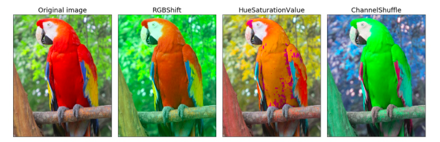
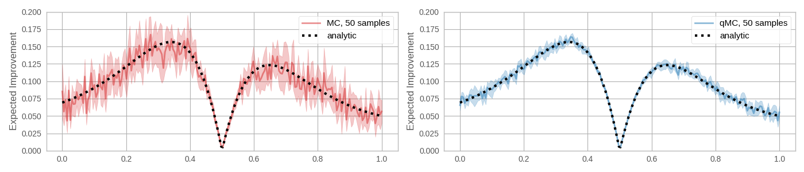
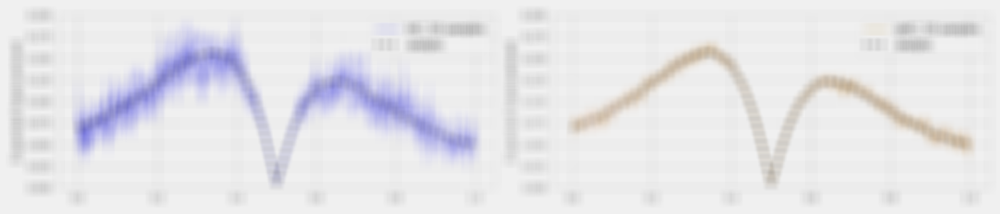
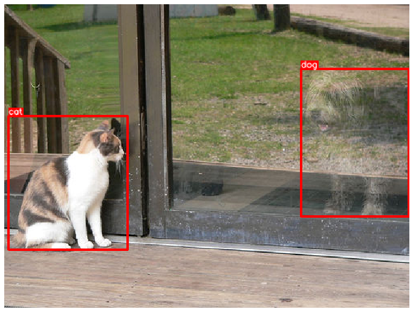
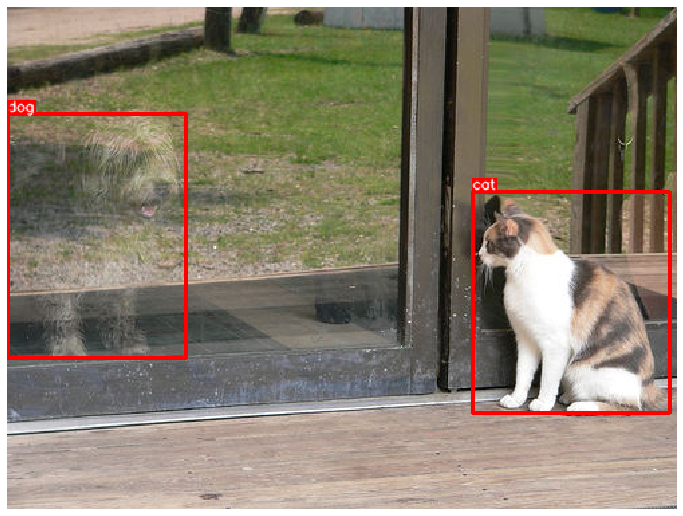
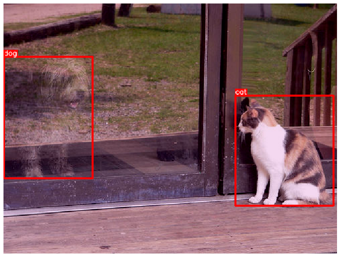

### 学习目标

* 掌握图像数据增强工具Albumentations的“能力”。
* 掌握对目标检测任务进行数据增强的实现。


---


<center>




</center>


### Albumentations简介

* 整合了70+种图像数据增强方法，针对各种CV常规任务，如分类，目标检测，语义分割等的数据增强，在业界，科学竞赛，科研中的都有很大程度的应用。


### Albumentations的增强能力

* 像素级变换
* 空间级变换

---

* 像素级变换：
	* Blur（模糊化）
	* CLAHE（对比度均衡化）
	* ChannelDropout（颜色通道置0）
	* ChannelShuffle（颜色通道打散）
	* ColorJitter（随机改变图像的亮度、对比度和饱和度）
	* Downscale（通过回缩降低图片质量）
	* Emboss（对输入图像进行浮雕并将结果与原始图像叠加）
	* Equalize（遮掩均衡）
	* FancyPCA（论文中使用的一种综合增强方法）
	* FromFloat（对浮点型矩阵的运算方法）
	* GaussNoise（对图片添加高斯噪音）
	* GaussianBlur（高斯模糊化）
	* GlassBlur（玻璃模糊化）
	* HueSaturationValue（随机改变色调和饱和度）
	* ISONoise（对图片添加传感器噪音，针对移动设备中的增强）
	* ImageCompression（图片压缩）
	* InvertImg（通过255减去当前像素值实现反转）
	* MedianBlur（中值模糊化）
	* MotionBlur（运动模糊化）
	* MultiplicativeNoise（对图片添加乘性噪音）
	* Normalize（对像素进行规范化）
	* Posterize（海报化）
	* RGBShift（颜色通道变换）
	* RandomBrightnessContrast（随机亮度和对比度调节）
	* RandomFog（随机雾化）
	* RandomGamma（随机调整图片中的gamma值）
	* RandomRain（随机添加雨天效果）
	* RandomShadow（随机添加阴影）
	* RandomSnow（随机添加雪天效果）
	* RandomSunFlare（随机添加太阳耀斑）
	* RandomToneCurve（随机改变色调曲线）
	* Sharpen（锐化特效）
	* Solarize（日晒特效）
	* Superpixels（超像素特效）
	* ToFloat（向浮点型转化）
	* ToGray（变成灰度图片）
	* ToSepia（变成棕褐图片）


> * 示例：

```shell
pip install albumentations
```


```python
# 导入必备的工具包
import albumentations as A
import cv2


# 使用cv2读取图片
image = cv2.imread("./input.png")
image = cv2.cvtColor(image, cv2.COLOR_BGR2RGB)


# 进行一系列的增强操作
transform = A.Compose([
    # 运动模糊
    A.MotionBlur(),
    # 海报化
    A.Posterize(),
    # 随机雾化
    A.RandomFog()
])

# 取出结果并保存图片
transformed = transform(image=image)["image"]
filename = "./output.png"
cv2.imwrite(filename, transformed)
```


> * 效果对比：





---


* 空间级变换：

| Transform                                                                                                                                                                       | Image | Masks | BBoxes | Keypoints |
| ------------------------------------------------------------------------------------------------------------------------------------------------------------------------------- | :---: | :---: | :----: | :-------: |
| [Affine（仿射变换）](https://albumentations.ai/docs/api_reference/augmentations/geometric/transforms/#albumentations.augmentations.geometric.transforms.Affine)                             | ✓     | ✓     | ✓      | ✓         |
| [CenterCrop（中心剪裁）](https://albumentations.ai/docs/api_reference/augmentations/crops/transforms/#albumentations.augmentations.crops.transforms.CenterCrop)                             | ✓     | ✓     | ✓      | ✓         |
| [CoarseDropout（线条舍弃以增加粗糙度）](https://albumentations.ai/docs/api_reference/augmentations/transforms/#albumentations.augmentations.transforms.CoarseDropout)                                   | ✓     | ✓     |        |           |
| [Crop（剪裁）](https://albumentations.ai/docs/api_reference/augmentations/crops/transforms/#albumentations.augmentations.crops.transforms.Crop)                                         | ✓     | ✓     | ✓      | ✓         |
| [CropAndPad（剪裁并填充）](https://albumentations.ai/docs/api_reference/augmentations/crops/transforms/#albumentations.augmentations.crops.transforms.CropAndPad)                             | ✓     | ✓     | ✓      | ✓         |
| [CropNonEmptyMaskIfExists（根据mask进行剪裁）](https://albumentations.ai/docs/api_reference/augmentations/crops/transforms/#albumentations.augmentations.crops.transforms.CropNonEmptyMaskIfExists) | ✓     | ✓     | ✓      | ✓         |
| [ElasticTransform（对图片进行弹性变换）](https://albumentations.ai/docs/api_reference/augmentations/geometric/transforms/#albumentations.augmentations.geometric.transforms.ElasticTransform)         | ✓     | ✓     |        |           |
| [Flip（水平／垂直翻转）](https://albumentations.ai/docs/api_reference/augmentations/transforms/#albumentations.augmentations.transforms.Flip)                                                     | ✓     | ✓     | ✓      | ✓         |
| [GridDistortion（指定区域失真）](https://albumentations.ai/docs/api_reference/augmentations/transforms/#albumentations.augmentations.transforms.GridDistortion)                                 | ✓     | ✓     |        |           |
| [GridDropout（网格区域舍弃）](https://albumentations.ai/docs/api_reference/augmentations/transforms/#albumentations.augmentations.transforms.GridDropout)                                       | ✓     | ✓     |        |           |
| [HorizontalFlip（水平翻转）](https://albumentations.ai/docs/api_reference/augmentations/transforms/#albumentations.augmentations.transforms.HorizontalFlip)                                 | ✓     | ✓     | ✓      | ✓         |
| [Lambda（用户自定义方法）](https://albumentations.ai/docs/api_reference/augmentations/transforms/#albumentations.augmentations.transforms.Lambda)                                                 | ✓     | ✓     | ✓      | ✓         |
| [LongestMaxSize（图片尺寸放大）](https://albumentations.ai/docs/api_reference/augmentations/geometric/resize/#albumentations.augmentations.geometric.resize.LongestMaxSize)                     | ✓     | ✓     | ✓      | ✓         |
| [MaskDropout（mask区域舍弃）](https://albumentations.ai/docs/api_reference/augmentations/transforms/#albumentations.augmentations.transforms.MaskDropout)                                       | ✓     | ✓     |        |           |
| [NoOp（空操作）](https://albumentations.ai/docs/api_reference/core/transforms_interface/#albumentations.core.transforms_interface.NoOp)                                                   | ✓     | ✓     | ✓      | ✓         |
| [OpticalDistortion（光学失真）](https://albumentations.ai/docs/api_reference/augmentations/transforms/#albumentations.augmentations.transforms.OpticalDistortion)                           | ✓     | ✓     |        |           |
| [PadIfNeeded（按需填充）](https://albumentations.ai/docs/api_reference/augmentations/transforms/#albumentations.augmentations.transforms.PadIfNeeded)                                       | ✓     | ✓     | ✓      | ✓         |
| [Perspective（四点透视变换）](https://albumentations.ai/docs/api_reference/augmentations/geometric/transforms/#albumentations.augmentations.geometric.transforms.Perspective)                   | ✓     | ✓     | ✓      | ✓         |
| [PiecewiseAffine（分段仿射）](https://albumentations.ai/docs/api_reference/augmentations/geometric/transforms/#albumentations.augmentations.geometric.transforms.PiecewiseAffine)           | ✓     | ✓     | ✓      | ✓         |
| [RandomCrop（随机剪裁）](https://albumentations.ai/docs/api_reference/augmentations/crops/transforms/#albumentations.augmentations.crops.transforms.RandomCrop)                             | ✓     | ✓     | ✓      | ✓         |
| [RandomCropNearBBox（图像中裁剪bbox，随机移动坐标）](https://albumentations.ai/docs/api_reference/augmentations/crops/transforms/#albumentations.augmentations.crops.transforms.RandomCropNearBBox)             | ✓     | ✓     | ✓      | ✓         |
| [RandomGridShuffle（随机网格打乱）](https://albumentations.ai/docs/api_reference/augmentations/transforms/#albumentations.augmentations.transforms.RandomGridShuffle)                           | ✓     | ✓     |        |           |
| [RandomResizedCrop（随机大小剪裁）](https://albumentations.ai/docs/api_reference/augmentations/crops/transforms/#albumentations.augmentations.crops.transforms.RandomResizedCrop)               | ✓     | ✓     | ✓      | ✓         |
| [RandomRotate90（随机翻转90度）](https://albumentations.ai/docs/api_reference/augmentations/geometric/rotate/#albumentations.augmentations.geometric.rotate.RandomRotate90)                     | ✓     | ✓     | ✓      | ✓         |
| [RandomScale（随机缩放）](https://albumentations.ai/docs/api_reference/augmentations/geometric/resize/#albumentations.augmentations.geometric.resize.RandomScale)                           | ✓     | ✓     | ✓      | ✓         |
| [RandomSizedBBoxSafeCrop（不丢失bbox下随机剪裁）](https://albumentations.ai/docs/api_reference/augmentations/crops/transforms/#albumentations.augmentations.crops.transforms.RandomSizedBBoxSafeCrop)   | ✓     | ✓     | ✓      |           |
| [RandomSizedCrop（随机尺寸剪裁）](https://albumentations.ai/docs/api_reference/augmentations/crops/transforms/#albumentations.augmentations.crops.transforms.RandomSizedCrop)                   | ✓     | ✓     | ✓      | ✓         |
| [Resize（改变图片尺寸）](https://albumentations.ai/docs/api_reference/augmentations/geometric/resize/#albumentations.augmentations.geometric.resize.Resize)                                     | ✓     | ✓     | ✓      | ✓         |
| [Rotate（旋转）](https://albumentations.ai/docs/api_reference/augmentations/geometric/rotate/#albumentations.augmentations.geometric.rotate.Rotate)                                     | ✓     | ✓     | ✓      | ✓         |
| [SafeRotate（安全旋转，旋转符合均匀分布）](https://albumentations.ai/docs/api_reference/augmentations/geometric/rotate/#albumentations.augmentations.geometric.rotate.SafeRotate)                             | ✓     | ✓     | ✓      | ✓         |
| [ShiftScaleRotate（平移缩放旋转）](https://albumentations.ai/docs/api_reference/augmentations/geometric/transforms/#albumentations.augmentations.geometric.transforms.ShiftScaleRotate)         | ✓     | ✓     | ✓      | ✓         |
| [SmallestMaxSize（缩小图片）](https://albumentations.ai/docs/api_reference/augmentations/geometric/resize/#albumentations.augmentations.geometric.resize.SmallestMaxSize)                   | ✓     | ✓     | ✓      | ✓         |
| [Transpose（转置操作）](https://albumentations.ai/docs/api_reference/augmentations/transforms/#albumentations.augmentations.transforms.Transpose)                                           | ✓     | ✓     | ✓      | ✓         |
| [VerticalFlip（垂直翻转）](https://albumentations.ai/docs/api_reference/augmentations/transforms/#albumentations.augmentations.transforms.VerticalFlip)                                     | ✓     | ✓     | ✓      | ✓         |


> * 试一试：
	* 根据像素级变换的代码，请同学们自己结合文档[https://albumentations.ai/docs/](https://albumentations.ai/docs/)尝试空间级的变换。

---


### 对目标检测任务进行数据增强的实现 

* 说明：
	* albumentations的bbox坐标形式类似于pascal_voc，采用极坐标表示，形如：[x_min, y_min, x_max, y_max]，而且albumentations要求坐标表示必须规范化，即使用真实坐标值除以对应的宽高，形如：[98 / 640, 345 / 480, 420 / 640, 462 / 480]。
	* 之前的coco是中心坐标表示，形如：[x_min, y_min, width, height]，而yolo是规范化中心坐标表示，形如：[((420 + 98) / 2) / 640, ((462 + 345) / 2) / 480, 322 / 640, 117 / 480]。
	


* 接下来，我们以coco数据集中的图片为例进行增强，首先下载[coco目标检测数据集](https://cocodataset.org/)，或者我们使用的实例：[https://cocodataset.org/#explore?id=386298](https://cocodataset.org/#explore?id=386298)


```python

# 导入必备的工具包
import random
import cv2
from matplotlib import pyplot as plt
import albumentations as A


# 使用cv2读取选择的一张图片
image = cv2.imread('images/000000386298.jpg')
image = cv2.cvtColor(image, cv2.COLOR_BGR2RGB)

# 找到该图片对应的标注信息，coco格式的bbox以及对应的标签
bboxes = [[5.66, 138.95, 147.09, 164.88], [366.7, 80.84, 132.8, 181.84]]
category_ids = [17, 18]

# 以及标签数值对应的实际文本
category_id_to_name = {17: 'cat', 18: 'dog'}


# 接下来我们要可视化一下这个目标检测的用例
# 我们要把这个bbox画在图片上并显示具体的标签文本


# 先定义框的颜色和文本颜色
BOX_COLOR = (255, 0, 0) # Red
TEXT_COLOR = (255, 255, 255) # White


def visualize_bbox(img, bbox, class_name, color=BOX_COLOR, thickness=2):
    """单个可视化目标框函数，参数包括，图片本身，目标框坐标，类别名字，框颜色，以及框的条纹宽度"""
    # 使用cv2.rectangle要使用极坐标，所以首先做坐标转换
    x_min, y_min, w, h = bbox
    x_min, x_max, y_min, y_max = int(x_min), int(x_min + w), int(y_min), int(y_min + h)

    # 先根据坐标画上目标框
    cv2.rectangle(img, (x_min, y_min), (x_max, y_max), color=color, thickness=thickness)

    # 设定参数来获得目标框对应的标签文本大小
    ((text_width, text_height), _) = cv2.getTextSize(class_name, cv2.FONT_HERSHEY_SIMPLEX, 0.35, 1)    
    # 再根据文本的宽高调整目标框
    cv2.rectangle(img, (x_min, y_min - int(1.3 * text_height)), (x_min + text_width, y_min), BOX_COLOR, -1)

    # 最后把文本放在目标框附近，其中设定一系列的文本参数，颜色，线条类型，字体类型等等
    cv2.putText(
        img,
        text=class_name,
        org=(x_min, y_min - int(0.3 * text_height)),
        fontFace=cv2.FONT_HERSHEY_SIMPLEX,
        fontScale=0.35, 
        color=TEXT_COLOR, 
        lineType=cv2.LINE_AA,
    )
    return img


def visualize(image, bboxes, category_ids, category_id_to_name):
    """对每一个目标框进行绘制"""
    img = image.copy()
    for bbox, category_id in zip(bboxes, category_ids):
        class_name = category_id_to_name[category_id]
        img = visualize_bbox(img, bbox, class_name)
    plt.figure(figsize=(12, 12))
    plt.axis('off')
    plt.imshow(img)
    plt.savefig("./ob_sample.png")


# 调用该函数显示coco图片
visualize(image, bboxes, category_ids, category_id_to_name)
```





* 接下来就是进行数据增强：

```python

# 使用A构建数据增强流水线
transform = A.Compose(
    # 先用一个简单的水平翻转
    [A.HorizontalFlip(p=0.5)],
    # 因为是目标检测的数据增强，要给出bbox_params，包括重要的format
    bbox_params=A.BboxParams(format='coco', label_fields=['category_ids']),
)

# 将图片，bbox以及类别id传入数据增强流水线
transformed = transform(image=image, bboxes=bboxes, category_ids=category_ids)


# 将得到的结果进行可视化
visualize(
    transformed['image'],
    transformed['bboxes'],
    transformed['category_ids'],
    category_id_to_name,
)
```





---


* 这里我们可以使用更加复杂的数据增强方式：


```python
# 使用A构建数据增强流水线
transform = A.Compose([
    A.HorizontalFlip(p=0.5),
    A.ShiftScaleRotate(p=0.5),
    A.RandomBrightnessContrast(p=0.3),
    A.RGBShift(r_shift_limit=30, g_shift_limit=30, b_shift_limit=30, p=0.3)],
    # 因为是目标检测的数据增强，要给出bbox_params，包括重要的format
    bbox_params=A.BboxParams(format='coco', label_fields=['category_ids']),
)

# 将图片，bbox以及类别id传入数据增强流水线
transformed = transform(image=image, bboxes=bboxes, category_ids=category_ids)


# 将得到的结果进行可视化
visualize(
    transformed['image'],
    transformed['bboxes'],
    transformed['category_ids'],
    category_id_to_name,
)

```





---


### 小节总结


* 学习了图像数据增强工具Albumentations的“能力”。
* 掌握了对目标检测任务进行数据增强的实现。 
