## 6.1 背景需求与分析

---

### 学习目标

* 了解该系统的背景需求。
* 通过对需求分析明确交付系统要求。

<center></center>

---

### 背景需求


* 该需求来自公司的数据分析团队，他们负责着全国教育市场现状的统计分析工作，尤其在疫情期间，多少机构从线下转到线上，不同机构线下转线上的速度以及不同区域受疫情影响的情况。这些重要信息将帮助决策层把控当前公司发展和调整的方向。


* 数据分析团队的数据抓取工程师会对各个教育机构发布的开班情况进行抓取，包括开班文案（标题和正文），开班照片等，我们希望通过这个抓取信息判断该地区的班级是否为线下开班（实际上，只有两种情况，要么线上要么线下），在这里，AI团队决定使用图片识别来区分开班情况。


---

### 需求分析

通过上述背景需求，该问题被转换成图片的二分类问题，我们首先明确以下几点:


* 系统输入: 一张班级开班照片。

* 系统输出: 是否为线下开班（0/1的决策值）。

* 在线服务: 经过与后端工程师的沟通，我最终将需要交付图片识别API，并且尽可能的缩短响应时间到ms级别。

 
以上这些也是我们最终需要交付系统的要求。


---

### 小节总结

* 学习了系统背景需求:
	* 利用人工智能等相关技术识别图片中展现的开班情况，线上开班还是线下开班。

* 学习了交付系统要求:
	* 明确了输入，输出和在线需求。


---


## 6.2 产品形态与效果展示

---

### 学习目标

* 了解系统的最终产品形态。
* 了解系统的产品设计逻辑。


---


### 产品形态

* 整个数据分析产品最终产出的是数据分析报表，里面包含在疫情影响下，各种全国机构的开班情况。


<center>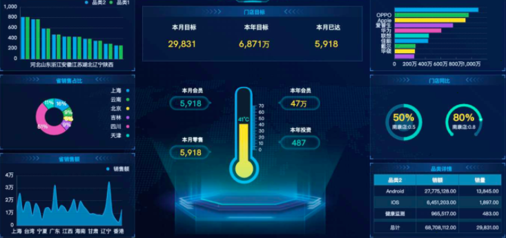</center>


---

### 产品设计逻辑


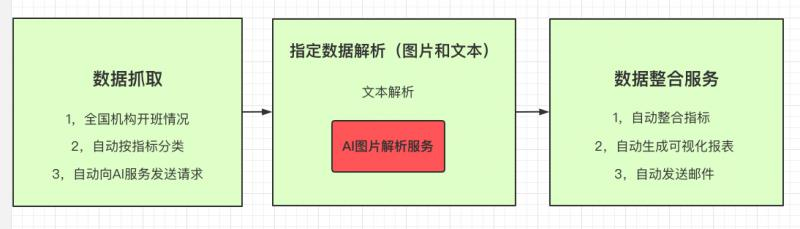


---

### 小节总结

* 学习了产品的最终形态。
* 学习了系统的输入输出过程，让我们对系统有了更加直观的认识。

---

	
## 6.3 整体解决方案初定

---


### 学习目标

* 了解初始整体解决方案的各个步骤。 


---


### 初始整体解决方案的步骤

* 第一步: 明确问题并提出数据要求
* 第二步: 对原始数据进行数据分析
* 第三步: 使用模型进行图像分类
* 第四步: 模型部署服务概述

---  

#### 第一步: 明确问题并提出数据要求
   
* 明确问题:
	* 从根据给定的图片判断是否为线下开班。

---

* 数据要求:
	*  数据抓取团队提供的全国机构开班照片不少于500张，并希望这些照片有一定的标注信息（是否为线下开班）。


---

#### 第二步: 对原始数据进行数据分析

* 数据分析指标：
	* 1，图片质量或格式过滤
> * 作用： 滤除图片中的非法格式（gif，mp4等等）
	* 2，统计图片尺寸分布
> * 作用： 了解当前图片集的图片尺寸概况，用于后续的剪裁尺寸选择。


---

#### 第三步：使用模型进行图像分类


* 根据当前的硬件设备和在线需求，我们将均衡准确率和推断时间来选择模型，简单过程如下：
	* 1，采集并标注不同类型问题的样本数据
	* 2，训练并验证Resnet系列进行分类


<center>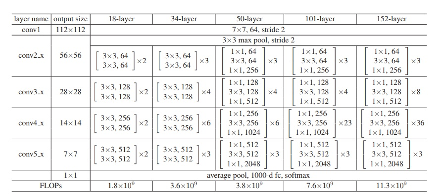</center>


---


#### 第四步: 模型部署服务概述


* 总体服务架构设计
	* 使用基于Django的服务框架。
	* 使用nginx作为反向代理和负载均衡。
	* 使用supervisor作为单服务守护与监控。
	* 使用uwsgi作为高性能web server。


---

* 模型服务封装
	* 基于tensorflow/keras框架开发的模型使用tf-serving进行封装，以保证服务健壮性以及模型热更新。
	* 基于pytorch框架开发的模型使用flask框架进行封装，使用交替双服务保证模型热更新。


---

* 系统联调与测试
	* 与外界服务使用REST API（http）进行交互。
	* 输入与输出为规范json格式（图片数据进行编码）。
	* 根据实际接口调用情况，进行并发压力测试。
	* 灰度发布，进行可用性测试。

---

* 服务器资源
	* 模型训练服务器:
	> * CPU：8C，16G内存，100G硬盘
	* 模型部署服务器:
	> * CPU：8C，16G内存，100G硬盘，2M带宽


---


### 小节总结

* 学习了初始整体解决方案的各个步骤:
	* 第一步: 明确问题并提出数据要求
	* 第二步: 对原始数据进行可视化数据分析
	* 第三步：使用模型进行图像分类
	* 第四步: 模型部署服务概述

---

## 6.4 整体解决方案实施与调整

---

### 学习目标

* 掌握整体解决方案的实施步骤和代码实现。
* 掌握根据真实数据情况作出的一些方案调整和代码实现。

---


### 整体解决方案的实施步骤

* 第一步: 获取指定数据并进行数据分析
* 第二步: 进行模型训练和验证过程的实现
* 第三步: 提升模型的训练速度
* 第四步: 提升模型的推断速度-模型剪枝

---

#### 第一步: 获取指定数据并进行数据分析

根据之前的"数据要求"，我们将从数据抓取工程师手中获得指定数据，大约2000张图片（即包含线上照片也包含线下的照片），但和我们预计的不同，这些图片并没有提供给标签，意味着需要我们自己进行相应的标注。

---

* 进行图片标注

> * 这些图片被存储在训练服务器的/data/ItcastBrain_CV/image/路径下.
	
```shell
# 通过以下shell命令获得图片数量
# 考虑数据安全，在这里并没有提供全部2132张图片，
# 只提供了部分图片，并进行了模糊化
# 图像的名字已被脱敏成数字，
# 实际上它应该是'xxx校区xxx学科xxx期开班合照'
cd /data/ItcastBrain_CV/image/
ls | wc -l
```

---

> * 在人工标注前，先创建两个文件夹分别存储对应的图片，offline和online，代表线下和线上。

```shell
mkdir /data/ItcastBrain_CV/online
mkdir /data/ItcastBrain_CV/offline 
```

---

> * 接下来，我们希望像本机一样能够查看这些图片，因此我们来到服务器的/data/ItcastBrain_CV/目录下，启动一个简单的服务：

```shell
# 你的服务器需要开通8000端口，这样就可以通过浏览器进行图片查看
python -m http.server 8000
```

---

> * 输出效果:

<center>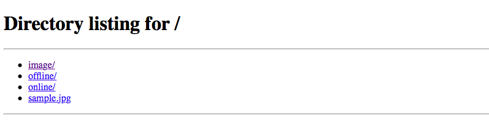</center>

---

* 这样我们就通过浏览器来查看该目录下的所有文件。查看每一张图片，将线上的图片通过`mv命令`转到online文件夹中，这样最后image就剩下offline图片，同时，在整个标注过程中，我们也将过滤掉所有非法格式和已经损坏的图片，在后续的数据分析处理过程中，将不再需要这些步骤。


---


* 通过数据增强来均衡数据集

> * 标注完成后，我们需要统计两种类型图片的数量

```shell
cd /data/ItcastBrain_CV/online
ls | wc -l
# 按照给定的部分数据，online图片数量应该是500左右


cd /data/ItcastBrain_CV/offline
ls | wc -l
# 按照给定的部分数据，offline图片数量应该是180左右
```

---

> * 数据不均衡对二分类的影响：
	* 对于分类问题的评估指标（比如acc），不均衡将导致acc不具有代表性。所以，我们需要以数据增强的方式来拓展数据，使其趋于平衡。当然解决数据不均衡不仅仅一种方式，修改损失函数中标签的权重，使用AUC指标进行评估等都是常见的选择，但是使用数据增强的方式平衡数据量是业界公认的效果更好的方式。


---

> * 如何做数据增强:
	* 对图像进行增强的方式有很多，比如，随机翻转，中心剪裁，调节亮度，调节饱和度等等，在这里我们将把online数据增强2倍来平衡offline，增强后online数据总数为180 + 2*180=540。我们选择随机调整亮度和随机调整饱和度。
	* 原因：对于哪种增强方式合适，可以通过任务特点进行一定的选择，对于该任务，即使之后的数据集足够大，在测试中也极少出现图像翻转的情况，因为抓取的开班文案一般发布前都经过审核，不会出现照片被翻转的情况，因此这方面的增强一般最后考虑。我们通过对数据的审查，这些照片来自不同的设备且在多变的环境中，因此图片亮度和饱和度是变化较大的方式。
	* 注意：关于图片增强工具的使用是没有限定的，pytorch/tensorflow框架都有实现工具，他们的实现也略有差异，我们会选择于我们增强要求最匹配的工具，这里使用tf.image。如果你想使用更加专业的数据增强工具，可以学习[Albumentations](https://github.com/albumentations-team/albumentations#documentation)，它的使用很简单，但能够增强的方式却非常丰富。

---


> * 亮度和饱和度的区别：
	* 亮度往暗走就是整个色相偏暗最暗就会变纯黑，往亮走就是整个色相偏白亮最亮就变纯白。（色相的深浅）
	* 饱和度最高就是当前色彩能达到的最大饱和程度就是最鲜艳的意思，饱和度最低就代表已经是灰色没有任何饱和度。（色相的强弱）


---

* 使用tf.image进行指定数据增强的示例


```python
# /data/ItcastBrain_CV/sample.jpg是我们给定的图片
import os
# pip install tensorflow==2.3.0
import tensorflow as tf
import PIL.Image
import matplotlib.pyplot as plt
import matplotlib as mpl
mpl.rcParams["figure.figsize"] = (12, 5)
import numpy as np

image_path = "./"
image_name = "sample.jpg"
# 将图片读入内存，与tf.io.decode_image配合使用
image_string = tf.io.read_file(os.path.join(image_path, image_name))
# 将其转换成张量，保留颜色通道
image = tf.io.decode_image(image_string, channels=3)

# 接下来我们看一下增强的效果
# 饱和度调节
saturation_image = tf.image.random_saturation(image, 5, 10)
saturation_image = tf.io.encode_jpeg(saturation_image)
filepath = os.path.join(image_path, "saturation_" + image_name)
tf.io.write_file(
    filepath, saturation_image
)
# 亮度调节
brightness_image = tf.image.random_brightness(image, 0.2)
brightness_image = tf.io.encode_jpeg(brightness_image)
filepath = filepath = os.path.join(image_path, "brightness_" + image_name)
tf.io.write_file(
    filepath, brightness_image
)

```

---
 
> * 代码位置:
	* /data/ItcastBrain_CV/data_analysis.py

---

> * 输出效果:
	* 在当前目录下生成brightness_sample.jpg和saturation_sample.jpg


---


> * 通过浏览器查看原图，亮度增强图，饱和度增强图

<center>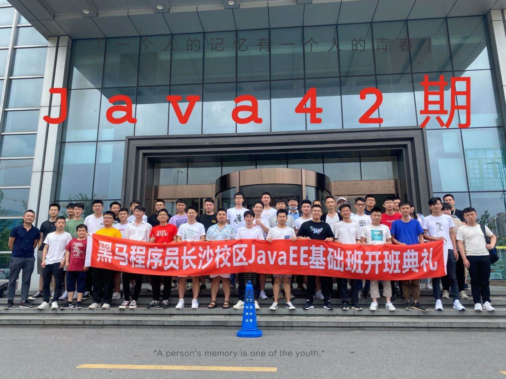</center>
<center>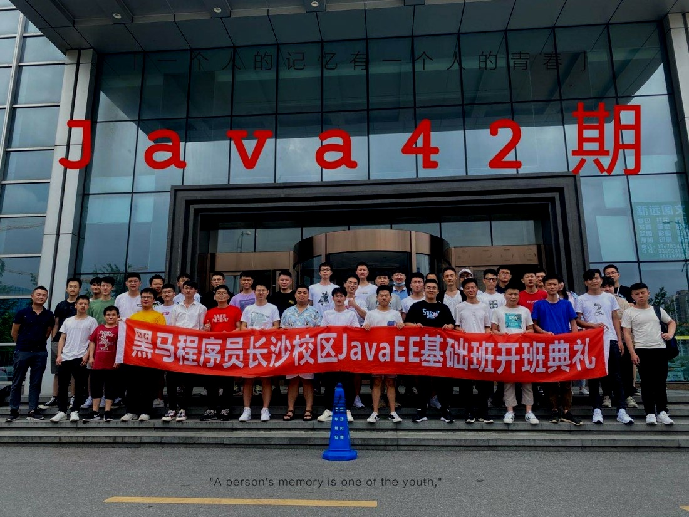</center>
<center>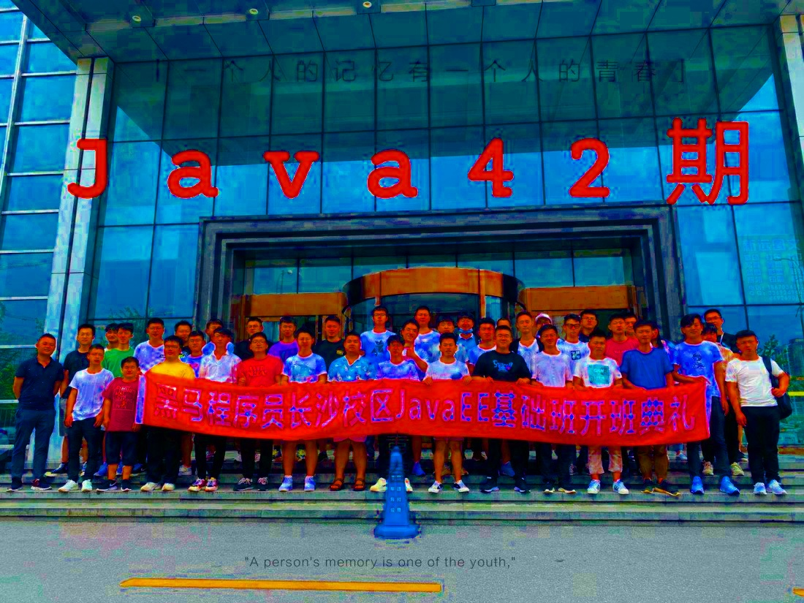</center>


---


> * 对online中的图片进行增强

```python
# 读取所有图片
online_image_path = "./online/"
online_image_names = os.listdir(online_image_path)

# 与刚刚的方式类似，只不过这次需要循环
for image_name in online_image_names:
    image_string = tf.io.read_file(os.path.join(online_image_path, image_name))
    image = tf.io.decode_image(image_string, channels=3)
    ## 饱和度调节
    saturation_image = tf.image.random_saturation(image, 5, 10)
    saturation_image = tf.io.encode_jpeg(saturation_image)
    filepath = os.path.join(online_image_path, "saturation_" + image_name)
    tf.io.write_file(filepath, saturation_image)
    ## 亮度调节
    brightness_image = tf.image.random_brightness(image, 0.2)
    brightness_image = tf.io.encode_jpeg(brightness_image)
    filepath = filepath = os.path.join(online_image_path, "brightness_" + image_name)
    tf.io.write_file(filepath, brightness_image)

print("Finished!")
```
---

> * 代码位置:
	* /data/ItcastBrain_CV/data_analysis.py

---

> * 输出效果:
	* 在/data/ItcastBrain_CV/online/路径下，图片数量增至500+
	* 在该路径下使用`ls | wc -l`查看文件数量


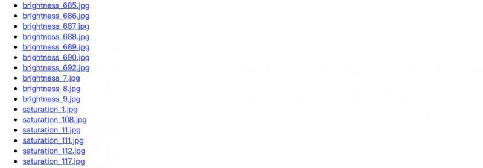


---

* 统计图片宽-高分布
	* 因为图片是我们人工标注的，因此不需要在进行格式过滤。
	* 但查看宽-高分布是有必要的，因为之后在输入模型前需要规范图片尺寸，通过该分布，可以获得比较合适的中间值。

```python
import seaborn as sns

# 准备online和offline路径下的图片名字
online_image_path = "./online/"
online_image_names = os.listdir(online_image_path)
offline_image_path = "./offline/"
offline_image_names = os.listdir(offline_image_path)

# 初始化宽度和高度列表
w_list = []
h_list = []

# 对所有的图片（包括online和offline）名字进行遍历
for image_name in online_image_names + offline_image_names:
    # 这里使用try来区分打开图片，因为这些图片名字既有online又有offline
    # 在online路径下打开出错，则在offline路径下打开 
    try:
        im = Image.open(os.path.join(online_image_path, image_name))
    except:
        im = Image.open(os.path.join(offline_image_path, image_name))
    # 将每张图片的宽高存入列表
    w_list.append(im.size[0])
    h_list.append(im.size[1])


# 接下来绘制学员对话句子的长度分布图
sns.distplot(w_list)
# 主要关注dist长度分布横坐标, 不需要绘制纵坐标
plt.yticks([])
plt.savefig("./w_distribu.png")
plt.close()

# 绘制学员对话句子的长度分布图
sns.distplot(h_list)
# 主要关注dist长度分布横坐标, 不需要绘制纵坐标
plt.yticks([])
plt.savefig("./h_distribu.png")
```


---

> * 代码位置:
	* /data/ItcastBrain_CV/data_analysis.py

---


> * 输出效果:
	* 在/data/ItcastBrain_CV/路径下生成w_distribu.png和h_distribu.png两张图片。


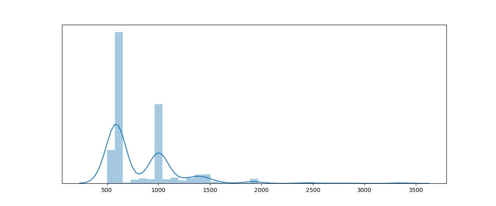
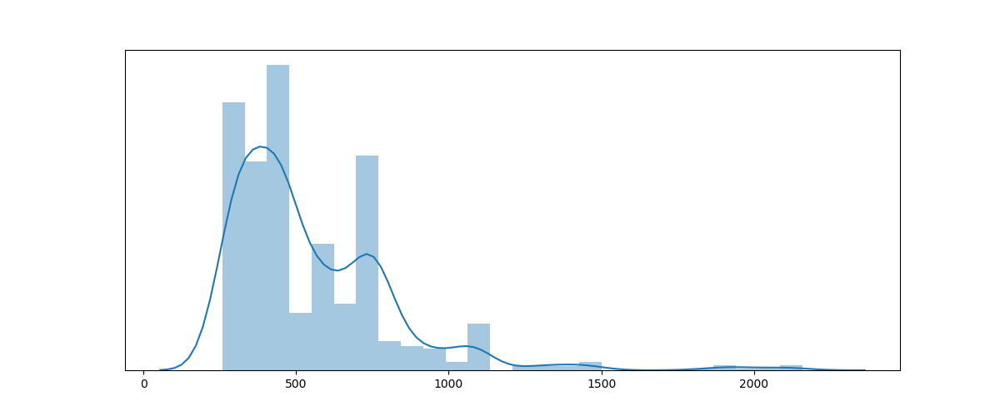


> * 分析:
	* 从图中我们可以看到所有图片的宽度范围大概为：500-2000，密度较高在500-1000之间；高度范围大概为：250-2000，密度较高在250-750之间，因此较合理的规范裁剪宽度为(500 + 1000)/2 = 750, 剪裁高度为(250 + 750)/2 = 500。这在训练前处理时将会使用。

---

* 划分训练集和验证集
	* 在这里我们划分比例并不是之前的0.2或者0.3，而是选择了更大的0.7（70%是验证集，只有30%是训练集）
	* 原因：因为总体上，训练数据总量并不大，因此过小的验证集可能不具有代表性，因此一定要加大验证集部分的比例，同时，你可能担心这会造成训练数据过少，而实际上，我们这里使用的训练方法是在预训练模型上进行微调，实验表明微调能够在很小的数据集上取得效果（甚至仅有100张图片）。

```shell
# 使用shell命令，创建train和val路径, 在train和val内再创建online和offline文件夹
mkdir /data/ItcastBrain_CV/train/
mkdir /data/ItcastBrain_CV/train/online/
mkdir /data/ItcastBrain_CV/train/offline/
mkdir /data/ItcastBrain_CV/val/
mkdir /data/ItcastBrain_CV/val/online/
mkdir /data/ItcastBrain_CV/val/offline/
```


```python
# 定义训练集和验证集存储路径
train_online_image_path = "./train/online/"
train_offline_image_path = "./train/offline/"
val_online_image_path = "./val/online/"
val_offline_image_path = "./val/offline/"

# 进行比例划分
online_train_num = int(len(online_image_names) * 0.3)
online_val_num = len(online_image_names) - online_train_num

offline_train_num = int(len(offline_image_names) * 0.3)
offline_val_num = len(offline_image_names) - offline_train_num

# 查看online和offline中划分的训练和验证图片数量
print(online_train_num, online_val_num)
print(offline_train_num, offline_val_num)

# 使用该工具中的copyfile方法复制粘贴功能
import shutil

# 将online数据分到train/online和val/online中
for image_name in online_image_names[:online_train_num]:
    shutil.copyfile(os.path.join(online_image_path, image_name), os.path.join(train_online_image_path, image_name))

for image_name in online_image_names[online_train_num:]:
    shutil.copyfile(os.path.join(online_image_path, image_name), os.path.join(val_online_image_path, image_name))

# 将offline数据分到train/offline和val/offline中
for image_name in offline_image_names[:offline_train_num]:
    shutil.copyfile(os.path.join(offline_image_path, image_name), os.path.join(train_offline_image_path, image_name))

for image_name in offline_image_names[offline_train_num:]:
    shutil.copyfile(os.path.join(offline_image_path, image_name), os.path.join(val_offline_image_path, image_name))
```

---

* 代码位置:
	* /data/ItcastBrain_CV/data_analysis.py

---

> * 输出效果:

```text
# online划分数量
165 387

# offline划分数量
152 356
```

> * 在/data/ItcastBrain_CV/train/online/，
      /data/ItcastBrain_CV/train/offline/，
      /data/ItcastBrain_CV/val/online/，
      /data/ItcastBrain_CV/val/offline/路径下都有对应的图片文件。


---


#### 第二步: 进行模型训练和验证过程的实现


在模型训练前，我们需要进行模型的选择，CV发展至今，已经积累了大量的用于分类任务的模型，它们在标准任务上都有不错的表现，同时，这些模型也在pytorch框架中有了标准实现，这对于我们进行快速应用具有重要意义。


* 下面我们看一下pytorch实现的29个主流预训练模型在标准数据集ImageNet上的表现：

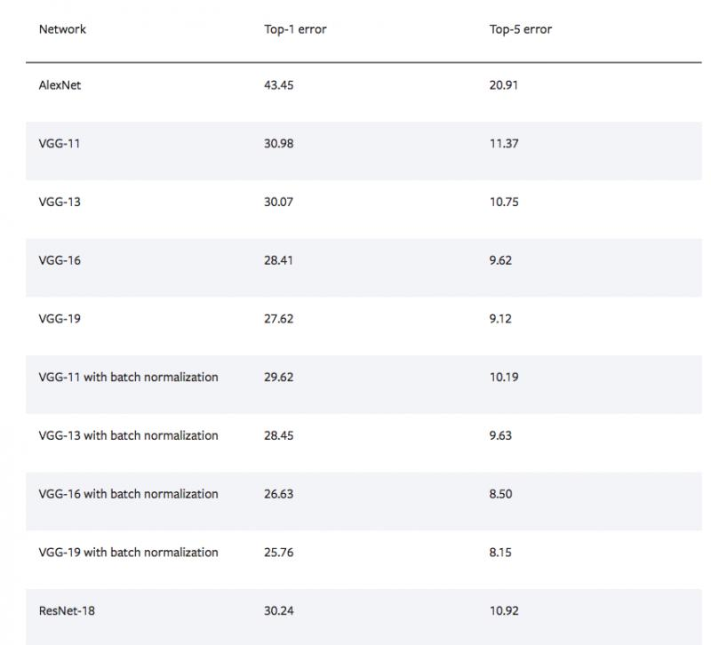
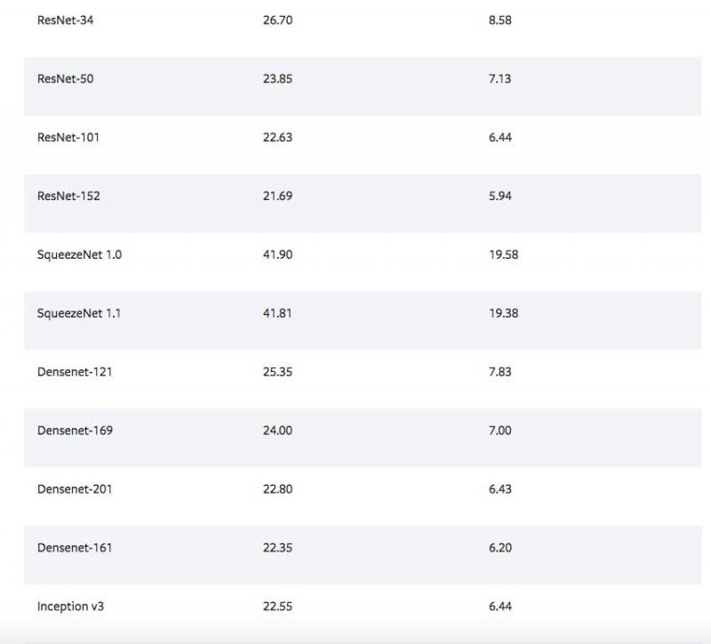
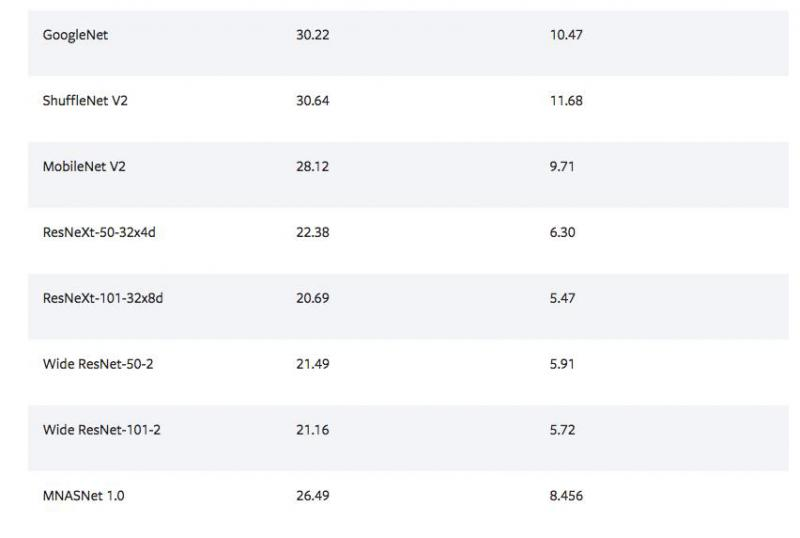


> * 分析：
	* top-N error是图像多分类问题重要的指标，因为该指标代表错误率，因此该值越小模型效果越好。从图中可以看出，ResNet系列模型在分类任务上具有非常不错的表现，无论是top-1 error还是top-5 error都有最佳成绩，这是我们选定该系列模型的原因。选定模型系列后，接下来我们将比对整个Resnet系列中若干模型在实际数据集上的效果。


---


* 封装数据成为pytorch中的datasets对象

```python
## torch-1.6.0 torchvision-0.7.0
import torch
import torch.nn as nn
import torch.optim as optim
from torch.optim import lr_scheduler
import numpy as np
import torchvision
from torchvision import datasets, models, transforms
import time
import os
import copy

# 该脚本将写在/data/ItcastBrain_CV/路径下
data_dir = './'

# 根据之前的数据分析获得
gold_size = (700, 500)

# 使模型输入张量服从标准正态分布，第一个参数为均值列表，代表各个通道的均值，
# 第二个参数为标准差列表，代表各个通道的标准差。这里的图片都是有三个通道。
# 其中均值和标准差列表中的数值来自对ImageNet的全局采样结果。 
# gold_normalize = ([0.485, 0.456, 0.406], [0.229, 0.224, 0.225])

# 定义一系列标准处理流程，Resize，张量化，规范化
# Resize和张量化用于统一图片尺寸和满足框架要求
# 规范化便于模型快速收敛
data_transforms = {
    'train': transforms.Compose([
        transforms.RandomResizedCrop(gold_size),
        transforms.ToTensor(),
        transforms.Normalize(gold_normalize[0], gold_normalize[1])
    ]),
    'val': transforms.Compose([
        transforms.Resize(gold_size),
        transforms.ToTensor(),
        transforms.Normalize(gold_normalize[0], gold_normalize[1])
    ]),
}

# 使用datasets的ImageFolder方法进行数据读取，并通过data_transforms处理
image_datasets = {x: datasets.ImageFolder(os.path.join(data_dir, x),
                                          data_transforms[x])
                  for x in ['train', 'val']}


# 之后使用DataLoader进行封装，使其每个批次能够使用迭代器以便减小内存，
# 这里设置批次大小为8，并打乱顺序，每次启用4个子进程来一同加载对应批次的数据。
dataloaders = {x: torch.utils.data.DataLoader(image_datasets[x], batch_size=8,
                                             shuffle=True, num_workers=4)
              for x in ['train', 'val']}


print(dataloaders)
dataset_sizes = {x: len(image_datasets[x]) for x in ['train', 'val']}
print(dataset_sizes)

# 如果有GPU我们将使用该设备训练
# 我们将在一台Tesla T4上进行训练，单精度峰值算力8.1TFLOPS
device = torch.device("cuda:0" if torch.cuda.is_available() else "cpu")
```

---

> * 代码位置: 
	* /data/ItcastBrain_CV/data_analysis.py

---

> * 输出效果:

```text
{'train': <torch.utils.data.dataloader.DataLoader object at 0x7f620d4d2550>, 
 'val': <torch.utils.data.dataloader.DataLoader object at 0x7f620d4d2390>}
{'train': 317, 'val': 743}
```


---


* 模型训练与验证的实现

```python
def train_and_eval_model(model, criterion, optimizer, scheduler, num_epochs=25):
    """训练并验证模型
 
    Args:
      model: 模型对象，这里将传入预训练模型
      criterion: 损失计算方法
      optimizer: 优化器
      sheduler: 学习率调节器
      num_epochs: 训练轮数
 
    Return: 
      训练后的模型
    """
    # 获得训练开始时间
    since = time.time()

    # 获得最初的model状态字典(参数)，使用深拷贝使best_model_wts值稳定
    best_model_wts = copy.deepcopy(model.state_dict())
    # 初始化模型准确率
    best_acc = 0.0

    # 循环轮数训练
    for epoch in range(num_epochs):
        # 打印轮数
        print('Epoch {}/{}'.format(epoch + 1, num_epochs))
        print('-' * 10)

        # 依次进入训练和验证阶段，处理方式有所不同
        for phase in ['train', 'val']:
            # 开启训练模式或验证模式
            model.train() if phase == 'train' else model.eval()
            # 初始化该轮次的损失和准确率
            running_loss = 0.0
            running_corrects = 0

            # 在该轮次中迭代批次数据
            for inputs, labels in dataloaders[phase]:
                inputs = inputs.to(device)
                labels = labels.to(device)

                # 梯度初始化
                optimizer.zero_grad()

                # 自动梯度计算是否开启，训练则开启，验证则不开启
                with torch.set_grad_enabled(phase=='train'):
                    # 使用模型获得输出分布
                    outputs = model(inputs)
                    # 从分布中获取概率最大的结果
                    _, preds = torch.max(outputs, 1)
                    # 计算当前损失
                    loss = criterion(outputs, labels)
                    if phase == 'train':
                        # 如果是训练阶段，误差反向传播
                        loss.backward()
                        # 更新参数
                        optimizer.step()

                # 计算平均损失和准确率
                running_loss += loss.item() * inputs.size(0)
                running_corrects += torch.sum(preds == labels.data)

            # 每一轮调整一次学习率
            if phase == 'train': scheduler.step()
            # 计算每轮的平均损失和准确率
            epoch_loss = running_loss / dataset_sizes[phase]
            epoch_acc = running_corrects.double() / dataset_sizes[phase]

            # 打印每轮的结果
            print('{} Loss: {:.4f} Acc: {:.4f}'.format(
                phase, epoch_loss, epoch_acc))

            # 在验证过程中，找到准确率最高的结果并保存该次模型的参数
            if phase == 'val' and epoch_acc > best_acc:
                best_acc = epoch_acc
                best_model_wts = copy.deepcopy(model.state_dict())

    # 获得模型训练和验证结束时间
    time_elapsed = time.time() - since
    # 打印模型训练和验证耗时最佳准确率
    print('Training complete in {:.0f}m {:.0f}s'.format(
        time_elapsed // 60, time_elapsed % 60))
    print('Best val Acc: {:4f}'.format(best_acc))

    # 模型重载最佳参数
    model.load_state_dict(best_model_wts)
    # 返回结果
    return model
```

---

> * 调用：

```python
# 加载resnet18模型和全部预训练参数
model = models.resnet18(pretrained=True)


# 取resnet18原有的最后一层(全连接层)输入特征(in_features)维度
num_ftrs = model.fc.in_features

# 替换原有的最后一层，输入维度不变，输出维度变为2
model.fc = nn.Linear(num_ftrs, 2)

# 将修改后的模型发到指定设备上
model = model.to(device)

# 定义交叉熵损失函数
criterion = nn.CrossEntropyLoss()

# 定义SGD优化器
optimizer = optim.SGD(model.parameters(), lr=0.001, momentum=0.9)

# 定义学习率调节器
scheduler = lr_scheduler.StepLR(optimizer, step_size=7, gamma=0.1)

# 调用train_model进行模型训练
model_ft = train_model(model, criterion, optimizer, scheduler, num_epochs=5)
```

---

* 代码位置:
	* /data/ItcastBrain_CV/train.py

---

> * 输出效果:

```text
Epoch 1/5
----------
train Loss: 0.3131 Acc: 0.8770
val Loss: 0.0840 Acc: 0.9865
Epoch 2/5
----------
train Loss: 0.1194 Acc: 0.9558
val Loss: 0.0083 Acc: 1.0000
Epoch 3/5
----------
train Loss: 0.0925 Acc: 0.9621
val Loss: 0.0093 Acc: 1.0000
Epoch 4/5
----------
train Loss: 0.1181 Acc: 0.9495
val Loss: 0.0039 Acc: 1.0000
Epoch 5/5
----------
train Loss: 0.0852 Acc: 0.9621
val Loss: 0.0068 Acc: 1.0000
Training complete in 1m 5s
Best val Acc: 1.000000
```


---

* 结论：
	* 我们发现，使用少量微调数据，就可以使用resnet18在验证集上达到近100%的准确率，可见迁移学习的“功力”所在，这也是为什么现在迁移学习风靡的重要原因。最终5个轮次在Tesla T4上训练耗时仅为1m5s。


---


* 如何在其他Resnet系列模型上训练

```python
# 只需修改模型名称即可, 修改上述代码
model = models.resnet18(pretrained=True)

# 修改为以下模型，可以逐个进行尝试
model = models.resnet34(pretrained=True)
model = models.resnet50(pretrained=True)
model = models.resnet101(pretrained=True)
model = models.resnet152(pretrained=True)
```

> * 对比结果
	* 所有模型均可达到验证准确率近100%，Telas T4上的5轮训练时间如下表：


<center>

|resnet18|resnet34|resnet50|resnet101|resnet152|
|--|--|--|--|--|
|1m5s|1m55s|2m32s|5m2s|9m17s|

</center>

---


* 保存模型

```python
PATH_ = "./18_model_ft_params.pth"
torch.save(model_ft.state_dict(), PATH_)
```

---

> * 代码位置：
	* /data/ItcastBrain_CV/train.py


---

> * 输出效果：
	* 在该目录下将得到18_model_ft_params.pth参数文件。


---


#### 第三步: 提升模型的训练速度

当前我们的模型在验证集的准确率已经非常高，我们不再需要优化准确率，但我们希望模型训练的速度能够进一步提升，这样就能够根据每一批新来的数据快速的迭代模型，以适应最新的数据规律。


* 冻结大部分参数的方式进行微调

```python
# 与之前相同，加载resnet18的模型和参数
model_conv = torchvision.models.resnet18(pretrained=True)

# 冻结指定网络的参数，
# 这里将resnet18特征提取部分的所有参数冻结(不求梯度)
for param in model_conv.parameters():
    param.requires_grad = False

# 相当于只去微调最后面的输出层
num_ftrs = model_conv.fc.in_features
model_conv.fc = nn.Linear(num_ftrs, 2)
model_conv = model_conv.to(device)

criterion = nn.CrossEntropyLoss()

optimizer_conv = optim.SGD(model_conv.fc.parameters(), lr=0.001, momentum=0.9)

exp_lr_scheduler = lr_scheduler.StepLR(optimizer_conv, step_size=7, gamma=0.1)

# 调用train_model进行模型训练
model_ft = train_model(model_conv, criterion, optimizer_conv, exp_lr_scheduler, num_epochs=5)
```

---

> * 代码位置：
	* /data/ItcastBrain_CV/train.py

---

> * 输出效果:

```text
Epoch 1/5
----------
train Loss: 0.4970 Acc: 0.7161
val Loss: 0.1035 Acc: 1.0000
Epoch 2/5
----------
train Loss: 0.2245 Acc: 0.9085
val Loss: 0.0733 Acc: 0.9919
Epoch 3/5
----------
train Loss: 0.2272 Acc: 0.9274
val Loss: 0.0376 Acc: 1.0000
Epoch 4/5
----------
train Loss: 0.1374 Acc: 0.9653
val Loss: 0.0747 Acc: 0.9812
Epoch 5/5
----------
train Loss: 0.1624 Acc: 0.9369
val Loss: 0.0262 Acc: 1.0000
Training complete in 0m 43s
Best val Acc: 1.000000
```

---

> * 结论：
	* 该种微调方式仍能保证验证准确率，同时将5轮训练时间缩短为43s（之前为1m5s），同学们可以自测该种方式下其它Resnet系列模型的训练时间。

---

* 不同微调方式下模型的参数情况
	* 通过summary工具包查看模型参数。

```shell
pip install torchsummary==1.5.1
```

---

```python
import os
import torch
import torch.nn as nn
import torchvision
from torchvision import datasets, models, transforms
from torchsummary import summary
device = torch.device("cuda" if torch.cuda.is_available() else "cpu")

# 恢复模型结构
model = torchvision.models.resnet18(pretrained=True)
num_ftrs = model.fc.in_features
model.fc = nn.Linear(num_ftrs, 2)

# 参数路径
PATH = "18_model_ft_params.pth"
# 恢复参数
model.load_state_dict(torch.load(PATH))
model.eval()

# 查看当前模型情况
summary(model, (3, 700, 500), device="cpu")
```

---

> * 代码位置:
	* /data/ItcastBrain_CV/test.py

---


> * 输出效果:

```text
----------------------------------------------------------------
        Layer (type)               Output Shape         Param #
================================================================
            Conv2d-1         [-1, 64, 112, 112]           9,408
       BatchNorm2d-2         [-1, 64, 112, 112]             128
              ReLU-3         [-1, 64, 112, 112]               0
         MaxPool2d-4           [-1, 64, 56, 56]               0
            Conv2d-5           [-1, 64, 56, 56]          36,864
       BatchNorm2d-6           [-1, 64, 56, 56]             128
              ReLU-7           [-1, 64, 56, 56]               0
            Conv2d-8           [-1, 64, 56, 56]          36,864
       BatchNorm2d-9           [-1, 64, 56, 56]             128
             ReLU-10           [-1, 64, 56, 56]               0
       BasicBlock-11           [-1, 64, 56, 56]               0
           Conv2d-12           [-1, 64, 56, 56]          36,864
      BatchNorm2d-13           [-1, 64, 56, 56]             128
             ReLU-14           [-1, 64, 56, 56]               0
           Conv2d-15           [-1, 64, 56, 56]          36,864
      BatchNorm2d-16           [-1, 64, 56, 56]             128
             ReLU-17           [-1, 64, 56, 56]               0
       BasicBlock-18           [-1, 64, 56, 56]               0
           Conv2d-19          [-1, 128, 28, 28]          73,728
      BatchNorm2d-20          [-1, 128, 28, 28]             256
             ReLU-21          [-1, 128, 28, 28]               0
           Conv2d-22          [-1, 128, 28, 28]         147,456
      BatchNorm2d-23          [-1, 128, 28, 28]             256
           Conv2d-24          [-1, 128, 28, 28]           8,192
      BatchNorm2d-25          [-1, 128, 28, 28]             256
             ReLU-26          [-1, 128, 28, 28]               0
       BasicBlock-27          [-1, 128, 28, 28]               0
           Conv2d-28          [-1, 128, 28, 28]         147,456
      BatchNorm2d-29          [-1, 128, 28, 28]             256
             ReLU-30          [-1, 128, 28, 28]               0
           Conv2d-31          [-1, 128, 28, 28]         147,456
      BatchNorm2d-32          [-1, 128, 28, 28]             256
             ReLU-33          [-1, 128, 28, 28]               0
       BasicBlock-34          [-1, 128, 28, 28]               0
           Conv2d-35          [-1, 256, 14, 14]         294,912
      BatchNorm2d-36          [-1, 256, 14, 14]             512
             ReLU-37          [-1, 256, 14, 14]               0
           Conv2d-38          [-1, 256, 14, 14]         589,824
      BatchNorm2d-39          [-1, 256, 14, 14]             512
           Conv2d-40          [-1, 256, 14, 14]          32,768
      BatchNorm2d-41          [-1, 256, 14, 14]             512
             ReLU-42          [-1, 256, 14, 14]               0
       BasicBlock-43          [-1, 256, 14, 14]               0
           Conv2d-44          [-1, 256, 14, 14]         589,824
      BatchNorm2d-45          [-1, 256, 14, 14]             512
             ReLU-46          [-1, 256, 14, 14]               0
           Conv2d-47          [-1, 256, 14, 14]         589,824
      BatchNorm2d-48          [-1, 256, 14, 14]             512
             ReLU-49          [-1, 256, 14, 14]               0
       BasicBlock-50          [-1, 256, 14, 14]               0
           Conv2d-51            [-1, 512, 7, 7]       1,179,648
      BatchNorm2d-52            [-1, 512, 7, 7]           1,024
             ReLU-53            [-1, 512, 7, 7]               0
           Conv2d-54            [-1, 512, 7, 7]       2,359,296
      BatchNorm2d-55            [-1, 512, 7, 7]           1,024
           Conv2d-56            [-1, 512, 7, 7]         131,072
      BatchNorm2d-57            [-1, 512, 7, 7]           1,024
             ReLU-58            [-1, 512, 7, 7]               0
       BasicBlock-59            [-1, 512, 7, 7]               0
           Conv2d-60            [-1, 512, 7, 7]       2,359,296
      BatchNorm2d-61            [-1, 512, 7, 7]           1,024
             ReLU-62            [-1, 512, 7, 7]               0
           Conv2d-63            [-1, 512, 7, 7]       2,359,296
      BatchNorm2d-64            [-1, 512, 7, 7]           1,024
             ReLU-65            [-1, 512, 7, 7]               0
       BasicBlock-66            [-1, 512, 7, 7]               0
AdaptiveAvgPool2d-67            [-1, 512, 1, 1]               0
           Linear-68                    [-1, 2]           1,026
================================================================
Total params: 11,177,538
Trainable params: 1,026
Non-trainable params: 11,176,512
----------------------------------------------------------------
Input size (MB): 0.57
Forward/backward pass size (MB): 62.79  ## 该模型完成正向/反向传播时需要占用的内存空间
Params size (MB): 42.64
Estimated Total Size (MB): 106.00
----------------------------------------------------------------
```

> * 结论：
	* 通过第二种微调方式，该模型只训练了1026个可调参数，而使用第一种微调方式，则是下面的参数量，这也是训练速度的差异所在。

```text
================================================================
Total params: 11,177,538
Trainable params: 11,177,538
Non-trainable params: 0
----------------------------------------------------------------
Input size (MB): 4.01
Forward/backward pass size (MB): 441.02
Params size (MB): 42.64
Estimated Total Size (MB): 487.66
----------------------------------------------------------------
```

---


* 使用模型进行预测并计算单条推断时间

```python
from PIL import Image
import time

# 以sample.jpg为例，它是一张offline（线下开班）的图片
data_dir = "./"
image = "sample.jpg"

# 使用GPU时使用
# model.to(device)

def singe_predict(data_dir, image):
    # 读取图片
    im = Image.open(os.path.join(data_dir, image)).convert('RGB')
    # 图片预处理
    data_transforms = transforms.Compose([
             transforms.Resize((700, 500)),
             transforms.ToTensor(),
             transforms.Normalize([0.485, 0.456, 0.406], [0.229, 0.224, 0.225])
        ])

    image_tensor = data_transforms(im)
    # 拓展维度，因为之前训练时有batch_size这个维度
    image_tensor = image_tensor.unsqueeze(0)
    # 使用GPU时使用
    # image_tensor = image_tensor.to(device)
    res = model(image_tensor)
    return torch.argmax(res).item()


if __name__ == "__main__":
    start = time.time()
    res = singe_predict(data_dir, image)
    end = time.time()
    # 打印单条预测时间
    print("Interval:", end - start)
    # 打印预测结果
    print(res)
```

---

> * 代码位置:
	* /data/ItcastBrain_CV/test.py

---

> * 输出效果:

```text
# 在CPU上单条推断时间在125ms左右
Interval: 0.12526451587677002

# 在GPU（Tesla T4）上单条推断时间在44ms左右
Interval: 0.4454502123531231

# 0表示offline，1表示online
0
```

---

* 更多的测试
	* 我们可以使用更多的图片，如image_dir = "./offline/77.jpg"等进行测试效果。

---


#### 第四步: 提升模型的推断速度-模型剪枝

关于剪枝技术原理可参见[第七章：模型剪枝技术](http://52.83.69.131:8123/7/)，下面是有关剪枝技术的直接应用。

* 使用剪枝技术的原因：
	* 我们CPU设备（16C）上的单条推断时间，包括图片预处理和模型推断时间，共计125ms左右（其中仅模型推断时间约95ms），我们希望将单条推断时间由125ms控制到90ms左右，即100ms内，同时准确率不可以下降低于95%，这里选择了剪枝技术来实现。
	
---

* 使用剪枝技术的步骤：
	* 1：加载未剪枝模型
	* 2：进行全局剪枝
	* 3：查看当前推断时间
	* 4：查看当前准确率

---


* 1：加载未剪枝模型

```python
# 导入必备的工具包
import os
import torch
from torch import nn
import torch.nn.utils.prune as prune
import torch.nn.functional as F
import torchvision
from torchvision import transforms

device = torch.device("cuda" if torch.cuda.is_available() else "cpu")

# 保存的模型参数地址
PATH = "./18_model_ft_params.pth"

# 重现模型结构
model = torchvision.models.resnet18(pretrained=True)
num_ftrs = model.fc.in_features
model.fc = nn.Linear(num_ftrs, 2)

# 加载参数
model.load_state_dict(torch.load(PATH))
model.eval()

# 打印模型结构，以确定剪枝名称
print(model)
```

---

> * 代码位置:
	* /data/ItcastBrain_CV/pruned.py


> * 输出效果:

```text
# 之后我们的剪枝时将指定该结构中的层名称

ResNet(
  (conv1): Conv2d(3, 64, kernel_size=(7, 7), stride=(2, 2), padding=(3, 3), bias=False)
  (bn1): BatchNorm2d(64, eps=1e-05, momentum=0.1, affine=True, track_running_stats=True)
  (relu): ReLU(inplace=True)
  (maxpool): MaxPool2d(kernel_size=3, stride=2, padding=1, dilation=1, ceil_mode=False)
  (layer1): Sequential(
    (0): BasicBlock(
      (conv1): Conv2d(64, 64, kernel_size=(3, 3), stride=(1, 1), padding=(1, 1), bias=False)
      (bn1): BatchNorm2d(64, eps=1e-05, momentum=0.1, affine=True, track_running_stats=True)
      (relu): ReLU(inplace=True)
      (conv2): Conv2d(64, 64, kernel_size=(3, 3), stride=(1, 1), padding=(1, 1), bias=False)
      (bn2): BatchNorm2d(64, eps=1e-05, momentum=0.1, affine=True, track_running_stats=True)
    )
    (1): BasicBlock(
      (conv1): Conv2d(64, 64, kernel_size=(3, 3), stride=(1, 1), padding=(1, 1), bias=False)
      (bn1): BatchNorm2d(64, eps=1e-05, momentum=0.1, affine=True, track_running_stats=True)
      (relu): ReLU(inplace=True)
      (conv2): Conv2d(64, 64, kernel_size=(3, 3), stride=(1, 1), padding=(1, 1), bias=False)
      (bn2): BatchNorm2d(64, eps=1e-05, momentum=0.1, affine=True, track_running_stats=True)
    )
  )
  (layer2): Sequential(
    (0): BasicBlock(
      (conv1): Conv2d(64, 128, kernel_size=(3, 3), stride=(2, 2), padding=(1, 1), bias=False)
      (bn1): BatchNorm2d(128, eps=1e-05, momentum=0.1, affine=True, track_running_stats=True)
      (relu): ReLU(inplace=True)
      (conv2): Conv2d(128, 128, kernel_size=(3, 3), stride=(1, 1), padding=(1, 1), bias=False)
      (bn2): BatchNorm2d(128, eps=1e-05, momentum=0.1, affine=True, track_running_stats=True)
      (downsample): Sequential(
        (0): Conv2d(64, 128, kernel_size=(1, 1), stride=(2, 2), bias=False)
        (1): BatchNorm2d(128, eps=1e-05, momentum=0.1, affine=True, track_running_stats=True)
      )
    )
    (1): BasicBlock(
      (conv1): Conv2d(128, 128, kernel_size=(3, 3), stride=(1, 1), padding=(1, 1), bias=False)
      (bn1): BatchNorm2d(128, eps=1e-05, momentum=0.1, affine=True, track_running_stats=True)
      (relu): ReLU(inplace=True)
      (conv2): Conv2d(128, 128, kernel_size=(3, 3), stride=(1, 1), padding=(1, 1), bias=False)
      (bn2): BatchNorm2d(128, eps=1e-05, momentum=0.1, affine=True, track_running_stats=True)
    )
  )
  (layer3): Sequential(
    (0): BasicBlock(
      (conv1): Conv2d(128, 256, kernel_size=(3, 3), stride=(2, 2), padding=(1, 1), bias=False)
      (bn1): BatchNorm2d(256, eps=1e-05, momentum=0.1, affine=True, track_running_stats=True)
      (relu): ReLU(inplace=True)
      (conv2): Conv2d(256, 256, kernel_size=(3, 3), stride=(1, 1), padding=(1, 1), bias=False)
      (bn2): BatchNorm2d(256, eps=1e-05, momentum=0.1, affine=True, track_running_stats=True)
      (downsample): Sequential(
        (0): Conv2d(128, 256, kernel_size=(1, 1), stride=(2, 2), bias=False)
        (1): BatchNorm2d(256, eps=1e-05, momentum=0.1, affine=True, track_running_stats=True)
      )
    )
    (1): BasicBlock(
      (conv1): Conv2d(256, 256, kernel_size=(3, 3), stride=(1, 1), padding=(1, 1), bias=False)
      (bn1): BatchNorm2d(256, eps=1e-05, momentum=0.1, affine=True, track_running_stats=True)
      (relu): ReLU(inplace=True)
      (conv2): Conv2d(256, 256, kernel_size=(3, 3), stride=(1, 1), padding=(1, 1), bias=False)
      (bn2): BatchNorm2d(256, eps=1e-05, momentum=0.1, affine=True, track_running_stats=True)
    )
  )
  (layer4): Sequential(
    (0): BasicBlock(
      (conv1): Conv2d(256, 512, kernel_size=(3, 3), stride=(2, 2), padding=(1, 1), bias=False)
      (bn1): BatchNorm2d(512, eps=1e-05, momentum=0.1, affine=True, track_running_stats=True)
      (relu): ReLU(inplace=True)
      (conv2): Conv2d(512, 512, kernel_size=(3, 3), stride=(1, 1), padding=(1, 1), bias=False)
      (bn2): BatchNorm2d(512, eps=1e-05, momentum=0.1, affine=True, track_running_stats=True)
      (downsample): Sequential(
        (0): Conv2d(256, 512, kernel_size=(1, 1), stride=(2, 2), bias=False)
        (1): BatchNorm2d(512, eps=1e-05, momentum=0.1, affine=True, track_running_stats=True)
      )
    )
    (1): BasicBlock(
      (conv1): Conv2d(512, 512, kernel_size=(3, 3), stride=(1, 1), padding=(1, 1), bias=False)
      (bn1): BatchNorm2d(512, eps=1e-05, momentum=0.1, affine=True, track_running_stats=True)
      (relu): ReLU(inplace=True)
      (conv2): Conv2d(512, 512, kernel_size=(3, 3), stride=(1, 1), padding=(1, 1), bias=False)
      (bn2): BatchNorm2d(512, eps=1e-05, momentum=0.1, affine=True, track_running_stats=True)
    )
  )
  (avgpool): AdaptiveAvgPool2d(output_size=(1, 1))
  (fc): Linear(in_features=512, out_features=2, bias=True)
)
```

---

* 2：进行全局剪枝

```python
# 用元组指定需要剪枝的层和参数类型
parameters_to_prune = (
    (model.conv1, 'weight'),
    (model.bn1, 'weight'),
    (model.layer1[0].conv1, 'weight'),
    (model.layer1[0].conv2, 'weight'),
    (model.layer1[0].bn1, 'weight'),
    (model.layer1[0].bn2, 'weight'),
    (model.layer1[1].bn1, 'weight'),
    (model.layer1[1].bn2, 'weight'),
    (model.layer1[1].conv1, 'weight'),
    (model.layer1[1].conv2, 'weight'),
    (model.layer2[0].conv1, 'weight'),
    (model.layer2[0].conv2, 'weight'),
    (model.layer2[0].bn1, 'weight'),
    (model.layer2[0].bn2, 'weight'),
    (model.layer2[1].bn1, 'weight'),
    (model.layer2[1].bn2, 'weight'),
    (model.layer2[1].conv1, 'weight'),
    (model.layer2[1].conv2, 'weight'),
    (model.layer3[0].conv1, 'weight'),
    (model.layer3[0].conv2, 'weight'),
    (model.layer3[0].bn1, 'weight'),
    (model.layer3[0].bn2, 'weight'),
    (model.layer3[1].bn1, 'weight'),
    (model.layer3[1].bn2, 'weight'),
    (model.layer3[1].conv1, 'weight'),
    (model.layer3[1].conv2, 'weight'),
    (model.layer4[0].conv1, 'weight'),
    (model.layer4[0].conv2, 'weight'),
    (model.layer4[1].conv1, 'weight'),
    (model.layer4[1].conv2, 'weight'),
)

# 进行全局剪枝，参数分别是需要剪枝的层和参数类型，剪枝方法，剪枝比例
# 通过这样的操作我们就可以得到剪枝后的模型，这里的0.45是整体的45%，各个部分剪枝在45%左右
# 这里使用了L1剪枝
prune.global_unstructured(
    parameters_to_prune,
    # pruning_method=prune.RandomUnstructured,
    pruning_method=prune.L1Unstructured,
    amount=0.45,
)


# 永久化参数
for module, name in parameters_to_prune:
    prune.remove(module, name)

# 查看任意层的参数情况，以确保剪枝成功
print(model.layer4[1].conv2.weight)
```


---

> * 代码位置:
	* /data/ItcastBrain_CV/pruned.py


---


> * 输出效果:

```text
# 根据0的情况就说明剪枝成功 

Parameter containing:
tensor([[[[ 0.0000,  0.0000, -0.0000],
          [ 0.0000,  0.0000, -0.0000],
          [ 0.0000,  0.0000,  0.0000]],

         [[-0.0113, -0.0132, -0.0103],
          [-0.0000, -0.0000, -0.0000],
          [-0.0000, -0.0000, -0.0000]],

         [[-0.0119, -0.0121, -0.0102],
          [-0.0121, -0.0116, -0.0000],
          [-0.0125, -0.0000, -0.0000]],

         ...,


        [[[ 0.0000,  0.0000,  0.0000],
          [-0.0000, -0.0000, -0.0000],
          [-0.0000, -0.0000, -0.0000]],

         [[-0.0146, -0.0123, -0.0145],
          [-0.0000, -0.0000, -0.0111],
          [-0.0000, -0.0000, -0.0000]],

         [[ 0.0000,  0.0000, -0.0000],
          [-0.0000,  0.0000, -0.0000],
          [ 0.0000,  0.0000,  0.0000]],

         ...,


         [[-0.0164, -0.0169, -0.0190],
          [-0.0000, -0.0113, -0.0103],
          [-0.0123, -0.0159, -0.0142]],

         [[ 0.0000, -0.0000,  0.0000],
          [ 0.0000, -0.0000, -0.0000],
          [-0.0000, -0.0000, -0.0000]],

         [[-0.0144, -0.0135, -0.0114],
          [-0.0000, -0.0000, -0.0000],
          [ 0.0000,  0.0000,  0.0000]]]], requires_grad=True)
```


---

* 3：查看当前推断时间

```python
# 与之前相同，计算单条的推断时间

from PIL import Image
import time

# 以sample.jpg为例，它是一张offline（线下开班）的图片
data_dir = "./"
image = "sample.jpg"

# 使用GPU时使用
# model.to(device)

def singe_predict(data_dir, image):
    # 读取图片
    im = Image.open(os.path.join(data_dir, image)).convert('RGB')
    # 图片预处理
    data_transforms = transforms.Compose([
             transforms.Resize((700, 500)),
             transforms.ToTensor(),
             transforms.Normalize([0.485, 0.456, 0.406], [0.229, 0.224, 0.225])
        ])

    image_tensor = data_transforms(im)
    # 拓展维度，因为之前训练时有batch_size这个维度
    image_tensor = image_tensor.unsqueeze(0)
    # 使用GPU时使用
    # image_tensor = image_tensor.to(device)
    res = model(image_tensor)
    return torch.argmax(res).item()


start = time.time()
res = singe_predict(data_dir, image))
end = time.time()
print("Interval:", end - start)
print(res)
```

---

> * 代码位置:
	* /data/ItcastBrain_CV/pruned.py

---


> * 输出效果:

```text
# 推断时间降至100ms以内
Interval: 0.09217426109313965
0
```


---

* 4：查看当前准确率

```python
# 定义验证集路径
off_data_dir = "./val/offline/"
on_data_dir = "./val/online/"

def calc_acc(data_dir, label):
    """计算指定路径下统一标签的准确率"""
    # 预测正确的计数
    score = 0
    # 该路径下的图片名
    data = os.listdir(data_dir)
    for image in data:
        res = singe_predict(data_dir, image)
        if str(res) == label:
            score += 1
    return score/len(data)

# offline数据的预测准确率
off_acc = calc_acc(off_data_dir, "0")

# online数据的预测准确率
on_acc = calc_acc(on_data_dir, "1")

# 平均准确率
acc = (off_acc + on_acc) / 2
print("ACC:", acc)

# 保存模型参数
PATH_ = "./pruned_18_model_ft_params.pth"
torch.save(model_ft.state_dict(), PATH_)

```

---


> * 代码位置:
	* /data/ItcastBrain_CV/pruned.py

---


> * 输出效果:

```text
# 最终准确率仍能保持在99%左右
ACC: 0.9943820224719101
```


---


---


### 小节总结


* 学习了整体解决方案的实施步骤
	* 第一步: 获取指定数据并进行数据分析
	* 第二步: 进行模型训练和验证过程的实现
	* 第三步: 提升模型的训练速度
	* 第四步: 提升模型的推断速度-模型剪枝
		* 1：加载未剪枝模型
		* 2：进行全局剪枝
		* 3：查看当前推断时间
		* 4：查看当前准确率
---


## 6.5 模型服务的部署


### 学习目标

* 了解什么是模型热更新以及如何做到热更新。
* 了解Flask框架及其相关的服务组件。
* 掌握使用Flask框架将模型封装成服务的流程。
* 整体服务部署与联调测试。


---

### 什么是模型热更新

* 因为训练AI模型往往是较大的文件，在每次IO时往往比较耗时，因此会选择在服务开启时读入内存，避免IO操作。而这样的话，就意味着当我们更新模型时需要暂停服务， 这对于在线任务是非常不可取的行为；因此我们需要一种既能避免IO又能使用户无感知的方式，这种的要求就是模型热更新要求。


---

### 如何做到热更新

* 最常见的满足热更新要求的方法就是一同开启两个模型服务，一个作为正式使用，一个作为backup(备用)，当我们有更新需求时，将正式服务暂停进行模型更换，而此时备用服务将继续为用户服务，直到正式服务重新上线。在正式服务运转正常后，再为备用服务更换模型。


---


### Flask服务组件


* web框架FLask：
	* Flask框架是当下最受欢迎的python轻量级框架, 也是pytorch官网指定的部署框架. Flask的基本模式为在程序里将一个视图函数分配给一个URL，每当用户访问这个URL时，系统就会执行给该URL分配好的视图函数，获取函数的返回值.

<center></center>

---

* 作用:
	* 在项目中, Flask框架是主逻辑服务和句子相关模型服务使用的服务框架.

---

* 安装:

```shell
# 使用pip安装Flask
pip install Flask==1.1.1
```

---


* 基本使用方法:

```python
# 导入Flask类
from flask import Flask
# 创建一个该类的实例app, 参数为__name__, 这个参数是必需的，
# 这样Flask才能知道在哪里可找到模板和静态文件等东西.
app = Flask(__name__)

# 使用route()装饰器来告诉Flask触发函数的URL
@app.route('/')
def hello_world():
    """请求指定的url后，执行的主要逻辑函数"""
    # 在用户浏览器中显示信息:'Hello, World!'
    return 'Hello, World!'

if __name__ == '__main__':
    app.run(host="0.0.0.0", port=5005)
```


---


* 代码位置:
	* /data/ItcastBrain/Pm/resnet_server/app.py

---

* 启动服务:

```shell
python app.py
```


---

* 查看效果:
	* 通过浏览器打开地址http://0.0.0.0:5001可看见打印了'Hello, World'.


---


* web组件Gunicorn:
	* Gunicorn是一个被广泛使用的高性能的Python WSGI UNIX HTTP服务组件(WSGI: Web Server Gateway Interface)，移植自Ruby的独角兽（Unicorn ）项目，具有使用非常简单，轻量级的资源消耗，以及高性能等特点。


---


* 作用:
	* 在项目中, Gunicorn和Flask框架一同使用, 处理请求, 因其高性能的特点能够有效减少服务丢包率.


---

* 安装:

```shell
# 使用pip安装gunicorn
pip install gunicorn==20.0.4
```

---


* 基本使用方法:

```shell
# 注意：kill掉之前的5001端口服务，不再使用原生的启动方式
# 而是使用gunicorn启动Flask服务:
gunicorn -w 1 -b 0.0.0.0:5005 app:app
# -w 代表开启的进程数, 我们只开启一个进程
# -b 服务的IP地址和端口
# app:app 是指执行的主要对象位置, 在app.py中的app对象
```


---


### 使用Flask框架将模型封装成服务


我们可以将模型封装成服务的流程分为三步:

* 第一步: 编写app.py文件
* 第二步: 使用gunicorn启动服务
* 第三步: 编写test.py进行接口测试
* 第四步: 使用Nginx代理两个服务满足热更新

---


#### 第一步: 编写app.py文件，代码实现如下:

```python
# Flask框架固定工具
from flask import Flask
from flask import request

app = Flask(__name__)

import torch
import torch.nn as nn
import torchvision
from torchvision import datasets, models, transforms
from PIL import Image

# 最新的模型，大家根据自己之前训练的模型名字进行修改
model_name = "18_model_ft_params.pth"

# 最新模型的全路径
model_path = "/data/ItcastBrain/Pm/resnet_model/" + model_name

# 加载已训练的模型，注意: 这段加载语句不能写入下方的函数中，
# 否则将会每次请求都会重新加载
# 恢复模型
model = torchvision.models.resnet18(pretrained=True)
num_ftrs = model.fc.in_features
model.fc = nn.Linear(num_ftrs, 2)
# 加载权重
model.load_state_dict(torch.load(model_path, map_location=torch.device('cpu')))
model.eval()

# 定义服务请求路径和方式, 这里使用POST请求
@app.route('/v1/is_online/', methods=["POST"])
def recogniition():
    # 传入的参数是json格式的图片路径
    image_path  = request.get_json()["image_path"]
    # 根据路径打开图片
    im = Image.open(image_path).convert('RGB')
    # 和之前验证数据集做相同的处理
    data_transforms = transforms.Compose([
             transforms.Resize((700, 500)),
             # transforms.CenterCrop(224),
             transforms.ToTensor(),
             transforms.Normalize([0.485, 0.456, 0.406], [0.229, 0.224, 0.225])
        ])
    image_tensor = data_transforms(im)
    # 拓展一个维度（因为之前有batch_size这个维度）
    image_tensor = image_tensor.unsqueeze(0)
    # 模型预测
    res = model(image_tensor)
    # 得到最大值对应的索引
    return str(torch.argmax(res).item())
```

---

> * 代码位置:
	* /data/ItcastBrain/Pm/resnet_server/app.py


---

#### 第二步: 使用gunicorn来启动服务

```shell
# 可以添加--chdir参数来指明app路径
gunicorn -w 1 -b 0.0.0.0:5005  --chdir /data/ItcastBrain/Pm/resnet_server/ app:app
```

---

> * 输出效果:

```text
[2020-06-04 17:04:11 +0800] [28276] [INFO] Starting gunicorn 20.0.4
[2020-06-04 17:04:11 +0800] [28276] [INFO] Listening at: http://0.0.0.0:5005 (29276)
[2020-06-04 17:04:11 +0800] [28276] [INFO] Using worker: sync
[2020-06-04 17:04:11 +0800] [28279] [INFO] Booting worker with pid: 29279
```

---

#### 第三步: 编写test.py进行接口测试

```python
import requests
import requests

url = "http://0.0.0.0:5005/v1/is_online/"

# 你可以自己在该目录下放置任意图片
image_path = "/data/ItcastBrain/Pm/image/sample.jpg"

# 传输的数据体
data = {'image_path': image_path}
res = requests.post(url, json=data, timeout=200)
print(res.text)
```

---


>  * 代码位置:
	* data/ItcastBrain/Pm/resnet_server/test.py


---


> * 输出效果:

```text
# 输出0或者1，代表online或者offline
0/1
```

---


#### 第四步: 使用Nginx代理两个服务满足热更新

到这里说明我们模型服务能够正常工作，之后我们将启动两个同样的服务，分别使用5001和5002端口, 并将两个服务使用Nginx代理宜满足热更新。下面对nginx进行一些简单介绍，并对其中的配置进行说明。

---


* Nginx:
	* Nginx是一个高性能的HTTP和反向代理web服务器，也是工业界web服务最常使用的外层代理。

---

* Nginx热更新部分配置说明:
	* 这些配置已经为大家写好，可以在/data/ItcastBrain/conf/nginx/nginx.conf中进行查看。

```text hl_lines="8 9"
...

 # 以下是与热更新有关的配置
 # 这里代理两个端口的服务
 # 其中5005为backup，即当5006服务停止时被启用
 # 这里的prod要与下面proxy_pass中http://后的名称相同
 upstream prod {
        server 0.0.0.0:5005;
        server 0.0.0.0:5006 backup;
     }

 # nginx的外层服务使用8086端口
 server {
        listen       8086;
        server_name  0.0.0.0;
         location /static/ {
            alias /data/ItcastBrain/static/;
         }

        # 这里注意prod要与上面upstream后的名称相同
        location / {
            proxy_pass     http://prod;
            include      /data/ItcastBrain/conf/nginx/uwsgi_params;
            proxy_set_header X-Real-IP $remote_addr;

        }
    }

...

```

---

* Nginx的启动与关闭:

```shell

# 实际中我们并不会直接启动Nginx，而是在整体服务部署时使用supervisor进行启动和关闭
# 因此这里大家了解以下启动命令即可
# -c是指向配置文件
nginx -c /data/ItcastBrain/conf/nginx/nginx.conf

# 关闭nginx
nginx -s stop
```


---


### 整体服务部署与联调测试

为了完成整体服务部署，我们需要让AI系统与咨询师后端系统进行对接。以往AI中的函数都是在处理一些自定义格式的数据，但是现在我们需要和后端工程师一同定义输入和输出的数据格式，以方便他们来请求我们的接口和使用数据。作为REST API，输入输出的基本格式都应是JSON。但现在，后端工程师需要传输的信息是图片，图片如何表示成json呢，这里需要编码成base64。


* 输入的JSON格式：
	* 我们在后面会讲解如何将本地图片转码成base64_data
```json
{
    "image_id": "12345", 
    "image_base64": str(base64_data)
}
```

---


* 数据说明:
	* 必须为json格式
	* image_id: 字符串类型，图片的唯一标识
	* str(image_base64): 字符串类型，图片被base64编码后还要转成str


---

关于输出则简单许多，输出的JSON格式如下:

```json
{
    "image_id":"12345",
    "result":"offline"
}
```

---

* 数据说明:
	* 必须为json格式
 	* image_id: 字符串类型，图片的唯一标识
	* result: 字符串类型，只可能为offline或者online，代表线下或者线上开班

---


这样我们就明确了AI整体服务的输入和输出，接下来我们开始搭建这个服务，整个服务框架基于Django，过程可分为一下几个步骤:

* 第一步: 拷贝服务框架的基本文件
* 第二步: 编写两个核心文件中的代码内容
* 第三步: 安装supervisor监控守护工具并启动服务
* 第四步: 进行联调测试


---

* 第一步: 拷贝服务框架的基本文件
	* 我们已经为大家准备好了Django服务的基本文件
	* 注意：需要在/data/目录下安装Anaconda3

---

> * 文件查看效果, 它们应该在/data/ItcastBrain/路径下:

```text hl_lines="4"
drwxr-xr-x  4 root root   4096 5月  11 17:21 api
drwxr-xr-x  3 root root   4096 5月  28 16:00 conf
-rw-r--r--  1 root root 180224 5月   9 15:30 db.sqlite3
drwxr-xr-x  5 root root   4096 6月   5 13:37 Pm
-rw-r--r--  1 root root      0 1月  26 2019 __init__.py
drwxr-xr-x  2 root root   4096 5月  28 16:42 log
-rwxr-xr-x  1 root root   1501 1月  26 2019 manage.py
-rw-r--r--  1 root root   1643 1月  26 2019 README.md
-rw-r--r--  1 root root    237 6月   1 16:13 requirements.txt
drwxr-xr-x  3 root root   4096 5月   9 15:46 server
drwxr-xr-x 12 root root   4096 2月   6 18:43 static
-rw-r--r--  1 root root  10177 5月  28 16:07 supervisord.conf
drwxr-xr-x  2 root root   4096 5月   9 15:33 supervisord.conf.d
-rw-r--r--  1 root root   6038 6月   1 17:35 test.py
```

---

> * 安装必备的工具:

```shell
# 确保你的pip是python3下的pip
# 在/data/ItcastBrain/路径下执行:
pip install -r requirements.txt
```


---


第二步: 编写两个核心文件中的内容


先来了解一下Django服务中的两个文件:

* urls.py, 位于/data/ItcastBrain/api/目录下, 用于将前端的请求url转发到views函数中。
* views.py, 位于/data/ItcastBrain/Pm/目录下, 用于接收来自前端请求的数据, 并请求模型微服务获得结果, 封装成响应体返回。


---

* 编写url.py:

```python hl_lines="8"
from django.conf.urls import url
from django.contrib import admin
# 引入Yxb中的views.py
from Yxb import views as y_views

urlpatterns = [
    url(r'^admin/', admin.site.urls),
    url(r'^api/v1/get_pm[/]?$', p_views.get_pm),
]

```

---


* 编写views.py

```python
# coding: utf8
# Copyright 2017 Stephen. All Rights Reserved.
#
# Licensed under the Apache License, Version 2.0 (the "License");
# you may not use this file except in compliance with the License.
# You may obtain a copy of the License at
#
#     http://www.apache.org/licenses/LICENSE-2.0
#
# Unless required by applicable law or agreed to in writing, software
# distributed under the License is distributed on an "AS IS" BASIS,
# WITHOUT WARRANTIES OR CONDITIONS OF ANY KIND, either express or implied.
# See the License for the specific language governing permissions and
# limitations under the License.
# ============================================================================

from django.http import (
    HttpResponse,
    StreamingHttpResponse,
    FileResponse,
)
from rest_framework import viewsets
from rest_framework.response import Response
from rest_framework.decorators import api_view
from rest_framework.authentication import (
    SessionAuthentication,
    BasicAuthentication,
)
from rest_framework.permissions import IsAuthenticated
from rest_framework.decorators import authentication_classes
from rest_framework.decorators import permission_classes
import json
from Pm.config import *
import base64
import requests

@api_view(["POST"])
def get_pm(request):
    """主要处理逻辑
    Args:
      request: 请求体, {"image_id": "12345", "image_base64": str(base64_data)}

    Return:
      {"image_id":"12345","result":"offline"}
    """

    # 获得请求数据
    content = json.loads(request.body.decode())
    img_id = content["image_id"]
    # 获得base64编码，因为之前加了str，所以这里使用eval
    img_base64 = eval(content["image_base64"])
    # 创建一个路径，用于存储每次用户请求的数据
    img_path = "/data/ItcastBrain/Pm/image/{}.png".format(img_id)
    # 解码base64，存储该图片
    file = open(img_path, 'wb')
    file.write(base64.b64decode(img_base64))
    file.close()

    # 请求模型服务
    url = "http://0.0.0.0:5005/v1/is_online/"
    data = {'image_path': img_path}
    res = requests.post(url, json=data, timeout=200)
    result = {"0": "offline", "1": "online"}
    return Response({"image_id": img_id, "result": result[str(res.text)]})
```


---

> * 代码位置:
	* /data/ItcastBrain/Pm/views.py

---


* 第三步: 安装supervisor监控守护工具并启动服务

> * Supervisor服务监控:
        * Supervisor是用Python开发的一个client/server服务，是Linux/Unix系统下的一个进程管理工具。它可
以很方便的监听、启动、停止、重启一个或多个进程, 并守护这些进程。
        * 在项目中, Supervisor用于监控和守护AI整体服务服务和模型服务.

---

> * 安装并启动supervisor:

```shell
# 使用yum安装supervisor
yum install supervisor -y
基本使用方法:
# 编辑配置文件, 指明监控和守护的进程开启命令,
# 请查看/data/ItcastBrain/supervisord.conf文件
# 开启supervisor, -c用于指定配置文件
sueprvisord -c /data/ItcastBrain/supervisord.conf
```

---

```shell
# 查看监控的进程状态:
supervisorctl status
```


```text hl_lines="1 2"
resnet_server1                     RUNNING   pid 23836, uptime 8 days, 1:02:59
resnet_server2                     RUNNING   pid 23893, uptime 8 days, 1:02:57
main_server                      RUNNING   pid 8018, uptime 0:07:54
nginx                            RUNNING   pid 23911, uptime 8 days, 1:02:57

```

---


```shell
# 关闭supervisor
supervisorctl shutdown
```

---


* 关于supervisor.conf的简单分析:


```hl_lines="8 42 52 60"
...

...

; 主服务配置命令，使用/data/anaconda3/bin/下的uwsgi命令，
; 指向/data/ItcastBrain/conf/uwsgi.ini配置
; 这些配置文件已经为同学们准备就绪
[program:main_server]
command=/data/anaconda3/bin/uwsgi --ini /data/ItcastBrain/conf/uwsgi.ini --close-on-exec                 ; the program (relative uses PATH, can take args)
;process_name=%(program_name)s ; process_name expr (default %(program_name)s)
;numprocs=1                    ; number of processes copies to start (def 1)
;directory=/tmp                ; directory to cwd to before exec (def no cwd)
;umask=022                     ; umask for process (default None)
;priority=999                  ; the relative start priority (default 999)
;autostart=true                ; start at supervisord start (default: true)
;startsecs=1                   ; # of secs prog must stay up to be running (def. 1)
;startretries=3                ; max # of serial start failures when starting (default 3)
;autorestart=unexpected        ; when to restart if exited after running (def: unexpected)
;exitcodes=0,2                 ; 'expected' exit codes used with autorestart (default 0,2)
stopsignal=QUIT               ; signal used to kill process (default TERM)
;stopwaitsecs=10               ; max num secs to wait b4 SIGKILL (default 10)
stopasgroup=false             ; send stop signal to the UNIX process group (default false)
killasgroup=false             ; SIGKILL the UNIX process group (def false)
;user=chrism                   ; setuid to this UNIX account to run the program
;redirect_stderr=true          ; redirect proc stderr to stdout (default false)
stdout_logfile=/data/ItcastBrain/log/main_server_out.log       ; stdout log path, NONE for none; default AUTO
stdout_logfile_maxbytes=1MB   ; max # logfile bytes b4 rotation (default 50MB)
;stdout_logfile_backups=10     ; # of stdout logfile backups (0 means none, default 10)
;stdout_capture_maxbytes=1MB   ; number of bytes in 'capturemode' (default 0)
;stdout_events_enabled=false   ; emit events on stdout writes (default false)
stderr_logfile=/data/ItcastBrain/log/main_server_err.log        ; stderr log path, NONE for none; default AUTO
stderr_logfile_maxbytes=1MB   ; max # logfile bytes b4 rotation (default 50MB)
;stderr_logfile_backups=10     ; # of stderr logfile backups (0 means none, default 10)
;stderr_capture_maxbytes=1MB   ; number of bytes in 'capturemode' (default 0)
;stderr_events_enabled=false   ; emit events on stderr writes (default false)
;environment=A="1",B="2"       ; process environment additions (def no adds)
;serverurl=AUTO                ; override serverurl computation (childutils)


; 监控代理模型服务的nginx，配置文件指向/data/ItcastBrain/conf/nginx/nginx.conf
[program:nginx]
command=/usr/sbin/nginx -c /data/ItcastBrain/conf/nginx/nginx.conf -g "daemon off;"

; 下面是日志写入位置和最大限制
stdout_logfile=/data/ItcastBrain/log/nginx_out.log
stderr_logfile=/data/ItcastBrain/log/nginx_err.log
stdout_logfile_maxbytes=1MB
stderr_logfile_maxbytes=1MB

; 模型服务
[program:resnet_server1]
command=gunicorn -w 4 -b 0.0.0.0:5005 --chdir /data/ItcastBrain/Yxb/resnet_server/ app:app
stdout_logfile=/data/ItcastBrain/log/res1_out.log
stderr_logfile=/data/ItcastBrain/log/res1_err.log
stdout_logfile_maxbytes=1MB
stderr_logfile_maxbytes=1MB

; 备用模型服务
[program:resnet_server2]
command=gunicorn -w 4 -b 0.0.0.0:5006 --chdir /data/ItcastBrain/Pm/resnet_server/ app:app
stdout_logfile=/data/ItcastBrain/log/res2_out.log
stderr_logfile=/data/ItcastBrain/log/res2_err.log
stdout_logfile_maxbytes=1MB

```


---


接下来，我们还需要最后一步，向Django指明新增的应用Yxb，即修改/data/ItcastBrain/server/settings.py文件：


```text hl_lines="13"
 52 INSTALLED_APPS = [
 53     'django.contrib.admin',
 54     'django.contrib.auth',
 55     'django.contrib.contenttypes',
 56     'django.contrib.sessions',
 57     'django.contrib.messages',
 58     'django.contrib.staticfiles',
 59     'api',
 60     'django_celery_beat',
 61     'rest_framework',
 62     'corsheaders',              # pip install django-cors-headers
 63     'Info',                     # 上一个信息中心的应用Info，默认给大家添加
 64     'Pm',                      # 本次需要添加的应用，也就是Pm文件夹名称
 65 ]

 ...
```


---

全部准备就绪，我们需要使用supervisor重启服务（每次修改代码都需要重新启动服务）

```shell
# 在/data/ItcastBrain/目录下运行
supervisord -c supervisord.conf

# 如果你需要查看报错日志，可以通过/data/ItcastBrain/log中的main_server_err.log查看
```


---


假设已经正常启动服务，下面我们将编写一个测试脚本进行测试.

* 测试脚本:

```python
import requests
import base64

# 在该路径下准备一张带识别的图片
image_path = "/data/ItcastBrain/Pm/image/sample.jpg"

with open(image_path, "rb") as f:
    # b64encode：编码，b64decode: 解码
    base64_data = base64.b64encode(f.read())


data = {
    "image_id": "12345", 
    "image_base64": str(base64_data)
    }
url = "http://0.0.0.0:8087/api/v1/get_pm/"

res = requests.post(url, json=data)
print(res.text)
```


---

> * 代码位置:
	* /data/ItcastBrain/Pm/test.py

---


> * 输出效果:

```json
{
    "image_id":"12345",
    "result":"offline"
}
```

---

* 当然，对于使用方来讲，他们在测试过程中会使用更大量的数据进行测试，以确保所有代码能够运行成功。最后我们将给对方一个API文档作为最终交付物，内容详见 附件[《数据分析图片解析API说明》](http://52.83.69.131:8123/8/#api_2)

---


### 小节总结

* 学习了什么是热更新与如何做到热更新

* 学习了Flask服务组件的使用

* 学习了将模型封装成服务的流程
	* 第一步: 编写app.py文件
	* 第二步: 使用gunicorn启动服务
	* 第三步: 编写test.py进行接口测试
	* 第四步: 使用Nginx代理两个服务满足热更新

---


* 学习了整体服务部署与联调测试
	* 第一步: 拷贝服务框架的基本文件
	* 第二步: 编写两个个核心文件中的代码内容
	* 第三步: 安装supervisor监控守护工具并启动服务
	* 第四步: 进行联调测试
---


