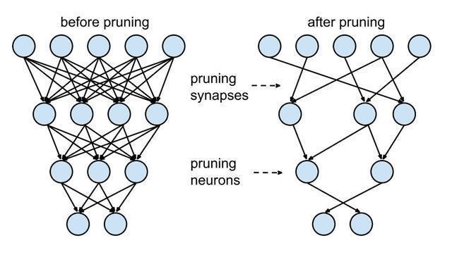
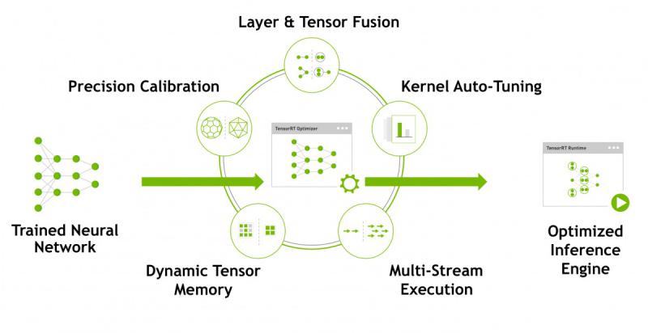
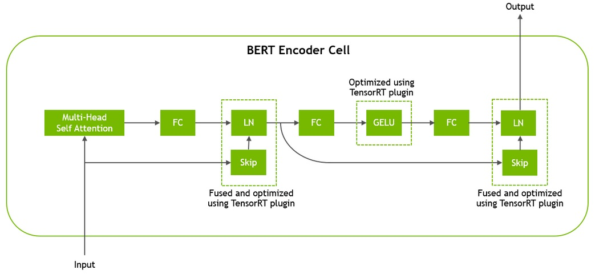
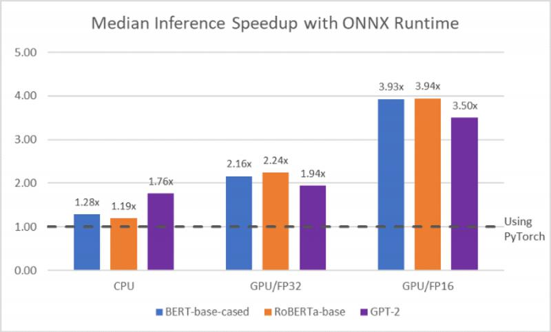

## 7.1 模型量化技术

### 学习目标


* 了解模型压缩技术中的动态量化与静态量化的相关知识。
* 掌握使用huggingface中的预训练BERT模型进行微调。
* 掌握使用动态量化技术对训练后的bert模型进行压缩。


---

<center></center>

---

### 相关知识

* 模型压缩:
	* 模型压缩是一种针对大型模型(参数量巨大)在使用过程中进行优化的一种常用措施。它往往能够使模型体积缩小，简化计算，增快推断速度，满足模型在特定场合(如: 移动端)的需求。目前，模型压缩可以从多方面考虑，如剪枝方法(简化模型架构)，参数量化方法(简化模型参数)，知识蒸馏等。本案例将着重讲解模型参数量化方法。

---

* 模型参数量化:
	* 在机器学习（深度学习）领域，模型量化一般是指将模型参数由类型FP32转换为INT8的过程，转换之后的模型大小被压缩为原来的1/4，所需内存和带宽减小4倍，同时，计算量减小约为2-4倍。模型又可分为动态量化和静态量化。

---

* 模型动态量化：
	* 操作最简单也是压缩效果最好的量化方式，量化过程发生在模型训练后，针对模型权重采取量化，之后会在模型预测过程中，再决定是否针对激活值采取量化，因此称作动态量化（在预测时可能发生量化）。这是我们本案例将会使用的量化方式。

---

* 模型静态量化：
	* 考虑到动态量化这种“一刀切”的量化方式有时会带来模型预测效果的大幅度下降，因此引入静态量化，它同样发生在模型训练后，为了判断哪些权重或激活值应该被量化，哪些应该保留或小幅度量化，在预测过程开始前，在模型中节点插入“观测者”（衡量节点使用情况的一些计算方法），他们将在一些实验数据中评估节点使用情况，来决定是否将其权重或激活值进行量化，因为在预测过程中，这些节点是否被量化已经确定，因此称作静态量化。

---

* （扩展知识）量化意识训练：
	* 这是一种操作相对复杂的模型量化方法，在训练过程中使用它，原理与静态量化类似，都需要像模型中插入“观测者”，同时它还需要插入量化计算操作，使得模型训练过程中除了进行原有的浮点型计算，还要进行量化计算，但模型参数的更新还是使用浮点型，而量化计算的作用就是让模型“意识”到这个过程，通过“观测者”评估每次量化结果与训练过程中参数更新程度，为之后模型如何进行量化还能保证准确率提供衡量指标。（类似于，人在接受训练时，意识到自己接下来可能除了训练内容外，还会接受其他“操作”（量化），因此也会准备一些如果进行量化仍能达成目标的措施）


---


* BERT模型:
	* 这里使用bert-base-uncased，它的编码器具有12个隐层, 输出768维张量, 12个自注意力头, 共110M参数量, 在小写的英文文本上进行训练而得到。


---

### 数据集说明

* GLUE数据集合的介绍：
	* GLUE由纽约大学，华盛顿大学，Google联合推出，涵盖不同的NLP任务类型，持续至2020年1月，其中包括11个子任务数据集，成为NLP研究发展的标准。我们这里使用其实MRPC数据集。

* 数据下载地址: 标准数据集一般使用下载脚本进行下载，会在之后的代码中演示。

* MRPC数据集的任务类型：
	* 句子对二分类任务
        * 训练集上正样本占68%，负样本占32%
	* 评估指标这里使用：F1
	* 评估指标计算方式：F1=2∗(precision∗recall)/(precision+recall)


* 数据集预览:

> * MRPC数据集文件样式：

```
- MRPC/
        - dev.tsv
        - test.tsv
        - train.tsv
    - dev_ids.tsv
    - msr_paraphrase_test.txt
    - msr_paraphrase_train.txt

```

> * 文件样式说明：
	* 在使用中常用到的文件是train.tsv，dev.tsv，test.tsv，分别代表训练集，验证集和测试集。其中train.tsv与dev.tsv数据样式相同，都是带有标签的数据，其中test.tsv是不带有标签的数据。


* train.tsv数据样式：

```
Quality #1 ID   #2 ID   #1 String   #2 String
1   702876  702977  Amrozi accused his brother , whom he called " the witness " , of deliberately distorting his evidence . Referring to him as only " the witness " , Amrozi accused his brother of deliberately distorting his evidence .
0   2108705 2108831 Yucaipa owned Dominick 's before selling the chain to Safeway in 1998 for $ 2.5 billion .   Yucaipa bought Dominick 's in 1995 for $ 693 million and sold it to Safeway for $ 1.8 billion in 1998 .
1   1330381 1330521 They had published an advertisement on the Internet on June 10 , offering the cargo for sale , he added .   On June 10 , the ship 's owners had published an advertisement on the Internet , offering the explosives for sale .
0   3344667 3344648 Around 0335 GMT , Tab shares were up 19 cents , or 4.4 % , at A $ 4.56 , having earlier set a record high of A $ 4.57 . Tab shares jumped 20 cents , or 4.6 % , to set a record closing high at A $ 4.57 .
1   1236820 1236712 The stock rose $ 2.11 , or about 11 percent , to close Friday at $ 21.51 on the New York Stock Exchange .   PG & E Corp. shares jumped $ 1.63 or 8 percent to $ 21.03 on the New York Stock Exchange on Friday .
1   738533  737951  Revenue in the first quarter of the year dropped 15 percent from the same period a year earlier .   With the scandal hanging over Stewart 's company , revenue the first quarter of the year dropped 15 percent from the same period a year earlier .
0   264589  264502  The Nasdaq had a weekly gain of 17.27 , or 1.2 percent , closing at 1,520.15 on Friday .    The tech-laced Nasdaq Composite .IXIC rallied 30.46 points , or 2.04 percent , to 1,520.15 .
1   579975  579810  The DVD-CCA then appealed to the state Supreme Court .  The DVD CCA appealed that decision to the U.S. Supreme Court .
...
```

> * train.tsv数据样式说明：
	* train.tsv中的数据内容共分为5列，第一列数据，0或1，代表每对句子是否具有相同的含义，0代表含义不相同，1代表含义相同。第二列和第三列分别代表每对句子的id，第四列和第五列分别具有相同/不同含义的句子对。

---

* test.tsv数据样式：

```
index   #1 ID   #2 ID   #1 String   #2 String
0   1089874 1089925 PCCW 's chief operating officer , Mike Butcher , and Alex Arena , the chief financial officer , will report directly to Mr So . Current Chief Operating Officer Mike Butcher and Group Chief Financial Officer Alex Arena will report to So .
1   3019446 3019327 The world 's two largest automakers said their U.S. sales declined more than predicted last month as a late summer sales frenzy caused more of an industry backlash than expected . Domestic sales at both GM and No. 2 Ford Motor Co. declined more than predicted as a late summer sales frenzy prompted a larger-than-expected industry backlash .
2   1945605 1945824 According to the federal Centers for Disease Control and Prevention ( news - web sites ) , there were 19 reported cases of measles in the United States in 2002 .   The Centers for Disease Control and Prevention said there were 19 reported cases of measles in the United States in 2002 .
3   1430402 1430329 A tropical storm rapidly developed in the Gulf of Mexico Sunday and was expected to hit somewhere along the Texas or Louisiana coasts by Monday night . A tropical storm rapidly developed in the Gulf of Mexico on Sunday and could have hurricane-force winds when it hits land somewhere along the Louisiana coast Monday night .
4   3354381 3354396 The company didn 't detail the costs of the replacement and repairs .   But company officials expect the costs of the replacement work to run into the millions of dollars .
5   1390995 1391183 The settling companies would also assign their possible claims against the underwriters to the investor plaintiffs , he added . Under the agreement , the settling companies will also assign their potential claims against the underwriters to the investors , he added .
6   2201401 2201285 Air Commodore Quaife said the Hornets remained on three-minute alert throughout the operation . Air Commodore John Quaife said the security operation was unprecedented .
7   2453843 2453998 A Washington County man may have the countys first human case of West Nile virus , the health department said Friday .  The countys first and only human case of West Nile this year was confirmed by health officials on Sept . 8 .
...

```

> * test.tsv数据样式说明：
	* test.tsv中的数据内容共分为5列，第一列数据代表每条文本数据的索引；其余列的含义与train.tsv中相同。


---


### 使用huggingface中的预训练BERT模型进行微调

* 第一步: 安装必要的工具包并导入
* 第二步: 下载数据集并使用脚本进行微调
* 第三步: 设定全局配置并加载微调模型
* 第四步: 编写用于模型使用的评估函数

---


#### 第一步: 安装核心的工具包并导入

* 安装核心工具包:

```
# 这是由huggingface提供的预训练模型使用工具包
pip install transformers==2.3.0
```

* 工具包导入

```python
from __future__ import absolute_import, division, print_function

import logging
import numpy as np
import os
import random
import sys
import time
import torch

# 用于设定全局配置的命名空间
from argparse import Namespace

# 从torch.utils.data中导入常用的模型处理工具，会在代码使用中进行详细介绍
from torch.utils.data import (DataLoader, RandomSampler, SequentialSampler,
                              TensorDataset)

# 模型进度可视化工具，在评估过程中，帮助打印进度条
from tqdm import tqdm

# 从transformers中导入BERT模型的相关工具
from transformers import (BertConfig, BertForSequenceClassification, BertTokenizer,)

# 从transformers中导入GLUE数据集的评估指标计算方法
from transformers import glue_compute_metrics as compute_metrics

# 从transformers中导入GLUE数据集的输出模式(回归/分类)
from transformers import glue_output_modes as output_modes

# 从transformers中导入GLUE数据集的预处理器processors
# processors是将持久化文件加载到内存的过程，即输入一般为文件路径，输出是训练数据和对应标签的某种数据结构，如列表表示。
from transformers import glue_processors as processors

# 从transformers中导入GLUE数据集的特征处理器convert_examples_to_features
# convert_examples_to_features是将processor的输出处理成模型需要的输入，NLP定中的一般流程为数值映射，指定长度的截断补齐等
# 在BERT模型上处理句子对时，还需要在句子前插入[CLS]开始标记，在两个句子中间和第二个句子末端插入[SEP]分割/结束标记
from transformers import glue_convert_examples_to_features as convert_examples_to_features


# 设定与日志打印有关的配置
logger = logging.getLogger(__name__)
logging.basicConfig(format = '%(asctime)s - %(levelname)s - %(name)s -   %(message)s',
                    datefmt = '%m/%d/%Y %H:%M:%S',
                    level = logging.WARN)

logging.getLogger("transformers.modeling_utils").setLevel(
   logging.WARN)  # Reduce logging


print("torch version:", torch.__version__)

# 设置torch允许启动的线程数, 因为之后会对比压缩模型的耗时，因此防止该变量产生影响
torch.set_num_threads(1)
print(torch.__config__.parallel_info())


```

> * 输出效果:

```text
torch version: 1.3.1

ATen/Parallel:
	at::get_num_threads() : 1
	at::get_num_interop_threads() : 8
OpenMP 201511 (a.k.a. OpenMP 4.5)
	omp_get_max_threads() : 1
Intel(R) Math Kernel Library Version 2019.0.4 Product Build 20190411 for Intel(R) 64 architecture applications
	mkl_get_max_threads() : 1
Intel(R) MKL-DNN v0.20.5 (Git Hash 0125f28c61c1f822fd48570b4c1066f96fcb9b2e)
std::thread::hardware_concurrency() : 16
Environment variables:
	OMP_NUM_THREADS : [not set]
	MKL_NUM_THREADS : [not set]
ATen parallel backend: OpenMP
```

---

#### 第二步: 下载数据集并使用脚本进行微调

* 下载GLUE中的MRPC数据集:

```shell
python download_glue_data.py --data_dir='./glue_data' --tasks='MRPC'
```

---


* 使用[run_glue.py[具体代码内容见附录]](http://47.92.175.143:8008/4/#1)进行模型微调:


```shell

# 注意: 这是一段使用shell运行的脚本, 运行过程中需要请求AWS的S3进行预训练模型下载

# 定义GLUE_DIR: 微调数据所在路径, 这里我们使用glue_data中的数据作为微调数据
export GLUE_DIR=./glue_data
# 定义OUT_DIR: 模型的保存路径, 我们将模型保存在当前目录的bert_finetuning_test文件中
export OUT_DIR=./bert_finetuning_test/

python ./run_glue.py \
    --model_type bert \
    --model_name_or_path bert-base-uncased \
    --task_name MRPC \
    --do_train \
    --do_eval \
    --do_lower_case \
    --data_dir $GLUE_DIR/MRPC \
    --max_seq_length 128 \
    --per_gpu_eval_batch_size=8   \
    --per_gpu_train_batch_size=8   \
    --learning_rate 2e-5 \
    --num_train_epochs 1.0 \
    --output_dir $OUT_DIR

# 使用python运行微调脚本
# --model_type: 选择需要微调的模型类型, 这里可以选择BERT, XLNET, XLM, roBERTa, distilBERT, ALBERT
# --model_name_or_path: 选择具体的模型或者变体, 这里是在英文语料上微调, 因此选择bert-base-uncased
# --task_name: 它将代表对应的任务类型, 如MRPC代表句子对二分类任务
# --do_train: 使用微调脚本进行训练
# --do_eval: 使用微调脚本进行验证
# --data_dir: 训练集及其验证集所在路径, 将自动寻找该路径下的train.tsv和dev.tsv作为训练集和验证集
# --max_seq_length: 输入句子的最大长度, 超过则截断, 不足则补齐
# --learning_rate: 学习率
# --num_train_epochs: 训练轮数
# --output_dir $OUT_DIR: 训练后的模型保存路径

```

> * 输出效果:

```text
...
03/18/2020 00:55:17 - INFO - __main__ -   Loading features from cached file ./glue_data/MRPC/cached_train_bert-base-uncased_128_mrpc
03/18/2020 00:55:17 - INFO - __main__ -   ***** Running training *****
03/18/2020 00:55:17 - INFO - __main__ -     Num examples = 3668
03/18/2020 00:55:17 - INFO - __main__ -     Num Epochs = 1
03/18/2020 00:55:17 - INFO - __main__ -     Instantaneous batch size per GPU = 8
03/18/2020 00:55:17 - INFO - __main__ -     Total train batch size (w. parallel, distributed & accumulation) = 8
03/18/2020 00:55:17 - INFO - __main__ -     Gradient Accumulation steps = 1
03/18/2020 00:55:17 - INFO - __main__ -     Total optimization steps = 459
Epoch:   0%|                 | 0/1 [00:00<?, ?it/s]
Iteration:   2%|   | 8/459 [00:13<12:42,  1.69s/it]
```

> * 运行成功后会在当前目录下生成 ./bert_finetuning_test文件夹，内部文件如下:

```
added_tokens.json  checkpoint-200  checkpoint-350  eval_results.txt         tokenizer_config.json
checkpoint-100     checkpoint-250  checkpoint-50   pytorch_model.bin        training_args.bin
checkpoint-150     checkpoint-300  config.json     special_tokens_map.json  vocab.txt
```

---

#### 第三步: 设定全局配置并加载微调模型

* 设定全局配置:

```python
# 这些配置将在调用微调模型时进行使用

# 实例化一个配置的命名空间
configs = Namespace()

# 模型的输出文件路径
configs.output_dir = "./bert_finetuning_test/"

# 验证数据集所在路径(与训练集相同)
configs.data_dir = "./glue_data/MRPC"

# 预训练模型的名字
configs.model_name_or_path = "bert-base-uncased"

# 文本的最大对齐长度
configs.max_seq_length = 128

# GLUE中的任务名(需要小写)
configs.task_name = "MRPC".lower()

# 根据任务名从GLUE数据集处理工具包中取出对应的预处理工具
configs.processor = processors[configs.task_name]()

# 得到对应模型输出模式(MRPC为分类)
configs.output_mode = output_modes[configs.task_name]

# 得到该任务的对应的标签种类列表
configs.label_list = configs.processor.get_labels()

# 定义模型类型
configs.model_type = "bert".lower()

# 是否全部使用小写文本
configs.do_lower_case = True

# 使用的设备
configs.device = "cpu"
# 每次验证的批次大小
configs.per_eval_batch_size = 8

# gpu的数量
configs.n_gpu = 0

# 是否需要重写数据缓存
configs.overwrite_cache = False
```

---


* 加载微调模型:

```
# 因为在模型使用中，会使用一些随机方法，为了使每次运行的结果可以复现
# 需要设定确定的随机种子，保证每次随机化的数字在范围内浮动
def set_seed(seed):
    random.seed(seed)
    np.random.seed(seed)
    torch.manual_seed(seed)
set_seed(42)


## 加载微调模型

# 加载BERT预训练模型的数值映射器
tokenizer = BertTokenizer.from_pretrained(
    configs.output_dir, do_lower_case=configs.do_lower_case)

# 加载带有文本分类头的BERT模型
model = BertForSequenceClassification.from_pretrained(configs.output_dir)

# 将模型传到制定设备上
model.to(configs.device)
```


---

#### 第四步: 编写用于模型使用的评估函数

```python
def evaluate(args, model, tokenizer):
    """
    模型评估函数
    :param args: 模型的全局配置对象，里面包含模型的各种配置信息
    :param model: 使用的模型
    :param tokenizer: 文本数据的数值映射器
    """

    # 因为之后会多次用到任务名和输出路径
    # 所以将其从参数中取出
    eval_task = args.task_name
    eval_output_dir = args.output_dir
    try:
        # 调用load_and_cache_examples加载原始或者已经缓存的数据
        # 得到一个验证数据集的迭代器对象
        eval_dataset = load_and_cache_examples(args, eval_task, tokenizer)

        # 判断模型输出路径是否存在
        if not os.path.exists(eval_output_dir):
            # 不存在的话，创建该路径
            os.makedirs(eval_output_dir)

        # 使用SequentialSampler封装验证数据集的迭代器对象
        # SequentialSampler是采样器对象，一般在Dataloader数据加载器中使用，
        # 因为数据加载器是以迭代的方式产生数据，因此每个批次数据可以指定采样规则，
        # SequentialSampler是顺序采样器，不改变原有数据集的顺序，依次取出数据。
        eval_sampler = SequentialSampler(eval_dataset)
        # 使用Dataloader数据加载器，参数分别是数据集的迭代器对象，采集器对象，批次大小
        eval_dataloader = DataLoader(eval_dataset, sampler=eval_sampler, batch_size=args.per_eval_batch_size)

        # 开始评估
        logger.info("***** Running evaluation *****")
        logger.info("  Num examples = %d", len(eval_dataset))
        logger.info("  Batch size = %d", args.per_eval_batch_size)
        # 初始化验证损失
        eval_loss = 0.0
        # 初始化验证步数
        nb_eval_steps = 0
        # 初始化预测的概率分布
        preds = None
        # 初始化输出真实标签值
        out_label_ids = None

        # 循环数据批次，使用tqdm封装数据加载器，可以在评估时显示进度条
        # desc是进度条前面的描述信息
        for batch in tqdm(eval_dataloader, desc="Evaluating"):
            # 评估过程中模型开启评估模式，不进行反向传播
            model.eval()
            # 从batch中取出数据的所有相关信息存于元组中
            batch = tuple(t.to(args.device) for t in batch)
            # 不进行梯度计算
            with torch.no_grad():
                # 将batch携带的数据信息表示称字典形式
                # 这些数据信息和load_and_cache_examples函数返回的数据对象中信息相同
                # 词汇的映射数值, 词汇的类型数值(0或1, 代表第一句和第二句话)
                # 注意力掩码张量，以及对应的标签
                inputs = {'input_ids':      batch[0],
                          'attention_mask': batch[1],
                          'token_type_ids': batch[2],
                          'labels':         batch[3]}
                # 将该字典作为参数输入到模型中获得输出
                outputs = model(**inputs)
                # 获得损失和预测分布
                tmp_eval_loss, logits = outputs
                # 将损失累加求均值
                eval_loss += tmp_eval_loss.mean().item()
            # 验证步数累加
            nb_eval_steps += 1

            # 如果是第一批次的数据
            if preds is None:
                # 结果分布就是模型的输出分布
                preds = logits.numpy()
                # 输出真实标签值为输入对应的labels
                out_label_ids = inputs['labels'].numpy()
            else:
                # 结果分布就是每一次模型输出分布组成的数组
                preds = np.append(preds, logits.numpy(), axis=0)
                # 输出真实标签值为每一次输入对应的labels组成的数组
                out_label_ids = np.append(out_label_ids, inputs['labels'].numpy(), axis=0)

        # 计算每一轮的平均损失
        eval_loss = eval_loss / nb_eval_steps
        # 取结果分布中最大的值对应的索引
        preds = np.argmax(preds, axis=1)
        # 使用compute_metrics计算对应的评估指标
        result = compute_metrics(eval_task, preds, out_label_ids)
        # 在日志中打印每一轮的评估结果
        logger.info("***** Eval results {} *****")
        logger.info(str(result))
    except Exception as e:
         print(e)
    return result


def load_and_cache_examples(args, task, tokenizer):
    """
    加载或使用缓存数据
    :param args: 全局配置参数
    :param task: 任务名
    :param tokenizer: 数值映射器
    """
    # 根据任务名(MRPC)获得对应数据预处理器
    processor = processors[task]()
    # 获得输出模式
    output_mode = output_modes[task]
    # 定义缓存数据文件的名字
    cached_features_file = os.path.join(args.data_dir, 'cached_{}_{}_{}_{}'.format(
        'dev',
        list(filter(None, args.model_name_or_path.split('/'))).pop(),
        str(args.max_seq_length),
        str(task)))
    # 判断缓存文件是否存在，以及全局配置中是否需要重写数据
    if os.path.exists(cached_features_file) and not args.overwrite_cache:
        # 使用torch.load(解序列化，一般用于加载模型，在这里用于加载训练数据)加载缓存文件
        features = torch.load(cached_features_file)
    else:
        # 如果没有缓存文件，则需要使用processor从原始数据路径中加载数据
        examples = processor.get_dev_examples(args.data_dir)
        # 获取对应的标签
        label_list = processor.get_labels()
        # 再使用convert_examples_to_features生成模型需要的输入形式
        features = convert_examples_to_features(examples,
                                                tokenizer,
                                                label_list=label_list,
                                                max_length=args.max_seq_length,
                                                output_mode=output_mode,
                                                pad_token=tokenizer.convert_tokens_to_ids([tokenizer.pad_token])[0],
        )
        logger.info("Saving features into cached file %s", cached_features_file)
        # 将其保存至缓存文件路径中
        torch.save(features, cached_features_file)


    # 为了有效利用内存，之后将使用数据加载器，我们需要在这里将张量数据转换成数据迭代器对象TensorDatase
    # TensorDataset：用于自定义训练数据结构的迭代封装器，它可以封装任何与训练数据映射值相关的数据
    #（如：训练数据对应的标签，训练数据使用的掩码张量，token的类型id等），
    # 它们必须能转换成张量，将同训练数据映射值一起在训练过程中迭代使用。

    # 以下是分别把input_ids，attention_mask，token_type_ids，label封装在TensorDataset之中
    all_input_ids = torch.tensor([f.input_ids for f in features], dtype=torch.long)
    all_attention_mask = torch.tensor([f.attention_mask for f in features], dtype=torch.long)
    all_token_type_ids = torch.tensor([f.token_type_ids for f in features], dtype=torch.long)
    all_labels = torch.tensor([f.label for f in features], dtype=torch.long)
    dataset = TensorDataset(all_input_ids, all_attention_mask, all_token_type_ids, all_labels)
    # 返回数据迭代器对象
    return dataset

```

* 我们将在下面的模型量化中调用该评估函数。

---

### 使用动态量化技术对训练后的bert模型进行压缩

* 第一步: 将模型应用动态量化技术
* 第二步: 对比压缩后模型的大小
* 第三步: 对比压缩后的模型的推理准确性和耗时
* 第四步: 序列化模型以便之后使用


---

#### 第一步: 将模型应用动态量化技术


* 应用动态量化技术:

```python

# 使用torch.quantization.quantize_dynamic获得动态量化的模型
# 量化的网络层为所有的nn.Linear的权重，使其成为int8
quantized_model = torch.quantization.quantize_dynamic(
    model, {torch.nn.Linear}, dtype=torch.qint8
)

# 打印动态量化后的BERT模型
print(quantized_model)
```

> * 输出效果:

```text

## 模型中的所有Linear层变成了DynamicQuantizedLinear层

BertForSequenceClassification(
  (bert): BertModel(
    (embeddings): BertEmbeddings(
      (word_embeddings): Embedding(30522, 768, padding_idx=0)
      (position_embeddings): Embedding(512, 768)
      (token_type_embeddings): Embedding(2, 768)
      (LayerNorm): LayerNorm((768,), eps=1e-12, elementwise_affine=True)
      (dropout): Dropout(p=0.1, inplace=False)
    )
    (encoder): BertEncoder(
      (layer): ModuleList(
        (0): BertLayer(
          (attention): BertAttention(
            (self): BertSelfAttention(
              (query): DynamicQuantizedLinear(in_features=768, out_features=768, scale=1.0, zero_point=0)
              (key): DynamicQuantizedLinear(in_features=768, out_features=768, scale=1.0, zero_point=0)
              (value): DynamicQuantizedLinear(in_features=768, out_features=768, scale=1.0, zero_point=0)
              (dropout): Dropout(p=0.1, inplace=False)
            )
            (output): BertSelfOutput(
              (dense): DynamicQuantizedLinear(in_features=768, out_features=768, scale=1.0, zero_point=0)
              (LayerNorm): LayerNorm((768,), eps=1e-12, elementwise_affine=True)
              (dropout): Dropout(p=0.1, inplace=False)
            )
          )
          (intermediate): BertIntermediate(
            (dense): DynamicQuantizedLinear(in_features=768, out_features=3072, scale=1.0, zero_point=0)
          )
          (output): BertOutput(
            (dense): DynamicQuantizedLinear(in_features=3072, out_features=768, scale=1.0, zero_point=0)
            (LayerNorm): LayerNorm((768,), eps=1e-12, elementwise_affine=True)
            (dropout): Dropout(p=0.1, inplace=False)
          )
        )
        (1): BertLayer(
          (attention): BertAttention(
            (self): BertSelfAttention(
              (query): DynamicQuantizedLinear(in_features=768, out_features=768, scale=1.0, zero_point=0)
              (key): DynamicQuantizedLinear(in_features=768, out_features=768, scale=1.0, zero_point=0)
              (value): DynamicQuantizedLinear(in_features=768, out_features=768, scale=1.0, zero_point=0)
              (dropout): Dropout(p=0.1, inplace=False)
            )
            (output): BertSelfOutput(
              (dense): DynamicQuantizedLinear(in_features=768, out_features=768, scale=1.0, zero_point=0)
              (LayerNorm): LayerNorm((768,), eps=1e-12, elementwise_affine=True)
              (dropout): Dropout(p=0.1, inplace=False)
            )
          )
          (intermediate): BertIntermediate(
            (dense): DynamicQuantizedLinear(in_features=768, out_features=3072, scale=1.0, zero_point=0)
          )
          (output): BertOutput(
            (dense): DynamicQuantizedLinear(in_features=3072, out_features=768, scale=1.0, zero_point=0)
            (LayerNorm): LayerNorm((768,), eps=1e-12, elementwise_affine=True)
            (dropout): Dropout(p=0.1, inplace=False)
          )
        )
...
...

        (11): BertLayer(
          (attention): BertAttention(
            (self): BertSelfAttention(
              (query): DynamicQuantizedLinear(in_features=768, out_features=768, scale=1.0, zero_point=0)
              (key): DynamicQuantizedLinear(in_features=768, out_features=768, scale=1.0, zero_point=0)
              (value): DynamicQuantizedLinear(in_features=768, out_features=768, scale=1.0, zero_point=0)
              (dropout): Dropout(p=0.1, inplace=False)
            )
            (output): BertSelfOutput(
              (dense): DynamicQuantizedLinear(in_features=768, out_features=768, scale=1.0, zero_point=0)
              (LayerNorm): LayerNorm((768,), eps=1e-12, elementwise_affine=True)
              (dropout): Dropout(p=0.1, inplace=False)
            )
          )
          (intermediate): BertIntermediate(
            (dense): DynamicQuantizedLinear(in_features=768, out_features=3072, scale=1.0, zero_point=0)
          )
          (output): BertOutput(
            (dense): DynamicQuantizedLinear(in_features=3072, out_features=768, scale=1.0, zero_point=0)
            (LayerNorm): LayerNorm((768,), eps=1e-12, elementwise_affine=True)
            (dropout): Dropout(p=0.1, inplace=False)
          )
        )
      )
    )
    (pooler): BertPooler(
      (dense): DynamicQuantizedLinear(in_features=768, out_features=768, scale=1.0, zero_point=0)
      (activation): Tanh()
    )
  )
  (dropout): Dropout(p=0.1, inplace=False)
  (classifier): DynamicQuantizedLinear(in_features=768, out_features=2, scale=1.0, zero_point=0)
)
```

---

#### 第二步: 对比压缩后模型的大小

```python
def print_size_of_model(model):
    """打印模型大小"""
    # 保存模型中的参数部分到持久化文件
    torch.save(model.state_dict(), "temp.p")
    # 打印持久化文件的大小
    print('Size (MB):', os.path.getsize("temp.p")/1e6)
    # 移除该文件
    os.remove('temp.p')

# 分别打印model和quantized_model
print_size_of_model(model)
print_size_of_model(quantized_model)
```

> * 输出效果:

```text

## 模型参数文件大小缩减了257MB

Size (MB): 437.982584
Size (MB): 181.430351
```


#### 第三步: 对比压缩后的模型的推理准确性和耗时

```python
def time_model_evaluation(model, configs, tokenizer):
    """获得模型评估结果和运行时间"""
    # 获得评估前时间
    eval_start_time = time.time()
    # 进行模型评估
    result = evaluate(configs, model, tokenizer)
    # 获得评估后时间
    eval_end_time = time.time()
    # 获得评估耗时
    eval_duration_time = eval_end_time - eval_start_time
    # 打印模型评估结果
    print("Evaluate result:", result)
    # 打印耗时
    print("Evaluate total time (seconds): {0:.1f}".format(eval_duration_time))
```

> * 输出效果:

```text
Evaluating: 100%|██| 51/51 [01:36<00:00,  1.89s/it]
Evaluate result: {'acc': 0.8161764705882353, 'f1': 0.8739495798319329, 'acc_and_f1': 0.8450630252100841}
Evaluate total time (seconds): 96.4

Evaluating: 100%|███████████████████████████████| 51/51 [00:43<00:00,  1.19it/s]
Evaluate result: {'acc': 0.7965686274509803, 'f1': 0.8663446054750403, 'acc_and_f1': 0.8314566164630104}
Evaluate total time (seconds): 43.0
```

* 结论:
	* 对模型进行动态量化后，参数文件大小明显减少。
	* 动态量化后的模型在验证集上评估指标几乎不变，但是耗时却只用了原来的一半左右。

---

#### 第四步: 序列化模型以便之后使用

```python
# 量化模型的保存路径
quantized_output_dir = configs.output_dir + "quantized/"
# 判断是否需要创建该路径
if not os.path.exists(quantized_output_dir):
    os.makedirs(quantized_output_dir)
    # 使用save_pretrained保存模型
    quantized_model.save_pretrained(quantized_output_dir)
```

> * 输出效果:

```text
# 在bert_finetuning_test/目录下

- quantized/
	- config.json
	- pytorch_model.bin

```


### 附录

#### run_glue.py微调脚本代码

请访问: [http://git.itcast.cn/Stephen/AI-key-file/blob/master/run_glue.py](http://git.itcast.cn/Stephen/AI-key-file/blob/master/run_glue.py)


---

## 7.2 模型剪枝技术

### 学习目标

* 了解模型剪枝原理。
* 掌握使用prune对已有模型进行剪枝。


---

<center></center>

---

### 剪枝技术介绍与原理

* 当前在NLP任务上取得优异成绩的模型往往是拥有大量参数的模型，如BERT，GPT等，但实际上，生物的高度文明是使用神经网络有效的稀疏连接，这正是“剪枝技术”的发展起源。而所谓剪枝技术原理，也就是将现有模型中的某些参数设置为0，等效于这些神经元失活。而参数置0的方式是使用MASK蒙版（蒙版0位置得到0，1位置得到原来的值）。下面我们将详细介绍这种技术的实现方式。


---


### 使用prune对已有模型进行剪枝


* 我们将使用torch.nn.utils.prune中的方法进行网络稀疏化，即剪枝。
* 要求torch版本应该>= 1.4.0。

```shell
pip install torch>=1.4.0
```

* 剪枝的讲解将分为以下步骤：
	* 第一步：导入工具包并获得模型
	* 第二步：使用剪枝工具并了解其作用方式
	* 第三步：持久化修剪后的模型
	* 第四步：工程中常用的修剪方法


---

####  第一步：导入工具包并获得模型


* 这里我们将使用LeNet作为剪枝的对象，当然你可以选择任何你已经训练好的某个网络和参数。

```python


# 导入必备的工具包
import torch
from torch import nn
import torch.nn.utils.prune as prune
import torch.nn.functional as F

device = torch.device("cuda" if torch.cuda.is_available() else "cpu")


# 这里不再对LeNet网络做过多的介绍，因为我们的重点是剪枝技术
# 无论你使用哪一种网络进行剪枝，你必须熟知这个网络中的组成部分即哪些能够剪枝
# 比如在这里，conv1，conv2，fc1，fc2，fc3都是可以被剪枝的
class LeNet(nn.Module):
    def __init__(self):
        super(LeNet, self).__init__()
        self.conv1 = nn.Conv2d(1, 6, 3)
        self.conv2 = nn.Conv2d(6, 16, 3)
        self.fc1 = nn.Linear(16 * 5 * 5, 120)  # 5x5 image dimension
        self.fc2 = nn.Linear(120, 84)
        self.fc3 = nn.Linear(84, 10)

    def forward(self, x):
        x = F.max_pool2d(F.relu(self.conv1(x)), (2, 2))
        x = F.max_pool2d(F.relu(self.conv2(x)), 2)
        x = x.view(-1, int(x.nelement() / x.shape[0]))
        x = F.relu(self.fc1(x))
        x = F.relu(self.fc2(x))
        x = self.fc3(x)
        return x

# 获得这个模型对象
model = LeNet().to(device=device)
```

---


#### 第二步：使用剪枝工具并了解其作用方式


* 下面我们会使用剪枝工具并逐步查看参数的变化，先来看看没有剪枝之前的状态。


```python
# 获得conv1模块
module = model.conv1
# 查看该模块的所有原生参数，一般由原生weight和原生bias组成
# 什么是原生参数呢？
# 这里是因为torch在设计存储网络参数时，允许为参数添加修改方式（如蒙版），
# 这些修改方式以buffer的形式存储，不会直接作用在named_parameters中的参数上，
# 因此把named_parameters中的参数叫做原生参数。
# 那如何获得作用了buffer之后的真实参数呢？
# 使用module.weight和module.bias即可
print(list(module.named_parameters()))
```


> * 输出效果：

```text
[('weight', Parameter containing:
tensor([[[[ 0.3161, -0.2212,  0.0417],
          [ 0.2488,  0.2415,  0.2071],
          [-0.2412, -0.2400, -0.2016]]],


        [[[ 0.0419,  0.3322, -0.2106],
          [ 0.1776, -0.1845, -0.3134],
          [-0.0708,  0.1921,  0.3095]]],


        [[[-0.2070,  0.0723,  0.2876],
          [ 0.2209,  0.2077,  0.2369],
          [ 0.2108,  0.0861, -0.2279]]],


        [[[-0.2799, -0.1527, -0.0388],
          [-0.2043,  0.1220,  0.1032],
          [-0.0755,  0.1281,  0.1077]]],


        [[[ 0.2035,  0.2245, -0.1129],
          [ 0.3257, -0.0385, -0.0115],
          [-0.3146, -0.2145, -0.1947]]],


        [[[-0.1426,  0.2370, -0.1089],
          [-0.2491,  0.1282,  0.1067],
          [ 0.2159, -0.1725,  0.0723]]]], device='cuda:0', requires_grad=True)), 

('bias', Parameter containing:
tensor([-0.1214, -0.0749, -0.2656, -0.1519, -0.1021,  0.1425], device='cuda:0',
       requires_grad=True))]
```


---

```python
# 查看参数修改方式即buffer
# 没有buffer的原生参数就是真实参数
print(list(module.named_buffers()))
```


> * 输出效果：

```text
[]
```

---


* 使用prune.random_unstructured随机方式进行剪枝

```python
# 剪枝指定moudle即conv1中的weight参数，修剪（设置为0）30%
prune.random_unstructured(module, name="weight", amount=0.3)
```

```python
# 查看修剪后的named_parameters参数
print(list(module.named_parameters()))
```


> * 输出效果：

```text

[('bias', Parameter containing:
tensor([-0.1214, -0.0749, -0.2656, -0.1519, -0.1021,  0.1425], device='cuda:0',
       requires_grad=True)), 

('weight_orig', Parameter containing:
tensor([[[[ 0.3161, -0.2212,  0.0417],
          [ 0.2488,  0.2415,  0.2071],
          [-0.2412, -0.2400, -0.2016]]],


        [[[ 0.0419,  0.3322, -0.2106],
          [ 0.1776, -0.1845, -0.3134],
          [-0.0708,  0.1921,  0.3095]]],


        [[[-0.2070,  0.0723,  0.2876],
          [ 0.2209,  0.2077,  0.2369],
          [ 0.2108,  0.0861, -0.2279]]],


        [[[-0.2799, -0.1527, -0.0388],
          [-0.2043,  0.1220,  0.1032],
          [-0.0755,  0.1281,  0.1077]]],


        [[[ 0.2035,  0.2245, -0.1129],
          [ 0.3257, -0.0385, -0.0115],
          [-0.3146, -0.2145, -0.1947]]],


        [[[-0.1426,  0.2370, -0.1089],
          [-0.2491,  0.1282,  0.1067],
          [ 0.2159, -0.1725,  0.0723]]]], device='cuda:0', requires_grad=True))]
```


* 在结果中，我们发现原生参数并没有变化，而是名字由weight变成了weight_orig，进一步强调了它是原生参数。
* 为什么要进一步强调原生呢，是因为此时buffer中已经多了一些信息，原生参数和真实参数已经不再等价。

---

```python
print(list(module.named_buffers()))
```

> * 输出效果：

```text
[('weight_mask', tensor([[[[0., 1., 0.],
          [1., 0., 0.],
          [1., 1., 1.]]],


        [[[1., 0., 1.],
          [1., 1., 0.],
          [1., 0., 1.]]],


        [[[1., 0., 0.],
          [0., 1., 1.],
          [1., 1., 1.]]],


        [[[1., 0., 0.],
          [1., 1., 1.],
          [1., 1., 1.]]],


        [[[1., 0., 1.],
          [1., 1., 1.],
          [0., 1., 1.]]],


        [[[1., 1., 1.],
          [1., 1., 0.],
          [1., 1., 0.]]]], device='cuda:0'))]
```


* buffer中已经存在了用于剪枝的蒙版

---

* 使用module.weight查看真实使用参数：

```python
print(module.weight)
```

> * 输出效果：

```text
tensor([[[[ 0.0000, -0.2212,  0.0000],
          [ 0.2488,  0.0000,  0.0000],
          [-0.2412, -0.2400, -0.2016]]],


        [[[ 0.0419,  0.0000, -0.2106],
          [ 0.1776, -0.1845, -0.0000],
          [-0.0708,  0.0000,  0.3095]]],


        [[[-0.2070,  0.0000,  0.0000],
          [ 0.0000,  0.2077,  0.2369],
          [ 0.2108,  0.0861, -0.2279]]],


        [[[-0.2799, -0.0000, -0.0000],
          [-0.2043,  0.1220,  0.1032],
          [-0.0755,  0.1281,  0.1077]]],


        [[[ 0.2035,  0.0000, -0.1129],
          [ 0.3257, -0.0385, -0.0115],
          [-0.0000, -0.2145, -0.1947]]],


        [[[-0.1426,  0.2370, -0.1089],
          [-0.2491,  0.1282,  0.0000],
          [ 0.2159, -0.1725,  0.0000]]]], device='cuda:0',
       grad_fn=<MulBackward0>)
```


---


#### 第三步：持久化修剪后的模型


* 假如你已经对剪枝后的模型进行了必要的验证，并觉得它可以被保存并在将来部署使用，那么你需要持久化模型。


```python

# 一般我们会首先将buffer中的蒙版永久作用在name_parameters中的参数上
# 这里的remove不是移除，而是永久化
prune.remove(module, 'weight')
print(list(module.named_parameters()))
```


> * 输出效果：

```text
[('bias_orig', Parameter containing:
tensor([-0.1214, -0.0749, -0.2656, -0.1519, -0.1021,  0.1425], device='cuda:0',
       requires_grad=True)), ('weight', Parameter containing:
tensor([[[[ 0.0000, -0.2212,  0.0000],
          [ 0.2488,  0.0000,  0.0000],
          [-0.2412, -0.2400, -0.2016]]],


        [[[ 0.0000,  0.0000, -0.0000],
          [ 0.0000, -0.0000, -0.0000],
          [-0.0000,  0.0000,  0.0000]]],


        [[[-0.2070,  0.0000,  0.0000],
          [ 0.0000,  0.2077,  0.2369],
          [ 0.2108,  0.0861, -0.2279]]],


        [[[-0.0000, -0.0000, -0.0000],
          [-0.0000,  0.0000,  0.0000],
          [-0.0000,  0.0000,  0.0000]]],


        [[[ 0.2035,  0.0000, -0.1129],
          [ 0.3257, -0.0385, -0.0115],
          [-0.0000, -0.2145, -0.1947]]],


        [[[-0.0000,  0.0000, -0.0000],
          [-0.0000,  0.0000,  0.0000],
          [ 0.0000, -0.0000,  0.0000]]]], device='cuda:0', requires_grad=True))]
```


```python
print(list(module.named_buffers()))
```

> * 输出效果：

```text
[]
```


* 此时buffer中已经没有任何修改，此时原生参数和真实参数等价。

---

* 保存序列化模型：

```python
PATH = "./model.pth"
torch.save(model.state_dict(), PATH)
print(model.state_dict().keys())
```

> * 输出效果：

```text
odict_keys(['conv1.bias', 'conv1.weight', 'conv2.weight', 'conv2.bias', 'fc1.weight', 'fc1.bias', 'fc2.weight', 'fc2.bias', 'fc3.weight', 'fc3.bias'])
```


* 实际上假如你不进行prune.remove操作，直接保存state_dict()也是可以的，因为buffer也可以被保存在state_dict中，因为剪枝后往往需要继续重新训练，一般直到最后判断剪枝模型可用才使用remove永久化剪枝参数。

---


#### 第四步：工程中常用的修剪方法

* 刚刚我们学习的都是“局部”的剪枝方式，而实际工程中我们往往直接针对模型进行整体剪枝。下面就是整体剪枝的方法：

```python
# 获得模型
model = LeNet()

# 用元组指定需要剪枝的层和参数类型
parameters_to_prune = (
    (model.conv1, 'weight'),
    (model.conv2, 'weight'),
    (model.fc1, 'weight'),
    (model.fc2, 'weight'),
    (model.fc3, 'weight'),
)

# 进行全局剪枝，参数分别是需要剪枝的层和参数类型，剪枝方法，剪枝比例
# 通过这样的操作我们就可以得到剪枝后的模型，这里的0.2是整体的20%，各个部分剪枝在20%左右
# 这里使用了L1剪枝
prune.global_unstructured(
    parameters_to_prune,
    pruning_method=prune.L1Unstructured,
    amount=0.2,
)


print(model.state_dict().keys())

print("#################")

# 永久化参数
for module, name in parameters_to_prune:
    prune.remove(module, name)

print(model.state_dict().keys())
```


> * 输出效果：

```text
dict_keys(['conv1.bias', 'conv1.weight', 'conv2.weight', 'conv2.bias', 'fc1.weight', 'fc1.bias', 'fc2.weight', 'fc2.bias', 'fc3.weight', 'fc3.bias'])
odict_keys(['conv1.bias', 'conv1.weight_orig', 'conv1.weight_mask', 'conv2.bias', 'conv2.weight_orig', 'conv2.weight_mask', 'fc1.bias', 'fc1.weight_orig', 'fc1.weight_mask', 'fc2.bias', 'fc2.weight_orig', 'fc2.weight_mask', 'fc3.bias', 'fc3.weight_orig', 'fc3.weight_mask'])

#################

odict_keys(['conv1.bias', 'conv1.weight', 'conv2.weight', 'conv2.bias', 'fc1.weight', 'fc1.bias', 'fc2.weight', 'fc2.bias', 'fc3.weight', 'fc3.bias'])
odict_keys(['conv1.bias', 'conv1.weight', 'conv2.bias', 'conv2.weight', 'fc1.bias', 'fc1.weight', 'fc2.bias', 'fc2.weight', 'fc3.bias', 'fc3.weight'])
```


---


* 检查一下全局剪枝的20%在各个层中剪枝占比:

```python
print(
    "Sparsity in conv1.weight: {:.2f}%".format(
        100. * float(torch.sum(model.conv1.weight == 0))
        / float(model.conv1.weight.nelement())
    )
)
print(
    "Sparsity in conv2.weight: {:.2f}%".format(
        100. * float(torch.sum(model.conv2.weight == 0))
        / float(model.conv2.weight.nelement())
    )
)
print(
    "Sparsity in fc1.weight: {:.2f}%".format(
        100. * float(torch.sum(model.fc1.weight == 0))
        / float(model.fc1.weight.nelement())
    )
)
print(
    "Sparsity in fc2.weight: {:.2f}%".format(
        100. * float(torch.sum(model.fc2.weight == 0))
        / float(model.fc2.weight.nelement())
    )
)
print(
    "Sparsity in fc3.weight: {:.2f}%".format(
        100. * float(torch.sum(model.fc3.weight == 0))
        / float(model.fc3.weight.nelement())
    )
)
print(
    "Global sparsity: {:.2f}%".format(
        100. * float(
            torch.sum(model.conv1.weight == 0)
            + torch.sum(model.conv2.weight == 0)
            + torch.sum(model.fc1.weight == 0)
            + torch.sum(model.fc2.weight == 0)
            + torch.sum(model.fc3.weight == 0)
        )
        / float(
            model.conv1.weight.nelement()
            + model.conv2.weight.nelement()
            + model.fc1.weight.nelement()
            + model.fc2.weight.nelement()
            + model.fc3.weight.nelement()
        )
    )
)
```


> * 输出效果：

```text
Sparsity in conv1.weight: 7.41%
Sparsity in conv2.weight: 9.49%
Sparsity in fc1.weight: 22.00%
Sparsity in fc2.weight: 12.28%
Sparsity in fc3.weight: 9.76%
Global sparsity: 20.00%
```


---

* 常用的剪枝方式解释：
	* RandomUnstructured：随机剪枝
	* L1Unstructured：按照L1范数（绝对值大小）剪枝，因为数值越小对结果的扰动也越小。


---


### 小节总结

* 学习了模型剪枝原理
* 学习了使用prune对已有模型进行剪枝
	* 第一步：导入工具包并获得模型
	* 第二步：使用剪枝工具并了解其作用方式
	* 第三步：持久化修剪后的模型
	* 第四步：工程中常用的修剪方法


---


## 7.3 使用ONNX-Runtime进行模型推断加速

### 学习目标

* 了解ONNX及其ONNX-Runtime的主要作用。
* 掌握如何使用ONNX-Runtime进行模型推断加速。


---


<center></center>


---


### 什么是ONNX和ONNX-Runtime
* ONNX（Open Neural Network Exchange）开放式神经网络交换格式，与torch的pth，keras的h5，tensorflow的pb一样，它属于一种模型格式。
* 这种交换格式被设计的初衷：希望各种模型框架训练得到的模型能够通用。而现在它已经结合ONNX-Runtime成为一种加速模型推理的方法。
* ONNX-Runtime就是指ONNX格式模型的运行环境，它由微软开源，该环境集成多种模型加速工具，如Nvidia的TensorRT等，用于快速模型推断。
* 能够原生支持ONNX模型转换的模型包括Pytorch，MXNET，Caffe2等框架（Tensorflow不可以）。


---


<center></center>


* 图中，蓝色的部分就是ONNX-Runtime，它能够自动利用已有设备上的各种加速工具，完成模型加速，无需人工参与，只需要我们将ONNX格式的模型作为输入即可。

---


### 使用ONNX-Runtime进行模型推断加速的步骤

* 第一步：安装必备的工具包
* 第二步：将已有模型转换成ONNX格式
* 第三步：使用ONNX-Runtime进行模型预测
* 第四步：对比结果差异和推断时间

---


#### 第一步：安装必备的工具包


```shell
# onnx 1.7.0
# onnxruntime 1.4.0
pip install onnx onnxruntime
```


---

#### 第二步：将已有模型转换成ONNX格式

```python
import torch
import torch.onnx
import torchvision

# 这里以resnet18模型为例
model = torchvision.models.resnet18(pretrained=True)
# 随机初始化一个指定shape的输入
input = torch.randn(1, 3, 224, 224, requires_grad=True)
# 评估模式
model.eval()
```

---

```python
# 定义onnx输入输出的名字（格式需要）
input_names = ["input1"]
output_names = ["output1"]

onnx_model_name = "resnet18.onnx"

# 使用torch.onnx导出resnet18.onnx
torch.onnx.export(model, input, onnx_model_name, input_names=input_names, output_names=output_names)
```

> * 输出效果:
	* 在该脚本路径下得到resnet18.onnx格式的模型。

---


#### 第三步：使用ONNX-Runtime进行模型预测


```python
import onnxruntime

# 当前onnxruntime的输入要求的为numpy形式
def to_numpy(tensor):
    """将tensor转化成numpy"""
    return tensor.detach().cpu().numpy() if tensor.requires_grad else tensor.cpu().numpy()

# 使用模型创建onnxruntime的session
ort_session = onnxruntime.InferenceSession(onnx_model_name)
# 在session中运行，要求输入为dict形式，key为之前定义好的input名字，且input必须为numpy形式
ort_outs = ort_session.run(None, {ort_session.get_inputs()[0].name: to_numpy(input)})
```

---


#### 第四步：对比结果差异和推断时间


```python
# pth模型的结果
torch_out = to_numpy(model(input))

# onnx模型的结果
ort_out = ort_outs[0]

print(torch_out)
print()
print(ort_out)
```


> * 输出效果:

```text
## 结果是一模一样的，没有任何差异

[[ 6.46063685e-01  2.58094740e+00  2.67934680e+00  2.84586716e+00
   4.45001364e+00  3.60939002e+00  3.51634717e+00  2.71348268e-01
  -1.15397012e+00 -7.00954318e-01 -7.89242506e-01  9.08504605e-01
   1.55155942e-01  1.08485329e+00  1.31591737e+00  5.42257011e-01]]

[[ 6.46063685e-01  2.58094740e+00  2.67934680e+00  2.84586716e+00
   4.45001364e+00  3.60939002e+00  3.51634717e+00  2.71348268e-01
  -1.15397012e+00 -7.00954318e-01 -7.89242506e-01  9.08504605e-01
   1.55155942e-01  1.08485329e+00  1.31591737e+00  5.42257011e-01]]

```


---

```python
import time


# 对比两者在CPU上的预测时间差异
# 二者在GPU上的表现相当，因为onnxruntime本身也是调用cuda

start = time.time()
torch_out = model(input)
end = time.time()
print(end - start)

start = time.time()
ort_outs = ort_session.run(None, {"input1": to_numpy(input)})
end = time.time()
print(end - start)
```


> * 输出效果:

```text
# pth模型推断时间为24.6ms
0.024605449676513672

# onnx仅需8.5ms，大约节省2-3倍时间
0.008518030548095703
```

---


### ONNX-Runtime能够加速的原理

* 下面以其调用TensorRT(nvidia加速工具)加速BERT为例进行说明：


<center></center>


> * 在BERT编码器中，将LayerNormalization层和残差连接进行融合以加速计算。

> * 对gelu激活函数使用`简化gelu`计算方法加速计算。


---


<center></center>
<center></center>

> * 对所有的self-attention layer中的全连接层进行融合，以减少内存和正反向传播次数加速计算。

> * ONNX-Runtime内置针对主流模型（BERT，RESNET等）的并行计算模式，实现加速计算。


<center></center>


---


### 小节总结

* 学习了使用ONNX-Runtime进行模型推断加速的步骤：
	* 第一步：安装必备的工具包
	* 第二步：将已有模型转换成ONNX格式
	* 第三步：使用ONNX-Runtime进行模型预测
	* 第四步：对比结果差异和推断时间


---

* ONNX-Runtime能够加速的原因：
	* 1，作为加速工具的集成环境，能够自动调用加速工具cuda，TensorRT，nGragh等。
	* 2，对特定模型的层和张量进行融合，以减少正反向传播次数。
	* 3，对特定激活函数gelu进行简化计算。
	* 4，针对主流模型（BERT，RESNET等）的并行计算模式，实现加速计算。

---
