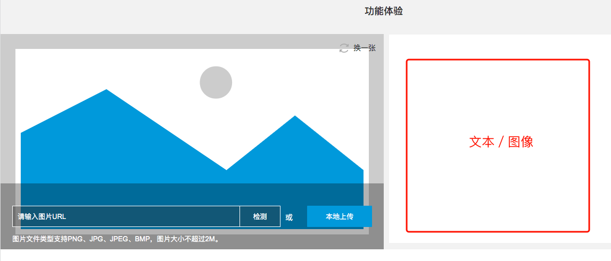
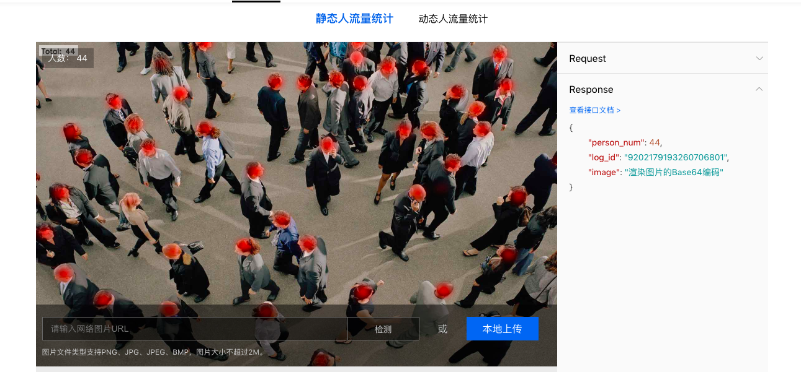
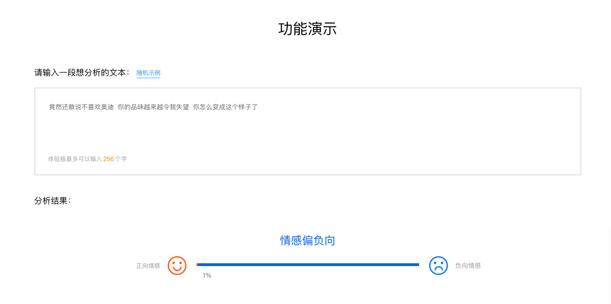
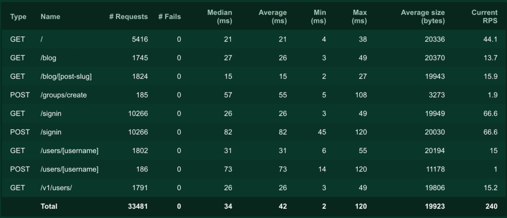

## 立项背景

* 明确AI学科的属性："后端的后端"，与Java／Python略有不同，AI的项目并不是一个从0-1的过程，大多数情况下
，它是一个1+的过程。它必须在已有的项目基础上对某些功能进行优化赋能，例如：从统计推荐系统到基于数据挖掘的个性化推荐系统，从简单的文本索引搜索到文本语义搜索。

* 正因如此，AI项目的"界"就是一个包含[N个API的服务](http://52.83.69.131:8123/1/)，这些服务一般只被后端系统调用。AI的项目形态无法很好的以一个应用或网站的形式展现给大家。考虑到让学员更好的理解项目，早期的AI项目展示，也是由我们研究员自己搭建简单的后端和前端页面（比如现在pip的CLS项目），但是从效果的美观和人员投入的精力上，我们觉得这样并不合适。

* 至此，我们开始抽象AI能够的展示模式：文本输入--->文本输出，图片输入--->文本输出，图片输入--->图片输出

我们希望有这样一个系统，在AI工程师完成AI服务打包后，通过配置展示信息，输入示例，输出示例，服务说明等等，就可以生成统一样式的展示页面用于教学。这也是立项的背景也是初衷。

---

## 非展示端AI项目进展简述

对于展示端如何，并不影响AI项目的实际应用的进展。

* 完成对信息中心咨询部门信息提取服务的支持。
	* 详情：[http://52.83.69.131:8123/2/](http://52.83.69.131:8123/2/)
* 完成院校邦考试题自动批阅服务的支持。
	* 详情: [http://52.83.69.131:8123/4/](http://52.83.69.131:8123/4/)
* 完成数据分析团队在疫情影响下全国机线上开班统计（图像类）服务的支持。
	* 详情: [http://52.83.69.131:8123/4/](http://52.83.69.131:8123/6/)
* 完成产品经理团队竞品分析流量统计（图像类）服务的支持。
	

为什么要合作呢，实现真实的AI项目的痛点就是：真实的数据和业务场景，合作能帮我们解决这样的需求。
以上的技术点都将在一定加工后转化成实际的AI课程讲义和视频。同时也是传智大脑展示端需要呈现的内容。如下图所示：

---

## 更多的功能

除了展示外，因为我们的AI被实际应用，对于服务在生产环境下的测试和监控也是必不可少，现在，我们正在自己完成这些工作。我们希望这些功能也能成为其中的一部分：

* 对提供的AI服务进行相关的测试。
* 对服务状态提供一定的监控。

这是一个对工程师开放的后端平台，如图所示：

---

## 项目的作用

* 更好的增强AI教学效果，让学生能够看到并试用这些功能。
* 更好的展示已有的AI项目，以促成更多的内部合作。
* 减少AI研究员在展示端的精力，以便更好的研究有关的模型教学。

---

## 总结

* 我们需要一个具有指定抽象模式的可配置的AI项目效果展示平台。

---

